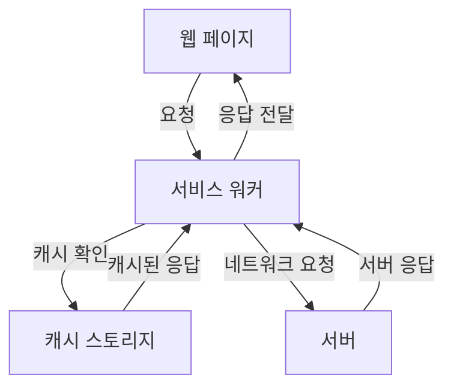
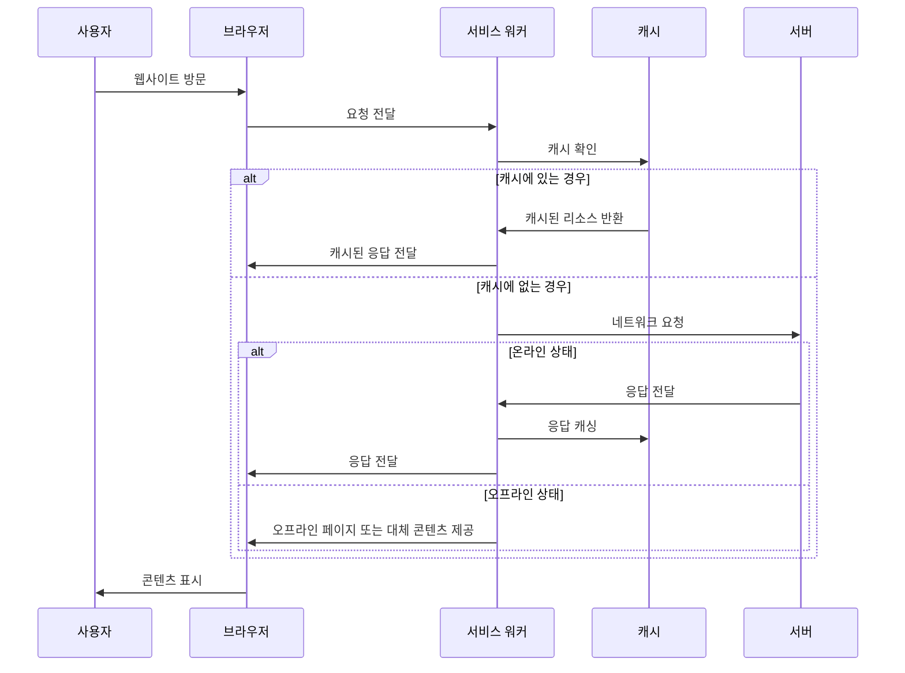
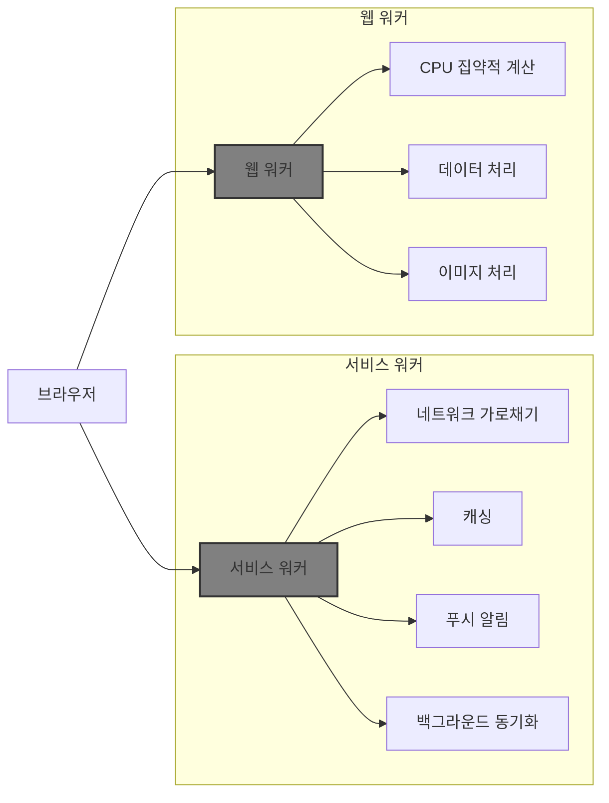

# Chapter 01 서비스 워커 소개

## 01-1 서비스 워커란 무엇인가

### 개요
서비스 워커는 웹 애플리케이션의 백그라운드에서 동작하는 스크립트로, 웹 페이지와 별도로 실행되어 다양한 기능을 제공합니다. 이 섹션에서는 서비스 워커의 기본 개념, 역할, 그리고 웹 개발자가 서비스 워커를 알아야 하는 이유에 대해 알아봅니다. 또한 서비스 워커와 웹 워커의 차이점을 이해하고, 서비스 워커의 핵심 포인트를 정리합니다.

### 서비스 워커의 정의와 역할

서비스 워커는 웹 브라우저가 백그라운드에서 실행하는 스크립트로, 웹 페이지와는 별도의 생명주기를 가집니다. 웹 페이지나 사용자 상호작용이 없어도 독립적으로 실행될 수 있는 JavaScript 워커입니다.

서비스 워커의 주요 역할은 다음과 같습니다:

1. **네트워크 요청 가로채기**: 웹 페이지에서 발생하는 네트워크 요청을 가로채고 수정할 수 있습니다.
2. **캐싱 관리**: 리소스를 캐시에 저장하고 관리하여 오프라인 상태에서도 웹 애플리케이션이 동작할 수 있게 합니다.
3. **푸시 알림**: 백그라운드 동기화 및 푸시 알림을 처리할 수 있습니다.
4. **성능 최적화**: 네트워크 요청을 최적화하여 웹 애플리케이션의 성능을 향상시킵니다.

### 웹 개발자가 서비스 워커를 알아야 하는 이유

웹 개발자가 서비스 워커를 이해하고 활용해야 하는 이유는 다양합니다. 특히 현대 웹 애플리케이션에서 사용자 경험을 향상시키는 데 중요한 역할을 합니다.

#### 오프라인 웹 경험 제공

서비스 워커의 가장 큰 장점 중 하나는 오프라인 웹 경험을 제공할 수 있다는 점입니다:

- **네트워크 독립성**: 인터넷 연결이 불안정하거나 없는 상황에서도 웹 애플리케이션이 작동할 수 있습니다.
- **캐싱 전략**: 필요한 리소스를 미리 캐시하여 오프라인 상태에서도 접근할 수 있게 합니다.
- **사용자 경험 일관성**: 네트워크 상태와 관계없이 일관된 사용자 경험을 제공합니다.

#### 성능 최적화 및 사용자 경험 향상

서비스 워커는 웹 애플리케이션의 성능을 최적화하고 사용자 경험을 향상시키는 데 중요한 역할을 합니다:

- **빠른 로딩 시간**: 자주 사용되는 리소스를 캐시하여 로딩 시간을 단축합니다.
- **네트워크 트래픽 감소**: 필요한 리소스만 요청하여 네트워크 트래픽을 줄입니다.
- **백그라운드 동기화**: 사용자가 앱을 사용하지 않을 때도 데이터를 동기화할 수 있습니다.
- **푸시 알림**: 사용자에게 중요한 업데이트나 정보를 알릴 수 있습니다.
- **프로그레시브 웹 앱(PWA)**: 네이티브 앱과 유사한 경험을 제공하는 PWA 개발의 핵심 기술입니다.

### 서비스 워커와 웹 워커의 차이점

서비스 워커와 웹 워커는 모두 메인 스레드와 별도로 실행되는 JavaScript 코드이지만, 목적과 기능에 있어 중요한 차이가 있습니다:

| 특성 | 서비스 워커 | 웹 워커 |
|------|------------|---------|
| **목적** | 네트워크 요청 가로채기, 캐싱, 오프라인 지원 | CPU 집약적 작업의 병렬 처리 |
| **생명주기** | 페이지와 독립적, 백그라운드에서 계속 실행 가능 | 페이지에 종속, 페이지가 닫히면 종료 |
| **범위** | 여러 탭과 창에 걸쳐 작동 가능 | 단일 페이지 내에서만 작동 |
| **네트워크 제어** | 네트워크 요청 가로채기 가능 | 네트워크 요청 가로채기 불가 |
| **상태 유지** | 종료 후 다시 시작될 때 상태 유지 안 됨 | 실행 중인 동안 상태 유지 |
| **사용 사례** | 오프라인 지원, 푸시 알림, 백그라운드 동기화 | 데이터 처리, 계산, 이미지 조작 등 |

### 3가지 키워드로 정리하는 핵심 포인트
1. **프록시**: 서비스 워커는 웹 페이지와 서버 사이에서 프록시 역할을 하며, 네트워크 요청을 가로채고 수정할 수 있습니다.
2. **오프라인 지원**: 서비스 워커는 리소스를 캐싱하여 오프라인 상태에서도 웹 애플리케이션이 작동할 수 있게 합니다.
3. **백그라운드 처리**: 서비스 워커는 웹 페이지와 별도로 백그라운드에서 실행되어 푸시 알림, 백그라운드 동기화 등의 기능을 제공합니다.

### 확인 문제
1. 서비스 워커의 주요 역할이 아닌 것은?
   - [ ] 네트워크 요청 가로채기
   - [ ] 리소스 캐싱
   - [ ] 푸시 알림 처리
   - [ ] DOM 직접 조작

2. 서비스 워커와 웹 워커의 차이점으로 올바른 것은?
   - [ ] 웹 워커는 백그라운드에서 실행되지만, 서비스 워커는 메인 스레드에서 실행된다
   - [ ] 서비스 워커는 페이지가 닫히면 종료되지만, 웹 워커는 계속 실행된다
   - [ ] 서비스 워커는 네트워크 요청을 가로챌 수 있지만, 웹 워커는 그렇지 않다
   - [ ] 웹 워커는 여러 탭에 걸쳐 작동할 수 있지만, 서비스 워커는 단일 페이지에서만 작동한다

3. 웹 개발자가 서비스 워커를 사용하는 주요 이유로 올바른 것을 모두 고르세요.
   - [ ] 오프라인 웹 경험 제공
   - [ ] 네트워크 요청 최적화
   - [ ] 서버 부하 감소
   - [ ] 푸시 알림 구현
   - [ ] DOM 직접 조작

> [정답 및 해설 보기](../answers_and_explanations.md#01-1-서비스-워커란-무엇인가)
