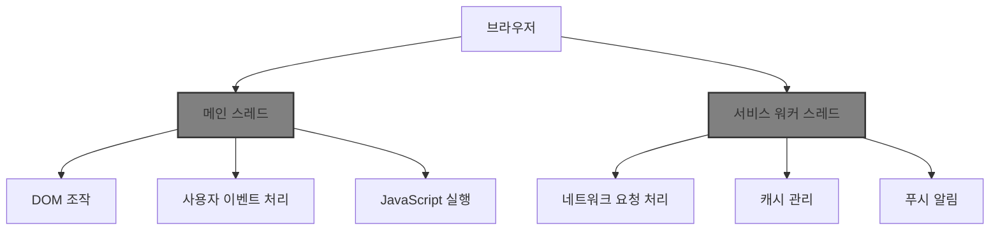
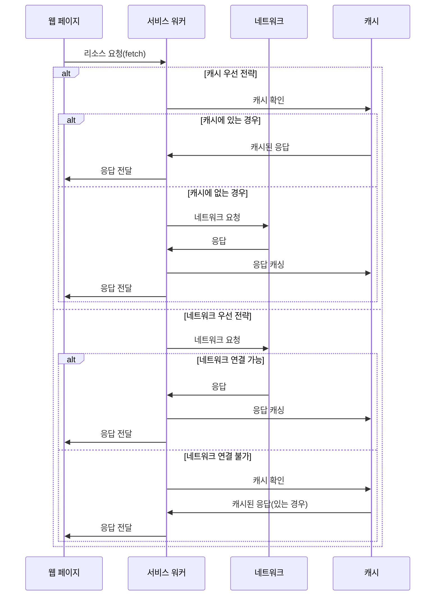
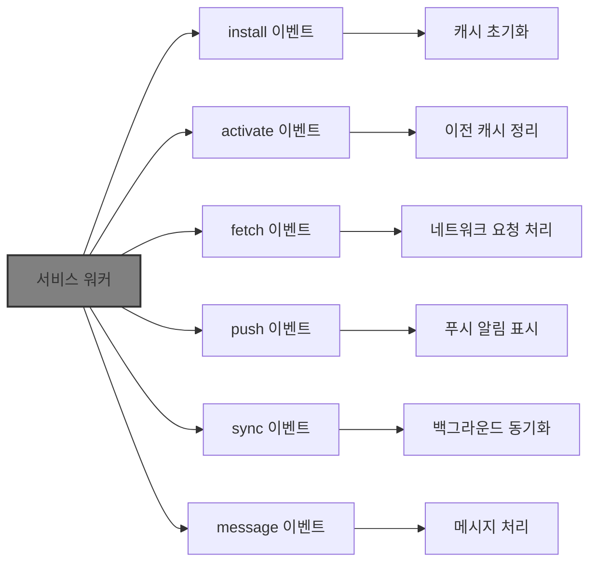
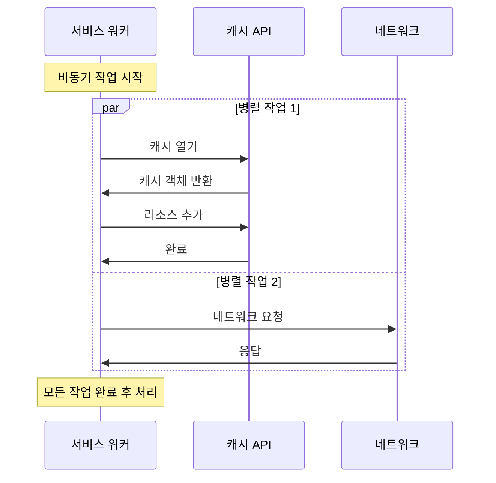

# Chapter 01 서비스 워커 소개

## 01-2 서비스 워커의 특징

### 개요
서비스 워커는 웹 애플리케이션에 강력한 기능을 제공하는 특별한 JavaScript 워커입니다. 이 섹션에서는 서비스 워커의 주요 특징인 자바스크립트 워커 스레드, 프록시 역할, 이벤트 기반 아키텍처, 비동기적 특성, 그리고 HTTPS 필수 요구사항에 대해 알아봅니다. 이러한 특징들을 이해함으로써 서비스 워커를 효과적으로 활용할 수 있는 기반을 마련할 수 있습니다.

### 자바스크립트 워커 스레드

서비스 워커는 브라우저의 메인 스레드와 별도로 실행되는 자바스크립트 워커 스레드입니다. 이러한 특성은 웹 애플리케이션의 성능과 사용자 경험에 중요한 영향을 미칩니다.

#### 메인 스레드와의 분리

서비스 워커가 메인 스레드와 분리되어 실행되는 것은 다음과 같은 이점을 제공합니다:

- **UI 블로킹 방지**: 서비스 워커의 작업이 메인 스레드를 차단하지 않아 사용자 인터페이스의 응답성을 유지합니다.
- **백그라운드 처리**: 웹 페이지가 활성화되지 않은 상태에서도 작업을 수행할 수 있습니다.
- **리소스 효율성**: 메인 스레드의 부하를 줄여 전반적인 애플리케이션 성능을 향상시킵니다.



#### 제한사항

서비스 워커가 워커 스레드에서 실행되기 때문에 다음과 같은 제한사항이 있습니다:

- **DOM 접근 불가**: 서비스 워커는 DOM에 직접 접근할 수 없습니다.
- **window 객체 접근 제한**: window 객체의 일부 속성과 메서드에 접근할 수 없습니다.
- **동기 XHR 및 localStorage 사용 불가**: 서비스 워커 내에서는 동기식 XHR 요청과 localStorage를 사용할 수 없습니다.

### 프록시 역할

서비스 워커는 웹 애플리케이션과 네트워크 사이에서 프록시 역할을 수행합니다. 이 특성은 서비스 워커의 가장 강력한 기능 중 하나입니다.

#### 네트워크 요청 가로채기

서비스 워커는 fetch 이벤트를 통해 웹 페이지에서 발생하는 모든 네트워크 요청을 가로챌 수 있습니다:

```javascript
self.addEventListener('fetch', event => {
  // 네트워크 요청 가로채기 및 처리
  event.respondWith(
    // 응답 생성 또는 수정
  );
});
```

이러한 기능을 통해 다음과 같은 작업이 가능합니다:

- **요청 수정**: URL, 헤더, 메서드 등을 변경할 수 있습니다.
- **응답 생성**: 네트워크 요청 없이 직접 응답을 생성할 수 있습니다.
- **조건부 처리**: 요청 유형에 따라 다른 처리 전략을 적용할 수 있습니다.



#### 캐싱 전략 구현

프록시 역할을 통해 다양한 캐싱 전략을 구현할 수 있습니다:

- **Cache First**: 캐시를 먼저 확인하고, 없으면 네트워크에서 가져옵니다.
- **Network First**: 네트워크에서 먼저 가져오고, 실패하면 캐시를 사용합니다.
- **Stale While Revalidate**: 캐시된 응답을 즉시 반환하고, 백그라운드에서 업데이트합니다.
- **Cache Only**: 캐시에서만 응답을 가져옵니다.
- **Network Only**: 네트워크에서만 응답을 가져옵니다.

### 이벤트 기반 아키텍처

서비스 워커는 이벤트 기반 아키텍처를 사용하여 다양한 상황에 반응합니다. 이 특성은 서비스 워커의 생명주기와 기능 구현에 중요한 역할을 합니다.

#### 주요 이벤트

서비스 워커는 다음과 같은 주요 이벤트를 처리합니다:

- **install**: 서비스 워커가 처음 설치될 때 발생합니다.
- **activate**: 서비스 워커가 활성화될 때 발생합니다.
- **fetch**: 네트워크 요청이 발생할 때 트리거됩니다.
- **push**: 서버에서 푸시 알림이 도착할 때 발생합니다.
- **sync**: 백그라운드 동기화가 요청될 때 발생합니다.
- **message**: 메시지가 서비스 워커로 전송될 때 발생합니다.

```javascript
// 설치 이벤트
self.addEventListener('install', event => {
  // 캐시 초기화 등의 설치 작업
});

// 활성화 이벤트
self.addEventListener('activate', event => {
  // 이전 캐시 정리 등의 활성화 작업
});

// 페치 이벤트
self.addEventListener('fetch', event => {
  // 네트워크 요청 처리
});

// 푸시 이벤트
self.addEventListener('push', event => {
  // 푸시 알림 처리
});
```



#### 이벤트 처리 방식

서비스 워커의 이벤트 처리는 다음과 같은 특징이 있습니다:

- **이벤트 확장**: `event.waitUntil()` 메서드를 사용하여 이벤트 처리 시간을 확장할 수 있습니다.
- **응답 제어**: `event.respondWith()` 메서드를 사용하여 네트워크 요청에 대한 응답을 제어할 수 있습니다.
- **비동기 처리**: Promise를 사용하여 비동기 작업을 처리합니다.

### 비동기적 특성

서비스 워커는 본질적으로 비동기적인 특성을 가지고 있으며, 이는 서비스 워커의 작동 방식과 코드 작성에 큰 영향을 미칩니다.

#### Promise 기반 API

서비스 워커는 대부분의 작업에 Promise를 사용합니다:

- **등록**: `navigator.serviceWorker.register()`는 Promise를 반환합니다.
- **캐시 작업**: Cache API의 모든 메서드는 Promise를 반환합니다.
- **네트워크 요청**: Fetch API는 Promise 기반으로 작동합니다.

```javascript
// 서비스 워커 등록
navigator.serviceWorker.register('/sw.js')
  .then(registration => {
    console.log('서비스 워커가 등록되었습니다:', registration.scope);
  })
  .catch(error => {
    console.error('서비스 워커 등록 실패:', error);
  });

// 캐시 작업
caches.open('my-cache')
  .then(cache => {
    return cache.add('/index.html');
  })
  .then(() => {
    console.log('리소스가 캐시되었습니다.');
  });
```

#### 비차단 작업

서비스 워커의 비동기적 특성은 다음과 같은 이점을 제공합니다:

- **성능 향상**: 긴 작업이 다른 작업을 차단하지 않습니다.
- **효율적인 리소스 사용**: 작업이 완료될 때까지 기다리는 동안 다른 작업을 수행할 수 있습니다.
- **응답성 유지**: 사용자 인터페이스의 응답성을 유지할 수 있습니다.



### HTTPS 필수 요구사항

서비스 워커는 보안상의 이유로 HTTPS 환경에서만 작동합니다. 이는 서비스 워커의 강력한 기능이 악의적인 목적으로 사용되는 것을 방지하기 위함입니다.

#### HTTPS 요구 이유

서비스 워커가 HTTPS를 요구하는 주요 이유는 다음과 같습니다:

- **중간자 공격 방지**: HTTPS는 통신 내용이 제3자에 의해 가로채지거나 변조되는 것을 방지합니다.
- **신뢰성 보장**: HTTPS는 사용자가 접속한 웹사이트의 신원을 확인할 수 있게 합니다.
- **민감한 정보 보호**: 서비스 워커는 네트워크 요청을 가로채고 수정할 수 있기 때문에, 이러한 기능이 안전한 환경에서만 작동하도록 보장해야 합니다.

#### 예외 사항

개발 목적으로 다음과 같은 환경에서는 HTTPS 없이도 서비스 워커를 사용할 수 있습니다:

- **localhost**: 로컬 개발 환경에서는 HTTP로도 서비스 워커를 사용할 수 있습니다.
- **127.0.0.1**: IP 주소를 통한 로컬 접속에서도 서비스 워커를 사용할 수 있습니다.
- **file://**: 일부 브라우저에서는 파일 프로토콜에서도 서비스 워커를 지원할 수 있습니다(브라우저마다 다름).

```javascript
// 서비스 워커 지원 및 HTTPS 확인
if ('serviceWorker' in navigator) {
  if (location.protocol === 'https:' || location.hostname === 'localhost' || location.hostname === '127.0.0.1') {
    navigator.serviceWorker.register('/sw.js')
      .then(registration => {
        console.log('서비스 워커가 등록되었습니다.');
      })
      .catch(error => {
        console.error('서비스 워커 등록 실패:', error);
      });
  } else {
    console.warn('서비스 워커는 HTTPS 또는 로컬 환경에서만 작동합니다.');
  }
}
```

### 5가지 키워드로 정리하는 핵심 포인트
1. **워커 스레드**: 서비스 워커는 메인 스레드와 별도로 실행되는 JavaScript 워커로, UI 블로킹 없이 백그라운드 작업을 수행할 수 있습니다.
2. **프록시**: 서비스 워커는 웹 애플리케이션과 네트워크 사이에서 프록시 역할을 하며, 모든 네트워크 요청을 가로채고 수정할 수 있습니다.
3. **이벤트 기반**: 서비스 워커는 install, activate, fetch, push 등의 이벤트에 반응하는 이벤트 기반 아키텍처를 사용합니다.
4. **비동기**: 서비스 워커는 Promise 기반의 비동기 API를 사용하여 효율적인 작업 처리를 가능하게 합니다.
5. **HTTPS 필수**: 보안상의 이유로 서비스 워커는 HTTPS 환경(또는 localhost)에서만 작동합니다.

### 확인 문제
1. 서비스 워커가 메인 스레드와 별도로 실행되는 이유로 가장 적절한 것은?
   - [ ] 더 많은 메모리를 사용하기 위해
   - [ ] DOM을 직접 조작하기 위해
   - [ ] UI 블로킹을 방지하고 백그라운드 작업을 수행하기 위해
   - [ ] 동기식 XHR 요청을 처리하기 위해

2. 서비스 워커의 프록시 역할에 대한 설명으로 올바르지 않은 것은?
   - [ ] 네트워크 요청을 가로채고 수정할 수 있다
   - [ ] 다양한 캐싱 전략을 구현할 수 있다
   - [ ] 오프라인 상태에서도 응답을 제공할 수 있다
   - [ ] 서버의 부하를 직접 모니터링할 수 있다

3. 서비스 워커에서 사용되는 이벤트가 아닌 것은?
   - [ ] install
   - [ ] activate
   - [ ] fetch
   - [ ] click

4. 서비스 워커의 비동기적 특성에 관한 설명으로 올바른 것은?
   - [ ] 서비스 워커는 동기식 API만 사용한다
   - [ ] 서비스 워커의 모든 작업은 순차적으로 처리된다
   - [ ] 서비스 워커는 Promise 기반의 API를 주로 사용한다
   - [ ] 서비스 워커는 비동기 작업을 위해 항상 콜백 함수를 사용한다

5. 서비스 워커가 HTTPS를 요구하는 이유로 가장 적절한 것은?
   - [ ] 더 빠른 네트워크 속도를 제공하기 위해
   - [ ] 더 많은 브라우저 지원을 확보하기 위해
   - [ ] 보안상의 이유로 중간자 공격을 방지하기 위해
   - [ ] 캐시 용량을 늘리기 위해

> [정답 및 해설 보기](../answers_and_explanations.md#01-2-서비스-워커의-특징)
