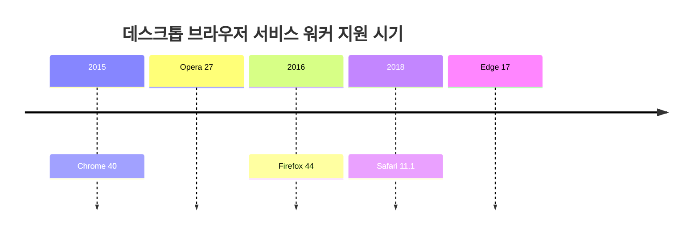

# Chapter 01 서비스 워커 소개

## 01-3 서비스 워커 지원 환경

### 개요
서비스 워커는 강력한 기능을 제공하지만, 모든 브라우저와 환경에서 동일하게 지원되지는 않습니다. 이 섹션에서는 서비스 워커의 브라우저 호환성, 폴리필과 대체 방안, 그리고 기능 감지 방법에 대해 알아봅니다. 이를 통해 서비스 워커를 활용한 웹 애플리케이션을 개발할 때 고려해야 할 환경적 요소를 이해할 수 있습니다.

### 브라우저 호환성

서비스 워커는 현대적인 웹 브라우저에서 널리 지원되고 있지만, 브라우저별로 지원 시기와 구현 범위에 차이가 있습니다.

#### 데스크톱 브라우저

데스크톱 브라우저의 서비스 워커 지원 현황은 다음과 같습니다:

- **Chrome**: 버전 40부터 지원 (2015년 1월)
- **Firefox**: 버전 44부터 지원 (2016년 1월)
- **Safari**: 버전 11.1부터 지원 (2018년 3월)
- **Edge**: 버전 17부터 지원 (2018년 4월)
- **Opera**: 버전 27부터 지원 (2015년 3월)



대부분의 최신 데스크톱 브라우저는 서비스 워커의 기본 기능을 지원하지만, 일부 고급 기능(예: Background Sync, Periodic Sync)은 브라우저마다 지원 여부가 다를 수 있습니다.

#### 모바일 브라우저

모바일 브라우저의 서비스 워커 지원 현황은 다음과 같습니다:

- **Chrome for Android**: 버전 40부터 지원
- **Firefox for Android**: 버전 44부터 지원
- **Safari on iOS**: 버전 11.3부터 지원 (2018년 3월)
- **Samsung Internet**: 버전 4.0부터 지원
- **UC Browser**: 버전 11.8부터 지원

모바일 환경에서는 특히 iOS Safari의 지원이 상대적으로 늦게 시작되었으며, 일부 기능에 제한이 있을 수 있습니다. 또한 모바일 브라우저는 백그라운드 실행 시간, 메모리 사용량 등에 데스크톱보다 더 엄격한 제한을 두는 경우가 많습니다.

```javascript
// 브라우저 호환성 확인 예제
if ('serviceWorker' in navigator) {
  console.log('이 브라우저는 서비스 워커를 지원합니다.');
} else {
  console.log('이 브라우저는 서비스 워커를 지원하지 않습니다.');
}
```

### 폴리필과 대체 방안

서비스 워커를 지원하지 않는 브라우저를 위한 대체 방안과 폴리필에 대해 알아보겠습니다.

#### 서비스 워커 폴리필

서비스 워커는 그 특성상 완전한 폴리필을 만들기 어렵습니다. 그러나 일부 기능을 제한적으로 구현한 폴리필이 존재합니다:

- **sw-toolbox**: 구글에서 개발한 라이브러리로, 서비스 워커 사용을 단순화하고 일부 기능을 폴리필합니다.
- **Workbox**: 구글의 최신 서비스 워커 라이브러리로, 다양한 캐싱 전략과 기능을 제공합니다.

```javascript
// Workbox를 사용한 서비스 워커 구현 예제
importScripts('https://storage.googleapis.com/workbox-cdn/releases/6.1.5/workbox-sw.js');

workbox.routing.registerRoute(
  ({request}) => request.destination === 'image',
  new workbox.strategies.CacheFirst()
);
```

#### 대체 기술

서비스 워커를 지원하지 않는 브라우저에서 사용할 수 있는 대체 기술은 다음과 같습니다:

- **Application Cache (AppCache)**: 이전 세대의 오프라인 캐싱 기술이지만, 현재는 deprecated 상태입니다.
- **LocalStorage/SessionStorage**: 간단한 데이터 저장에 사용할 수 있지만, 네트워크 요청 가로채기 등의 기능은 제공하지 않습니다.
- **IndexedDB**: 클라이언트 측 데이터베이스로, 대용량 데이터 저장에 적합합니다.
- **Web Storage API**: 브라우저에 데이터를 저장하는 간단한 방법을 제공합니다.

```mermaid
graph TD
    A[브라우저가 서비스 워커를 지원하는가?]
    A -->|Yes| B[서비스 워커 사용]
    A -->|No| C[대체 기술 사용]
    
    C --> D[IndexedDB]
    C --> E[LocalStorage]
    C --> F[SessionStorage]
    C --> G[AppCache - 레거시]
    
    style A fill:#444,stroke:#333,stroke-width:2px
```



### 기능 감지 방법

서비스 워커와 관련 기능의 지원 여부를 감지하는 방법에 대해 알아보겠습니다.

#### 서비스 워커 지원 감지

가장 기본적인 서비스 워커 지원 감지 방법은 다음과 같습니다:

```javascript
if ('serviceWorker' in navigator) {
  // 서비스 워커 지원
  navigator.serviceWorker.register('/sw.js')
    .then(registration => {
      console.log('서비스 워커가 등록되었습니다:', registration.scope);
    })
    .catch(error => {
      console.error('서비스 워커 등록 실패:', error);
    });
} else {
  // 서비스 워커 미지원
  console.log('이 브라우저는 서비스 워커를 지원하지 않습니다.');
}
```

#### 특정 기능 지원 감지

서비스 워커의 특정 기능 지원 여부를 감지하는 방법은 다음과 같습니다:

```javascript
// 푸시 알림 지원 여부 확인
if ('PushManager' in window) {
  console.log('이 브라우저는 푸시 알림을 지원합니다.');
} else {
  console.log('이 브라우저는 푸시 알림을 지원하지 않습니다.');
}

// 백그라운드 동기화 지원 여부 확인
if ('SyncManager' in window) {
  console.log('이 브라우저는 백그라운드 동기화를 지원합니다.');
} else {
  console.log('이 브라우저는 백그라운드 동기화를 지원하지 않습니다.');
}

// 캐시 API 지원 여부 확인
if ('caches' in window) {
  console.log('이 브라우저는 Cache API를 지원합니다.');
} else {
  console.log('이 브라우저는 Cache API를 지원하지 않습니다.');
}
```

#### 점진적 향상 기법 적용

서비스 워커를 사용할 때는 점진적 향상(Progressive Enhancement) 기법을 적용하는 것이 좋습니다:

```javascript
// 기본 기능 구현
function loadContent() {
  fetch('/api/content')
    .then(response => response.json())
    .then(data => {
      displayContent(data);
    });
}

// 서비스 워커 지원 시 추가 기능 활성화
if ('serviceWorker' in navigator) {
  navigator.serviceWorker.register('/sw.js')
    .then(registration => {
      console.log('서비스 워커가 등록되었습니다.');
      // 오프라인 기능 활성화
    });
}

// 기본 기능은 모든 브라우저에서 작동
loadContent();
```

이 접근 방식을 통해 서비스 워커를 지원하는 브라우저에서는 향상된 기능을 제공하고, 지원하지 않는 브라우저에서도 기본 기능은 정상적으로 작동하도록 할 수 있습니다.

### 4가지 키워드로 정리하는 핵심 포인트
1. **브라우저 호환성**: 대부분의 현대적인 브라우저는 서비스 워커를 지원하지만, 브라우저별로 지원 시기와 구현 범위에 차이가 있습니다.
2. **점진적 향상**: 서비스 워커를 지원하지 않는 브라우저에서도 기본 기능이 작동하도록 점진적 향상 기법을 적용해야 합니다.
3. **기능 감지**: 'serviceWorker' in navigator와 같은 방법으로 서비스 워커 및 관련 기능의 지원 여부를 확인할 수 있습니다.
4. **대체 기술**: 서비스 워커를 지원하지 않는 환경에서는 IndexedDB, LocalStorage 등의 대체 기술을 활용할 수 있습니다.

### 확인 문제
1. 다음 중 서비스 워커를 가장 먼저 지원한 브라우저는?
   - [ ] Safari
   - [ ] Firefox
   - [ ] Chrome
   - [ ] Edge

2. 서비스 워커 지원 여부를 확인하는 올바른 JavaScript 코드는?
   - [ ] if (window.serviceWorker) { ... }
   - [ ] if ('serviceWorker' in navigator) { ... }
   - [ ] if (document.serviceWorker) { ... }
   - [ ] if (browser.supportsServiceWorker()) { ... }

3. 서비스 워커를 지원하지 않는 브라우저에서 사용할 수 있는 대체 기술이 아닌 것은?
   - [ ] IndexedDB
   - [ ] LocalStorage
   - [ ] Web Workers
   - [ ] WebSocket API

4. 서비스 워커 관련 기술 중 iOS Safari에서 지원이 가장 늦게 시작된 것은?
   - [ ] 기본 서비스 워커 기능
   - [ ] 푸시 알림
   - [ ] 백그라운드 동기화
   - [ ] 캐시 API

5. 서비스 워커를 사용할 때 권장되는 개발 접근 방식은?
   - [ ] 서비스 워커를 지원하는 브라우저만 타겟팅하기
   - [ ] 모든 기능을 폴리필로 구현하기
   - [ ] 점진적 향상 기법 적용하기
   - [ ] AppCache와 함께 사용하기

> [정답 및 해설 보기](../answers_and_explanations.md#01-3-서비스-워커-지원-환경)
