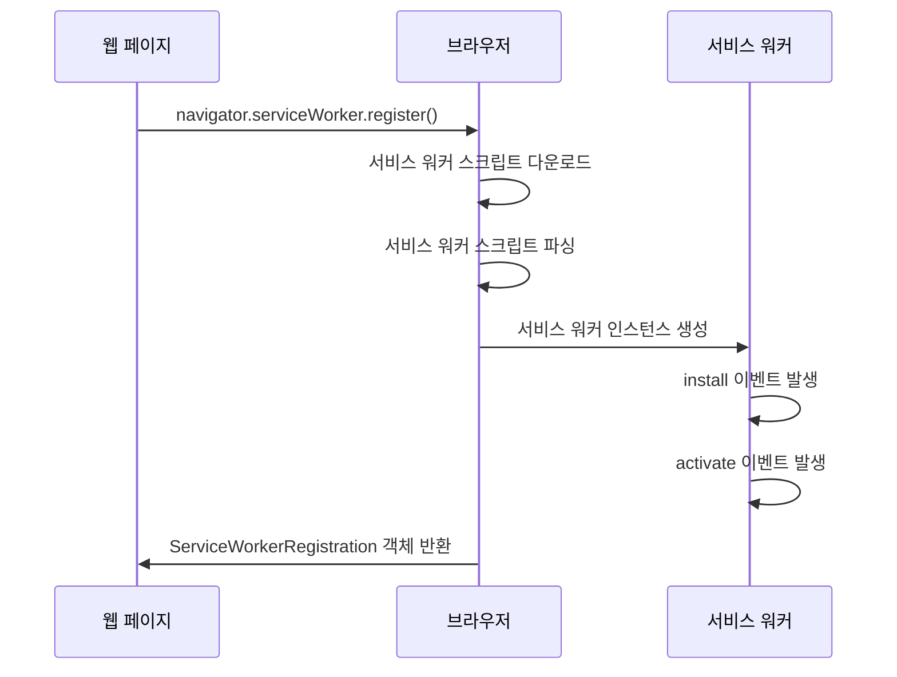
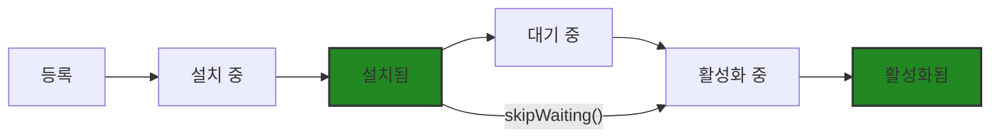

# Chapter 02 서비스 워커 생명주기

## 02-1 서비스 워커 등록과 설치

### 개요
서비스 워커는 웹 애플리케이션에 다양한 기능을 제공하기 위해 등록 및 설치 과정을 거쳐야 합니다. 이 섹션에서는 서비스 워커 스크립트 작성부터 등록, 설치까지의 전체 과정을 살펴보고, 관련 API와 이벤트 처리 방법을 알아봅니다. 또한 개발 과정에서 발생할 수 있는 문제를 디버깅하는 방법도 함께 다룹니다.

### 서비스 워커 스크립트 작성

서비스 워커 스크립트는 웹 애플리케이션의 백그라운드에서 실행되는 JavaScript 파일입니다. 이 파일은 다음과 같은 특성을 가집니다:

- 별도의 JavaScript 파일로 작성됩니다 (일반적으로 `sw.js` 또는 `service-worker.js`라는 이름 사용)
- 웹 페이지와는 별도의 스레드에서 실행됩니다
- DOM에 직접 접근할 수 없습니다
- 비동기 API를 주로 사용합니다

기본적인 서비스 워커 스크립트의 구조는 다음과 같습니다:

```javascript
// service-worker.js

// 설치 이벤트 처리
self.addEventListener('install', event => {
  console.log('서비스 워커 설치 중...');
  // 설치 작업 수행
});

// 활성화 이벤트 처리
self.addEventListener('activate', event => {
  console.log('서비스 워커 활성화 중...');
  // 활성화 작업 수행
});

// fetch 이벤트 처리
self.addEventListener('fetch', event => {
  console.log('네트워크 요청 가로채기:', event.request.url);
  // 네트워크 요청 처리
});
```

서비스 워커 스크립트에서는 `self`가 서비스 워커 자신을 가리키는 전역 객체로 사용됩니다. 이 객체를 통해 다양한 이벤트 리스너를 등록하고 서비스 워커의 기능을 구현합니다.

### 서비스 워커 등록 과정

#### navigator.serviceWorker.register()

서비스 워커를 등록하는 과정은 웹 페이지의 JavaScript 코드에서 시작됩니다. `navigator.serviceWorker.register()` 메서드를 사용하여 서비스 워커 스크립트를 등록합니다:

```javascript
// 웹 페이지의 JavaScript 코드
if ('serviceWorker' in navigator) {
  navigator.serviceWorker.register('/service-worker.js')
    .then(registration => {
      console.log('서비스 워커 등록 성공:', registration.scope);
    })
    .catch(error => {
      console.error('서비스 워커 등록 실패:', error);
    });
} else {
  console.log('이 브라우저는 서비스 워커를 지원하지 않습니다.');
}
```

`register()` 메서드는 Promise를 반환하며, 등록이 성공하면 `ServiceWorkerRegistration` 객체를 제공합니다. 이 객체를 통해 등록된 서비스 워커의 상태와 범위를 확인할 수 있습니다.

서비스 워커 등록 과정은 다음과 같은 단계로 진행됩니다:



#### 스코프 설정

서비스 워커의 스코프는 서비스 워커가 제어할 수 있는 페이지의 범위를 결정합니다. 기본적으로 서비스 워커의 스코프는 서비스 워커 파일이 위치한 디렉토리와 그 하위 디렉토리로 제한됩니다.

예를 들어, 서비스 워커 파일이 `/js/service-worker.js`에 위치한다면, 기본 스코프는 `/js/`가 되어 `/js/` 경로와 그 하위 경로의 페이지만 제어할 수 있습니다.

스코프를 명시적으로 지정하려면 `register()` 메서드의 두 번째 매개변수로 옵션 객체를 전달합니다:

```javascript
navigator.serviceWorker.register('/service-worker.js', {
  scope: '/' // 전체 사이트를 제어하도록 스코프 설정
})
  .then(registration => {
    console.log('서비스 워커 등록 성공:', registration.scope);
  });
```

스코프 설정 시 주의할 점:
- 스코프는 서비스 워커 파일 위치보다 상위 디렉토리로 설정할 수 없습니다 (보안상의 이유)
- 서비스 워커 파일을 루트 디렉토리(`/`)에 배치하면 전체 사이트를 제어할 수 있습니다
- 특정 기능만 서비스 워커로 제어하고 싶다면, 해당 기능과 관련된 경로에 서비스 워커를 배치하고 스코프를 제한할 수 있습니다

```mermaid
graph TD
    A["웹사이트 루트 /"] --> B["/js/"]
    A --> C["/images/"]
    A --> D["/styles/"]
    B --> E["service-worker.js"]
    
    subgraph "스코프: /js/"
        E
    end
    
    subgraph "스코프: /"
        A
        B
        C
        D
    end
    
    style E fill:#444,stroke:#333,stroke-width:2px
```



### 설치 이벤트 처리

#### install 이벤트

서비스 워커가 등록되면 브라우저는 서비스 워커 스크립트를 다운로드하고 파싱한 후, 서비스 워커 인스턴스를 생성합니다. 그리고 `install` 이벤트가 발생합니다.

`install` 이벤트는 서비스 워커가 처음 설치될 때와 업데이트된 서비스 워커가 발견될 때 발생합니다. 이 이벤트는 캐시를 초기화하고 필요한 리소스를 미리 캐싱하는 데 주로 사용됩니다:

```javascript
self.addEventListener('install', event => {
  console.log('서비스 워커 설치 중...');
  
  // waitUntil()을 사용하여 비동기 작업이 완료될 때까지 설치 단계를 연장
  event.waitUntil(
    caches.open('v1').then(cache => {
      console.log('캐시 생성 완료');
      // 필수 리소스를 미리 캐싱
      return cache.addAll([
        '/',
        '/index.html',
        '/styles/main.css',
        '/scripts/main.js',
        '/images/logo.png'
      ]);
    })
  );
});
```

`event.waitUntil()` 메서드는 Promise를 인자로 받아 해당 Promise가 해결될 때까지 설치 과정을 연장합니다. 이 메서드를 사용하면 캐싱과 같은 비동기 작업이 완료될 때까지 서비스 워커의 설치가 완료되지 않습니다.

설치 과정에서 오류가 발생하면 서비스 워커 설치가 실패하고 이전 서비스 워커(있는 경우)가 계속 활성 상태로 유지됩니다.

#### skipWaiting() 메서드

서비스 워커가 설치된 후에는 일반적으로 기존 서비스 워커가 제어하는 페이지가 모두 닫힐 때까지 대기 상태에 머무릅니다. 이 대기 과정을 건너뛰고 즉시 활성화하려면 `skipWaiting()` 메서드를 사용합니다:

```javascript
self.addEventListener('install', event => {
  console.log('서비스 워커 설치 중...');
  
  // 대기 단계를 건너뛰고 즉시 활성화
  self.skipWaiting();
  
  event.waitUntil(
    caches.open('v1').then(cache => {
      return cache.addAll([
        '/',
        '/index.html',
        '/styles/main.css',
        '/scripts/main.js'
      ]);
    })
  );
});
```

`skipWaiting()`을 사용하면 새 서비스 워커가 설치 완료 후 즉시 활성화되어 기존 페이지를 제어할 수 있게 됩니다. 이는 중요한 업데이트를 즉시 적용해야 할 때 유용하지만, 페이지가 로드된 후 서비스 워커가 변경되면 예상치 못한 동작이 발생할 수 있으므로 주의해야 합니다.

서비스 워커의 상태 변화는 다음과 같은 흐름으로 진행됩니다:



### 디버깅 및 문제 해결

서비스 워커 개발 과정에서 발생할 수 있는 문제를 디버깅하고 해결하는 방법은 다음과 같습니다:

#### 브라우저 개발자 도구 활용

대부분의 모던 브라우저는 서비스 워커를 디버깅하기 위한 도구를 제공합니다:

1. **Chrome**:
   - DevTools > Application > Service Workers 탭에서 서비스 워커 상태 확인
   - 로그 확인, 강제 업데이트, 서비스 워커 중지 등의 작업 수행 가능

2. **Firefox**:
   - DevTools > Application > Service Workers 탭에서 유사한 기능 제공

3. **Edge**:
   - Chrome과 유사한 인터페이스로 서비스 워커 디버깅 도구 제공

#### 일반적인 문제와 해결 방법

1. **서비스 워커 등록 실패**:
   - HTTPS 환경인지 확인 (localhost는 예외)
   - 서비스 워커 파일 경로가 올바른지 확인
   - 서비스 워커 스크립트에 문법 오류가 없는지 확인

2. **캐싱 문제**:
   - 캐시 이름이 올바른지 확인
   - `event.waitUntil()`을 사용하여 캐싱 작업이 완료될 때까지 설치 과정 연장
   - 캐시할 리소스의 URL이 정확한지 확인

3. **서비스 워커 업데이트 문제**:
   - 서비스 워커 파일이 1바이트라도 변경되었는지 확인
   - 개발 중에는 `skipWaiting()`과 `clients.claim()`을 사용하여 즉시 활성화

4. **스코프 관련 문제**:
   - 서비스 워커 파일 위치와 스코프 설정 확인
   - 서비스 워커가 제어해야 하는 페이지가 스코프 내에 있는지 확인

#### 개발 시 유용한 팁

1. **개발 모드 활성화**:
   ```javascript
   // 개발 환경에서만 사용할 디버깅 플래그
   const isDevMode = true;
   
   if (isDevMode) {
     console.log('서비스 워커 개발 모드 활성화');
     // 자세한 로깅 활성화
   }
   ```

2. **Chrome DevTools의 "Update on reload" 옵션 활성화**:
   - 페이지를 새로고침할 때마다 서비스 워커를 강제로 업데이트

3. **로깅 강화**:
   ```javascript
   self.addEventListener('install', event => {
     console.log('[서비스 워커] 설치 이벤트 발생', event);
     // 상세 로깅
   });
   ```

4. **서비스 워커 등록 상태 확인**:
   ```javascript
   navigator.serviceWorker.getRegistration().then(registration => {
     if (registration) {
       console.log('현재 활성화된 서비스 워커:', registration.active);
       console.log('대기 중인 서비스 워커:', registration.waiting);
       console.log('설치 중인 서비스 워커:', registration.installing);
     }
   });
   ```

### 5가지 키워드로 정리하는 핵심 포인트
1. **등록(Registration)**: `navigator.serviceWorker.register()`를 사용하여 서비스 워커 스크립트를 등록하고, 이 과정은 Promise를 반환하여 비동기적으로 처리됩니다.
2. **스코프(Scope)**: 서비스 워커가 제어할 수 있는 페이지의 범위로, 기본적으로 서비스 워커 파일이 위치한 디렉토리와 그 하위 디렉토리로 제한됩니다.
3. **설치 이벤트(Install Event)**: 서비스 워커가 처음 등록되거나 업데이트될 때 발생하는 이벤트로, 주로 캐시 초기화와 필수 리소스 캐싱에 사용됩니다.
4. **waitUntil()**: 설치 이벤트에서 비동기 작업이 완료될 때까지 설치 과정을 연장하는 메서드로, 캐싱 작업이 완료되기 전에 설치가 완료되는 것을 방지합니다.
5. **skipWaiting()**: 새 서비스 워커가 대기 단계를 건너뛰고 즉시 활성화되도록 하는 메서드로, 중요한 업데이트를 즉시 적용할 때 사용합니다.

### 확인 문제
1. 서비스 워커 등록 시 사용하는 올바른 메서드는?
   - [ ] navigator.serviceWorker.create()
   - [ ] window.serviceWorker.register()
   - [ ] navigator.serviceWorker.register()
   - [ ] document.serviceWorker.install()

2. 서비스 워커의 기본 스코프를 결정하는 요소는?
   - [ ] 웹 페이지의 URL
   - [ ] 서비스 워커 스크립트 파일의 위치
   - [ ] register() 메서드의 첫 번째 매개변수
   - [ ] 브라우저 설정

3. 서비스 워커 설치 과정에서 비동기 작업이 완료될 때까지 설치를 연장하기 위해 사용하는 메서드는?
   - [ ] event.complete()
   - [ ] event.waitUntil()
   - [ ] self.waitFor()
   - [ ] event.extend()

4. 서비스 워커가 설치된 후 대기 단계를 건너뛰고 즉시 활성화하기 위해 사용하는 메서드는?
   - [ ] self.activate()
   - [ ] event.skipWaiting()
   - [ ] self.skipWaiting()
   - [ ] registration.activate()

5. 다음 중 서비스 워커 등록 과정에서 발생할 수 있는 문제가 아닌 것은?
   - [ ] HTTP 환경에서 서비스 워커 등록 시도
   - [ ] 서비스 워커 스크립트 파일 경로 오류
   - [ ] DOM 요소에 직접 접근 시도
   - [ ] 잘못된 스코프 설정

> [정답 및 해설 보기](../answers_and_explanations.md#02-1-서비스-워커-등록과-설치)
