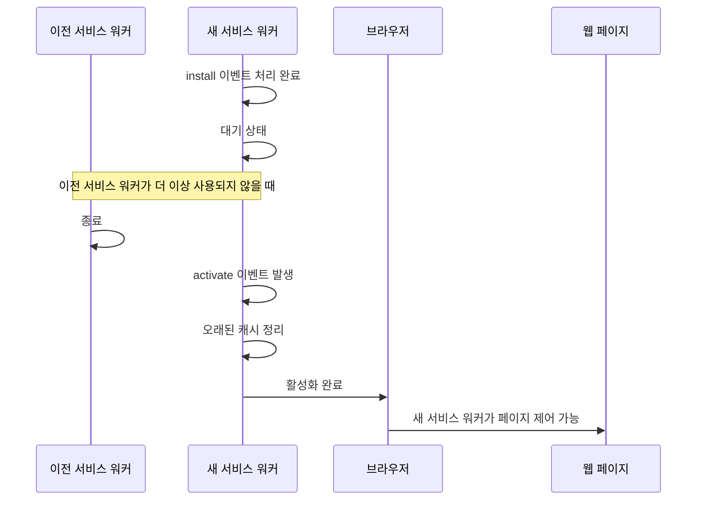
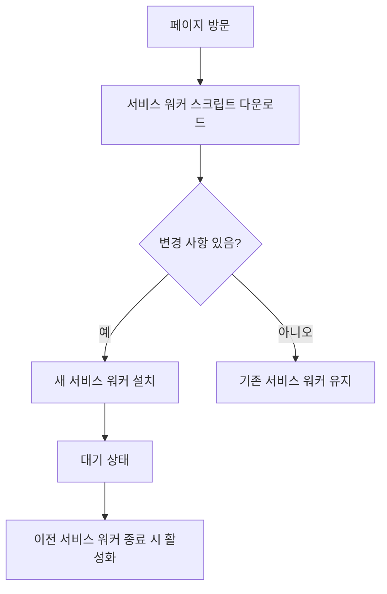
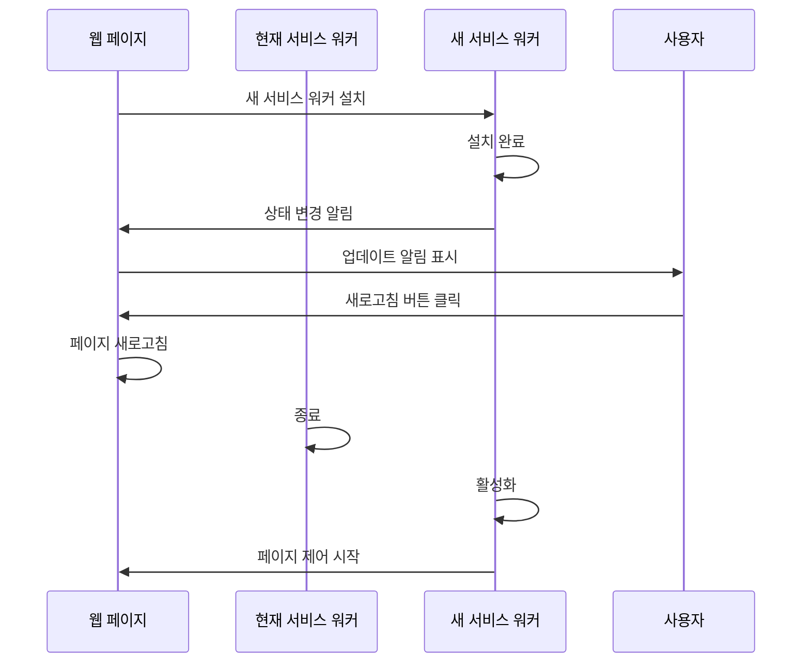

# Chapter 02 서비스 워커 생명주기

## 02-2 서비스 워커 활성화와 업데이트

### 개요
서비스 워커가 설치된 후에는 활성화 단계를 거쳐 페이지를 제어할 수 있게 됩니다. 또한 서비스 워커는 주기적으로 업데이트되어 최신 기능과 버그 수정을 적용할 수 있습니다. 이 섹션에서는 서비스 워커의 활성화 과정과 업데이트 메커니즘을 살펴보고, 효과적인 버전 관리 전략에 대해 알아봅니다.

### 활성화 이벤트 처리

서비스 워커가 설치된 후에는 `activate` 이벤트가 발생합니다. 이 이벤트는 서비스 워커가 활성화되어 페이지를 제어할 준비가 되었음을 나타냅니다.

#### activate 이벤트

`activate` 이벤트는 다음과 같은 상황에서 발생합니다:

1. 서비스 워커가 처음 설치되고 대기 단계를 거친 후
2. 이전 서비스 워커가 더 이상 사용되지 않을 때 (모든 페이지가 닫히거나 `skipWaiting()`이 호출된 경우)
3. 서비스 워커가 업데이트되어 새 버전이 활성화될 때

`activate` 이벤트 핸들러는 주로 다음과 같은 작업에 사용됩니다:

- 이전 캐시 정리 (오래된 캐시 버전 삭제)
- 데이터베이스 마이그레이션
- 새 버전의 서비스 워커에 필요한 설정 초기화

```javascript
self.addEventListener('activate', event => {
  console.log('서비스 워커 활성화 중...');
  
  // waitUntil()을 사용하여 비동기 작업이 완료될 때까지 활성화 단계를 연장
  event.waitUntil(
    // 오래된 캐시 버전 삭제
    caches.keys().then(cacheNames => {
      return Promise.all(
        cacheNames.map(cacheName => {
          // 현재 버전이 아닌 캐시 삭제
          if (cacheName !== 'v2') {
            console.log('오래된 캐시 삭제:', cacheName);
            return caches.delete(cacheName);
          }
        })
      );
    })
  );
});
```

`activate` 이벤트에서도 `event.waitUntil()` 메서드를 사용하여 비동기 작업이 완료될 때까지 활성화 단계를 연장할 수 있습니다. 이는 캐시 정리와 같은 중요한 작업이 완료되기 전에 서비스 워커가 페이지 요청을 처리하지 않도록 합니다.

서비스 워커 활성화 과정은 다음과 같은 흐름으로 진행됩니다:



#### clients.claim() 메서드

기본적으로 서비스 워커는 활성화된 후에도 이미 로드된 페이지는 제어하지 않습니다. 새로 열리는 페이지만 제어하게 됩니다. 이미 열려있는 페이지를 즉시 제어하려면 `clients.claim()` 메서드를 사용합니다:

```javascript
self.addEventListener('activate', event => {
  console.log('서비스 워커 활성화 중...');
  
  // 이미 열려있는 페이지를 즉시 제어
  event.waitUntil(clients.claim());
});
```

`clients.claim()`을 사용하면 활성화된 서비스 워커가 즉시 모든 열린 페이지를 제어할 수 있게 됩니다. 이는 다음과 같은 상황에서 유용합니다:

- 서비스 워커를 처음 설치할 때 즉시 오프라인 기능을 활성화하고 싶은 경우
- 중요한 업데이트를 모든 열린 페이지에 즉시 적용하고 싶은 경우
- 개발 중에 서비스 워커 변경사항을 빠르게 테스트하고 싶은 경우

그러나 `clients.claim()`을 사용할 때는 주의해야 합니다. 페이지가 로드된 후 서비스 워커가 변경되면 예상치 못한 동작이 발생할 수 있습니다. 특히 네트워크 요청 처리 방식이 크게 변경된 경우 문제가 될 수 있습니다.

### 서비스 워커 업데이트 메커니즘

서비스 워커는 웹 애플리케이션의 기능을 개선하거나 버그를 수정하기 위해 주기적으로 업데이트될 수 있습니다. 서비스 워커 업데이트는 자동 또는 수동으로 이루어질 수 있습니다.

#### 자동 업데이트

브라우저는 다음과 같은 상황에서 서비스 워커 스크립트를 자동으로 다시 다운로드하고 업데이트를 확인합니다:

1. 사용자가 서비스 워커가 제어하는 페이지를 방문할 때 (최소 24시간마다)
2. `push` 또는 `sync` 이벤트가 발생할 때
3. 서비스 워커 등록 코드가 실행될 때 (`navigator.serviceWorker.register()` 호출)

브라우저는 서비스 워커 스크립트를 바이트 단위로 비교하여 변경 사항이 있는지 확인합니다. 스크립트가 1바이트라도 변경되었다면, 브라우저는 이를 새 버전으로 간주하고 설치 과정을 시작합니다.



자동 업데이트 과정에서 주의할 점:

- 브라우저의 HTTP 캐시가 서비스 워커 스크립트를 캐싱하면 업데이트가 감지되지 않을 수 있습니다
- 이를 방지하기 위해 서비스 워커 등록 시 `updateViaCache` 옵션을 설정할 수 있습니다

```javascript
navigator.serviceWorker.register('/service-worker.js', {
  updateViaCache: 'none' // 항상 네트워크에서 서비스 워커 스크립트 가져오기
});
```

#### 수동 업데이트

자동 업데이트 외에도 개발자는 `ServiceWorkerRegistration` 객체의 `update()` 메서드를 사용하여 수동으로 서비스 워커 업데이트를 트리거할 수 있습니다:

```javascript
// 서비스 워커 수동 업데이트
navigator.serviceWorker.ready.then(registration => {
  // 서비스 워커 업데이트 확인
  registration.update();
});
```

수동 업데이트는 다음과 같은 상황에서 유용합니다:

- 중요한 업데이트를 즉시 적용해야 할 때
- 사용자에게 업데이트 알림을 표시하고 싶을 때
- 특정 사용자 작업(예: "업데이트 확인" 버튼 클릭) 후 업데이트를 확인하고 싶을 때

수동 업데이트를 구현하는 예제 코드:

```javascript
// 업데이트 버튼 이벤트 리스너
document.getElementById('update-button').addEventListener('click', () => {
  console.log('서비스 워커 업데이트 확인 중...');
  
  navigator.serviceWorker.ready
    .then(registration => {
      // 업데이트 확인
      return registration.update();
    })
    .then(() => {
      console.log('서비스 워커 업데이트 확인 완료');
    })
    .catch(error => {
      console.error('서비스 워커 업데이트 확인 실패:', error);
    });
});
```

### 버전 관리 전략

서비스 워커를 효과적으로 업데이트하려면 체계적인 버전 관리 전략이 필요합니다. 다음은 서비스 워커 버전 관리를 위한 몇 가지 전략입니다:

#### 1. 캐시 버전 관리

캐시 이름에 버전 번호를 포함시켜 서비스 워커 업데이트 시 캐시를 구분할 수 있습니다:

```javascript
const CACHE_VERSION = 'v1.2.3';
const CACHE_NAME = `app-cache-${CACHE_VERSION}`;

self.addEventListener('install', event => {
  event.waitUntil(
    caches.open(CACHE_NAME).then(cache => {
      return cache.addAll([
        '/',
        '/index.html',
        '/styles/main.css',
        '/scripts/main.js'
      ]);
    })
  );
});

self.addEventListener('activate', event => {
  event.waitUntil(
    caches.keys().then(cacheNames => {
      return Promise.all(
        cacheNames.map(cacheName => {
          // 현재 버전이 아닌 캐시 삭제
          if (cacheName.startsWith('app-cache-') && cacheName !== CACHE_NAME) {
            return caches.delete(cacheName);
          }
        })
      );
    })
  );
});
```

#### 2. 서비스 워커 파일 이름 변경

서비스 워커 파일 이름에 버전 번호를 포함시키는 방법도 있습니다:

```javascript
// 버전이 변경될 때마다 파일 이름 업데이트
navigator.serviceWorker.register('/service-worker-v2.js');
```

그러나 이 방법은 등록 코드도 함께 업데이트해야 하므로 권장되지 않습니다.

#### 3. 임포트 스크립트 활용

서비스 워커 파일은 그대로 두고, 버전이 변경되는 별도의 스크립트를 임포트하는 방법:

```javascript
// service-worker.js
importScripts('version.js'); // version.js에는 VERSION 변수가 정의되어 있음

const CACHE_NAME = `app-cache-${VERSION}`;

// 나머지 서비스 워커 코드
```

이 방법을 사용하면 `version.js` 파일만 업데이트하여 서비스 워커를 새 버전으로 인식시킬 수 있습니다.

#### 4. 업데이트 알림 및 제어

새 서비스 워커가 설치되었지만 아직 활성화되지 않은 상태를 감지하여 사용자에게 알림을 표시할 수 있습니다:

```javascript
// 웹 페이지의 JavaScript 코드
navigator.serviceWorker.register('/service-worker.js')
  .then(registration => {
    // 대기 중인 서비스 워커 감지
    registration.addEventListener('updatefound', () => {
      const newWorker = registration.installing;
      
      newWorker.addEventListener('statechange', () => {
        // 새 서비스 워커가 설치 완료되면 사용자에게 알림
        if (newWorker.state === 'installed' && navigator.serviceWorker.controller) {
          console.log('새 버전이 설치되었습니다. 페이지를 새로고침하세요.');
          
          // 사용자에게 업데이트 알림 표시
          showUpdateNotification();
        }
      });
    });
  });

// 업데이트 알림 표시 함수
function showUpdateNotification() {
  const notification = document.createElement('div');
  notification.className = 'update-notification';
  notification.innerHTML = `
    <p>새 버전이 준비되었습니다!</p>
    <button id="refresh-button">새로고침하여 업데이트</button>
  `;
  
  document.body.appendChild(notification);
  
  // 새로고침 버튼 이벤트 리스너
  document.getElementById('refresh-button').addEventListener('click', () => {
    window.location.reload();
  });
}
```

이 코드는 새 서비스 워커가 설치되었지만 아직 활성화되지 않은 상태를 감지하여 사용자에게 알림을 표시합니다. 사용자가 새로고침 버튼을 클릭하면 페이지가 새로고침되고 새 서비스 워커가 활성화됩니다.



### 4가지 키워드로 정리하는 핵심 포인트
1. **활성화(Activation)**: 서비스 워커의 `activate` 이벤트는 서비스 워커가 페이지를 제어할 준비가 되었을 때 발생하며, 주로 오래된 캐시를 정리하는 데 사용됩니다.
2. **clients.claim()**: 활성화된 서비스 워커가 이미 열려있는 페이지를 즉시 제어할 수 있게 하는 메서드로, 서비스 워커 업데이트를 즉시 적용하고 싶을 때 유용합니다.
3. **업데이트 감지(Update Detection)**: 브라우저는 서비스 워커 스크립트를 바이트 단위로 비교하여 변경 사항이 있을 때 새 버전으로 인식하고 업데이트 과정을 시작합니다.
4. **버전 관리(Version Management)**: 캐시 이름에 버전 번호를 포함시키거나 임포트 스크립트를 활용하는 등의 전략을 통해 서비스 워커와 캐시의 버전을 체계적으로 관리할 수 있습니다.

### 확인 문제
1. 서비스 워커의 활성화 이벤트에서 주로 수행하는 작업은?
   - [ ] 필수 리소스 캐싱
   - [ ] 네트워크 요청 가로채기
   - [ ] 오래된 캐시 정리
   - [ ] 푸시 알림 설정

2. 활성화된 서비스 워커가 이미 열려있는 페이지를 즉시 제어하도록 하는 메서드는?
   - [ ] self.activate()
   - [ ] clients.claim()
   - [ ] self.control()
   - [ ] navigator.serviceWorker.claim()

3. 서비스 워커 스크립트가 업데이트되었다고 브라우저가 인식하는 조건은?
   - [ ] 서비스 워커 파일의 수정 날짜가 변경된 경우
   - [ ] 서비스 워커 파일의 내용이 1바이트라도 변경된 경우
   - [ ] 서비스 워커 파일의 이름이 변경된 경우
   - [ ] 서비스 워커 파일의 크기가 10% 이상 변경된 경우

4. 서비스 워커 업데이트를 수동으로 트리거하는 올바른 메서드는?
   - [ ] navigator.serviceWorker.update()
   - [ ] self.update()
   - [ ] registration.update()
   - [ ] serviceWorker.checkForUpdates()

5. 다음 중 서비스 워커 버전 관리 전략으로 적절하지 않은 것은? (복수 응답)
   - [ ] 캐시 이름에 버전 번호 포함
   - [ ] 서비스 워커 파일 이름에 버전 번호 포함
   - [ ] importScripts()를 사용하여 버전 정보가 포함된 파일 임포트
   - [ ] localStorage에 버전 정보 저장
   - [ ] 서비스 워커 코드에 버전 상수 정의

> [정답 및 해설 보기](../answers_and_explanations.md#02-2-서비스-워커-활성화와-업데이트)
