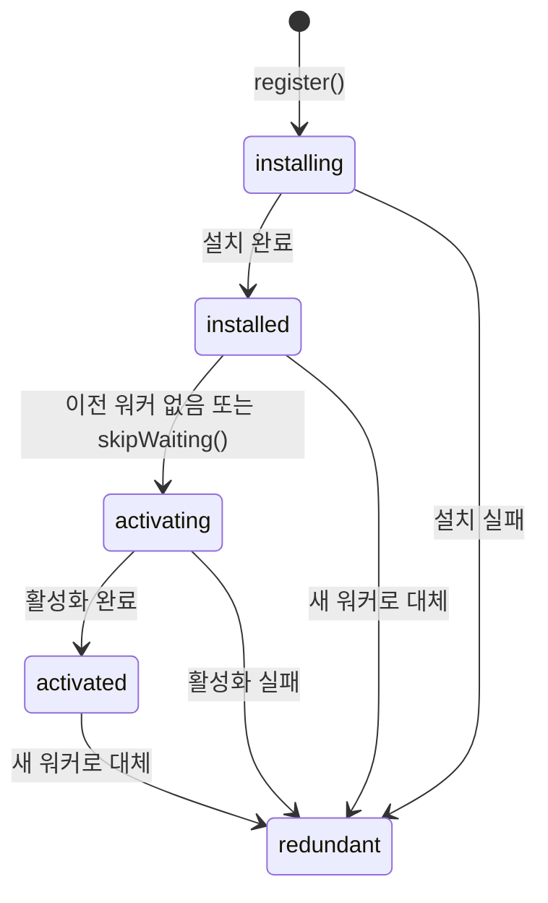
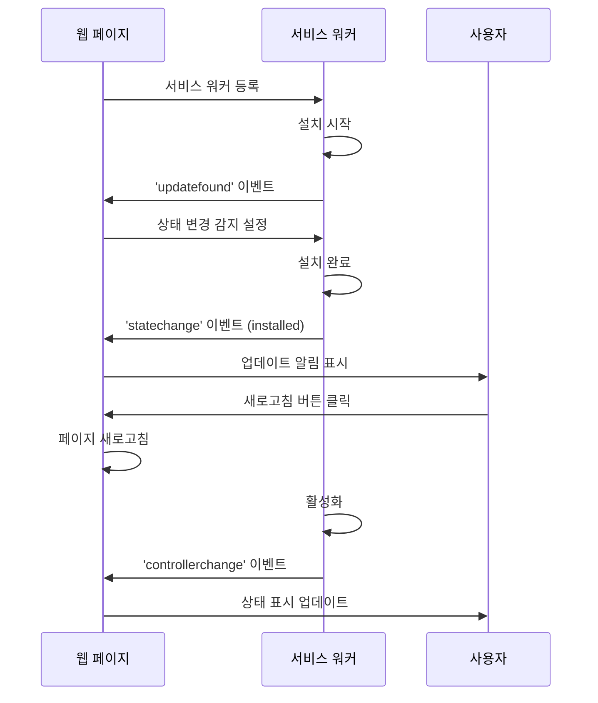
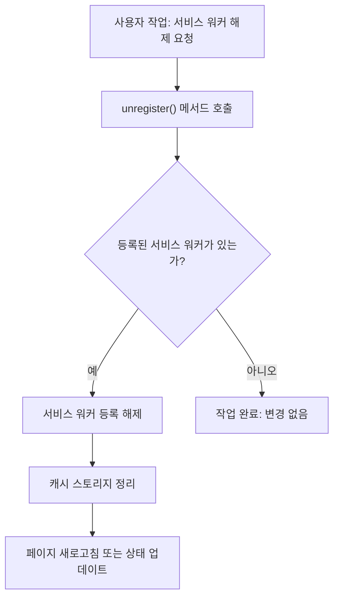

# Chapter 02 서비스 워커 생명주기

## 02-3 서비스 워커 상태 관리

### 개요
서비스 워커는 설치, 활성화, 실행 등 다양한 상태를 가지며, 이러한 상태를 효과적으로 관리하는 것은 웹 애플리케이션의 안정성과 성능에 중요합니다. 이 섹션에서는 서비스 워커의 상태를 확인하고 관리하는 방법, 상태 변경 이벤트를 처리하는 방법, 그리고 필요에 따라 서비스 워커를 제거하는 방법에 대해 알아봅니다.

### 서비스 워커 상태 확인

서비스 워커의 상태를 확인하는 것은 웹 애플리케이션의 동작을 이해하고 디버깅하는 데 중요합니다. 브라우저는 서비스 워커의 상태를 추적하고 관리하기 위한 다양한 API를 제공합니다.

#### ServiceWorkerRegistration 객체

`ServiceWorkerRegistration` 객체는 서비스 워커 등록에 관한 정보를 제공하며, 서비스 워커의 상태를 확인하고 관리하는 데 사용됩니다.

```javascript
navigator.serviceWorker.register('/service-worker.js')
  .then(registration => {
    console.log('서비스 워커 등록 성공:', registration);
    
    // 등록된 서비스 워커의 상태 확인
    checkWorkerState(registration);
  })
  .catch(error => {
    console.error('서비스 워커 등록 실패:', error);
  });

function checkWorkerState(registration) {
  // 설치 중인 서비스 워커
  if (registration.installing) {
    console.log('서비스 워커 상태: 설치 중');
  }
  
  // 대기 중인 서비스 워커
  if (registration.waiting) {
    console.log('서비스 워커 상태: 대기 중');
  }
  
  // 활성화된 서비스 워커
  if (registration.active) {
    console.log('서비스 워커 상태: 활성화됨');
  }
}
```

`ServiceWorkerRegistration` 객체는 다음과 같은 속성을 제공합니다:

- `installing`: 설치 중인 서비스 워커 (없으면 `null`)
- `waiting`: 대기 중인 서비스 워커 (없으면 `null`)
- `active`: 활성화된 서비스 워커 (없으면 `null`)
- `scope`: 서비스 워커의 범위 URL
- `updateViaCache`: 서비스 워커 스크립트 업데이트 방식

또한 다음과 같은 메서드를 제공합니다:

- `update()`: 서비스 워커 업데이트 확인
- `unregister()`: 서비스 워커 등록 해제
- `showNotification()`: 알림 표시
- `getNotifications()`: 활성 알림 가져오기

#### ServiceWorker 객체

`ServiceWorker` 객체는 개별 서비스 워커 인스턴스를 나타내며, 서비스 워커의 현재 상태와 관련 정보를 제공합니다.

```javascript
navigator.serviceWorker.register('/service-worker.js')
  .then(registration => {
    const serviceWorker = registration.installing || registration.waiting || registration.active;
    
    if (serviceWorker) {
      // 서비스 워커의 현재 상태 확인
      console.log('서비스 워커 상태:', serviceWorker.state);
      
      // 상태 변경 이벤트 리스너 등록
      serviceWorker.addEventListener('statechange', event => {
        console.log('서비스 워커 상태 변경:', event.target.state);
      });
    }
  });
```

`ServiceWorker` 객체는 다음과 같은 속성을 제공합니다:

- `state`: 서비스 워커의 현재 상태 (문자열)
  - `"installing"`: 설치 중
  - `"installed"`: 설치 완료 (대기 중)
  - `"activating"`: 활성화 중
  - `"activated"`: 활성화 완료
  - `"redundant"`: 중복(더 이상 사용되지 않음)
- `scriptURL`: 서비스 워커 스크립트의 URL
- `id`: 서비스 워커의 고유 식별자

서비스 워커의 상태 변화는 다음과 같은 흐름으로 진행됩니다:



### 상태 변경 이벤트 처리

서비스 워커의 상태 변경을 감지하고 적절하게 대응하는 것은 웹 애플리케이션의 사용자 경험을 향상시키는 데 중요합니다.

#### 상태 변경 감지

서비스 워커의 상태 변경은 `statechange` 이벤트를 통해 감지할 수 있습니다:

```javascript
navigator.serviceWorker.register('/service-worker.js')
  .then(registration => {
    // 새 서비스 워커 감지
    registration.addEventListener('updatefound', () => {
      // 설치 중인 새 서비스 워커 가져오기
      const newWorker = registration.installing;
      
      // 상태 변경 이벤트 리스너 등록
      newWorker.addEventListener('statechange', () => {
        console.log('서비스 워커 상태 변경:', newWorker.state);
        
        // 상태에 따른 처리
        switch (newWorker.state) {
          case 'installed':
            if (navigator.serviceWorker.controller) {
              console.log('새 버전이 설치되었습니다. 페이지를 새로고침하세요.');
              showUpdateNotification();
            } else {
              console.log('서비스 워커가 처음으로 설치되었습니다.');
              showInstallNotification();
            }
            break;
          case 'redundant':
            console.log('서비스 워커 설치 실패 또는 중복');
            break;
        }
      });
    });
  });
```

#### 컨트롤러 변경 감지

서비스 워커 컨트롤러의 변경은 `controllerchange` 이벤트를 통해 감지할 수 있습니다:

```javascript
// 서비스 워커 컨트롤러 변경 감지
navigator.serviceWorker.addEventListener('controllerchange', () => {
  console.log('활성 서비스 워커가 변경되었습니다.');
  
  // 필요한 경우 페이지 새로고침
  // window.location.reload();
});
```

#### 상태 변경에 따른 UI 업데이트

서비스 워커의 상태 변경에 따라 사용자 인터페이스를 업데이트하여 사용자에게 현재 상태를 알릴 수 있습니다:

```javascript
function updateServiceWorkerStatus() {
  const statusElement = document.getElementById('sw-status');
  
  if (!('serviceWorker' in navigator)) {
    statusElement.textContent = '서비스 워커가 지원되지 않습니다.';
    statusElement.className = 'not-supported';
    return;
  }
  
  if (!navigator.serviceWorker.controller) {
    statusElement.textContent = '서비스 워커가 활성화되지 않았습니다.';
    statusElement.className = 'inactive';
    return;
  }
  
  statusElement.textContent = '서비스 워커가 활성화되었습니다.';
  statusElement.className = 'active';
  
  // 서비스 워커 등록 정보 확인
  navigator.serviceWorker.getRegistration().then(registration => {
    if (registration.waiting) {
      statusElement.textContent = '새 버전이 대기 중입니다.';
      statusElement.className = 'waiting';
    }
  });
}

// 페이지 로드 시 상태 업데이트
window.addEventListener('load', updateServiceWorkerStatus);

// 서비스 워커 컨트롤러 변경 시 상태 업데이트
navigator.serviceWorker.addEventListener('controllerchange', updateServiceWorkerStatus);
```

다음은 서비스 워커 상태 변경에 따른 사용자 알림 흐름을 보여주는 다이어그램입니다:



### 서비스 워커 제거 및 해제

서비스 워커를 더 이상 사용하지 않거나 문제가 발생한 경우, 서비스 워커를 제거하거나 등록을 해제할 수 있습니다.

#### 서비스 워커 등록 해제

`ServiceWorkerRegistration` 객체의 `unregister()` 메서드를 사용하여 서비스 워커 등록을 해제할 수 있습니다:

```javascript
// 서비스 워커 등록 해제
navigator.serviceWorker.getRegistration().then(registration => {
  if (registration) {
    registration.unregister().then(success => {
      if (success) {
        console.log('서비스 워커 등록이 성공적으로 해제되었습니다.');
      } else {
        console.log('서비스 워커 등록 해제에 실패했습니다.');
      }
    });
  }
});
```

또는 특정 스코프의 서비스 워커를 해제할 수도 있습니다:

```javascript
navigator.serviceWorker.getRegistration('/app/').then(registration => {
  if (registration) {
    registration.unregister();
  }
});
```

#### 모든 서비스 워커 등록 해제

웹 애플리케이션의 모든 서비스 워커 등록을 해제하려면 다음과 같이 할 수 있습니다:

```javascript
navigator.serviceWorker.getRegistrations().then(registrations => {
  for (const registration of registrations) {
    registration.unregister();
    console.log(`스코프 '${registration.scope}'의 서비스 워커 등록이 해제되었습니다.`);
  }
});
```

#### 서비스 워커 캐시 정리

서비스 워커를 제거할 때 관련 캐시도 함께 정리하는 것이 좋습니다:

```javascript
// 서비스 워커 등록 해제 및 캐시 정리
function unregisterAndClearCaches() {
  // 모든 캐시 스토리지 삭제
  caches.keys().then(cacheNames => {
    return Promise.all(
      cacheNames.map(cacheName => {
        console.log(`캐시 '${cacheName}' 삭제 중...`);
        return caches.delete(cacheName);
      })
    );
  }).then(() => {
    console.log('모든 캐시가 삭제되었습니다.');
    
    // 서비스 워커 등록 해제
    return navigator.serviceWorker.getRegistrations();
  }).then(registrations => {
    return Promise.all(
      registrations.map(registration => {
        console.log(`서비스 워커 등록 해제 중: ${registration.scope}`);
        return registration.unregister();
      })
    );
  }).then(() => {
    console.log('모든 서비스 워커가 등록 해제되었습니다.');
    
    // 페이지 새로고침
    window.location.reload();
  }).catch(error => {
    console.error('서비스 워커 정리 중 오류 발생:', error);
  });
}
```

#### 사용자 인터페이스에서 서비스 워커 관리

웹 애플리케이션에 서비스 워커 관리 기능을 추가하여 사용자가 서비스 워커를 제어할 수 있게 할 수 있습니다:

```html
<div class="service-worker-controls">
  <h3>서비스 워커 관리</h3>
  <div id="sw-status">상태 확인 중...</div>
  <button id="update-sw">업데이트 확인</button>
  <button id="unregister-sw">서비스 워커 해제</button>
  <button id="clear-cache">캐시 정리</button>
</div>

<script>
  // 상태 표시 업데이트
  function updateStatus() {
    const statusElement = document.getElementById('sw-status');
    
    if (!('serviceWorker' in navigator)) {
      statusElement.textContent = '서비스 워커가 지원되지 않습니다.';
      return;
    }
    
    navigator.serviceWorker.getRegistration().then(registration => {
      if (!registration) {
        statusElement.textContent = '서비스 워커가 등록되지 않았습니다.';
        return;
      }
      
      if (registration.installing) {
        statusElement.textContent = '서비스 워커 설치 중...';
      } else if (registration.waiting) {
        statusElement.textContent = '새 서비스 워커가 대기 중입니다.';
      } else if (registration.active) {
        statusElement.textContent = '서비스 워커가 활성화되었습니다.';
      }
    });
  }
  
  // 초기 상태 업데이트
  updateStatus();
  
  // 업데이트 버튼 이벤트 리스너
  document.getElementById('update-sw').addEventListener('click', () => {
    navigator.serviceWorker.getRegistration().then(registration => {
      if (registration) {
        registration.update();
        console.log('서비스 워커 업데이트 확인 중...');
      }
    });
  });
  
  // 등록 해제 버튼 이벤트 리스너
  document.getElementById('unregister-sw').addEventListener('click', () => {
    navigator.serviceWorker.getRegistration().then(registration => {
      if (registration) {
        registration.unregister().then(() => {
          console.log('서비스 워커가 등록 해제되었습니다.');
          updateStatus();
        });
      }
    });
  });
  
  // 캐시 정리 버튼 이벤트 리스너
  document.getElementById('clear-cache').addEventListener('click', () => {
    caches.keys().then(cacheNames => {
      return Promise.all(
        cacheNames.map(cacheName => caches.delete(cacheName))
      );
    }).then(() => {
      console.log('모든 캐시가 정리되었습니다.');
    });
  });
</script>
```

다음은 서비스 워커 제거 과정을 보여주는 다이어그램입니다:



### 4가지 키워드로 정리하는 핵심 포인트
1. **상태 추적(State Tracking)**: `ServiceWorkerRegistration`과 `ServiceWorker` 객체를 통해 서비스 워커의 현재 상태(설치 중, 대기 중, 활성화됨 등)를 추적하고 관리할 수 있습니다.
2. **이벤트 기반 관리(Event-based Management)**: `updatefound`, `statechange`, `controllerchange` 등의 이벤트를 활용하여 서비스 워커의 상태 변화를 감지하고 적절하게 대응할 수 있습니다.
3. **등록 해제(Unregistration)**: `unregister()` 메서드를 사용하여 서비스 워커 등록을 해제하고, 더 이상 사용하지 않는 서비스 워커를 제거할 수 있습니다.
4. **사용자 인터페이스 통합(UI Integration)**: 서비스 워커의 상태를 사용자 인터페이스에 표시하고, 사용자가 서비스 워커를 관리할 수 있는 컨트롤을 제공하여 사용자 경험을 향상시킬 수 있습니다.

### 확인 문제
1. 서비스 워커의 상태를 확인하기 위해 사용하는 객체는?
   - [ ] ServiceWorkerController
   - [ ] ServiceWorkerRegistration
   - [ ] ServiceWorkerState
   - [ ] ServiceWorkerManager

2. 서비스 워커의 상태 중 '설치는 완료되었지만 아직 활성화되지 않은 상태'를 나타내는 것은?
   - [ ] installing
   - [ ] installed
   - [ ] activating
   - [ ] activated

3. 서비스 워커 등록을 해제하는 메서드는?
   - [ ] registration.remove()
   - [ ] registration.delete()
   - [ ] registration.unregister()
   - [ ] registration.deactivate()

4. 서비스 워커의 상태 변경을 감지하는 이벤트는?
   - [ ] statuschange
   - [ ] statechange
   - [ ] change
   - [ ] update

5. 다음 중 서비스 워커 상태 관리와 관련된 올바른 설명은? (복수 응답)
   - [ ] 서비스 워커의 상태는 `navigator.serviceWorker.state`로 직접 확인할 수 있다.
   - [ ] 새로운 서비스 워커가 설치되면 `updatefound` 이벤트가 발생한다.
   - [ ] 활성화된 서비스 워커가 변경되면 `controllerchange` 이벤트가 발생한다.
   - [ ] 서비스 워커 등록을 해제하면 관련 캐시는 자동으로 삭제된다.
   - [ ] `getRegistrations()` 메서드를 사용하여 모든 서비스 워커 등록을 가져올 수 있다.

> [정답 및 해설 보기](../answers_and_explanations.md#02-3-서비스-워커-상태-관리)
