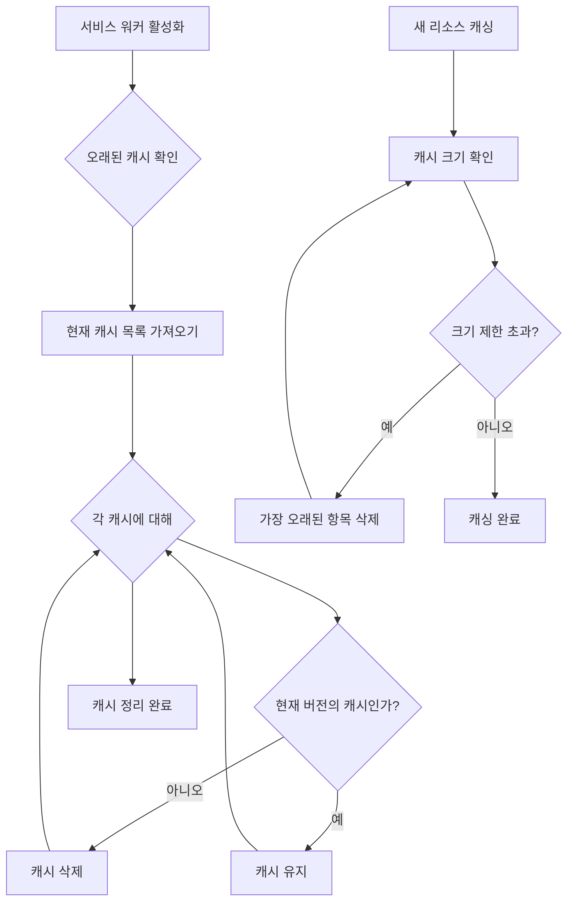

# Chapter 03 서비스 워커와 캐싱

## 03-1 Cache API 기초

### 개요
Cache API는 서비스 워커와 함께 사용되어 웹 애플리케이션의 오프라인 기능과 성능을 향상시키는 핵심 기술입니다. 이 섹션에서는 Cache API의 기본 개념, 캐시 스토리지 작업 방법, 그리고 효율적인 캐시 관리 전략에 대해 알아봅니다. Cache API를 통해 네트워크 요청과 응답을 저장하고 검색하는 방법을 배워 웹 애플리케이션의 사용자 경험을 크게 개선할 수 있습니다.

### Cache API 소개

Cache API는 HTTP 요청과 응답 쌍을 저장하고 관리할 수 있는 브라우저 API입니다. 서비스 워커와 함께 사용하면 네트워크 연결 없이도 웹 애플리케이션이 작동할 수 있게 해주는 강력한 도구입니다.

```javascript
// Cache API 지원 확인
if ('caches' in window) {
  console.log('Cache API를 지원합니다.');
} else {
  console.log('Cache API를 지원하지 않습니다.');
}
```

#### Cache API의 주요 특징

1. **요청-응답 저장**: HTTP 요청과 그에 대한 응답을 키-값 쌍으로 저장합니다.
2. **다양한 리소스 캐싱**: HTML, CSS, JavaScript, 이미지, JSON 등 다양한 형식의 리소스를 캐싱할 수 있습니다.
3. **프로그래밍 방식의 제어**: 캐시의 생성, 읽기, 업데이트, 삭제를 프로그래밍 방식으로 완전히 제어할 수 있습니다.
4. **Promise 기반 API**: 모든 작업이 Promise를 반환하여 비동기 작업을 쉽게 처리할 수 있습니다.
5. **서비스 워커와의 통합**: 서비스 워커의 fetch 이벤트와 함께 사용하여 오프라인 경험을 제공할 수 있습니다.

#### Cache API와 HTTP 캐시의 차이점

Cache API는 브라우저의 HTTP 캐시와는 다른 별도의 저장소입니다. 주요 차이점은 다음과 같습니다:

| 특성 | Cache API | HTTP 캐시 |
|------|-----------|-----------|
| 제어 방식 | 프로그래밍 방식으로 완전히 제어 | HTTP 헤더에 의해 제어 |
| 저장 범위 | 개발자가 명시적으로 지정한 리소스만 저장 | 브라우저가 캐시 가능한 모든 리소스 저장 |
| 수명 관리 | 개발자가 직접 관리 | 헤더의 만료 시간에 따라 자동 관리 |
| 오프라인 지원 | 오프라인 사용을 위해 설계됨 | 주로 성능 향상을 위해 설계됨 |
| 접근 방식 | JavaScript를 통해 접근 | 브라우저에 의해 자동으로 관리됨 |

### 캐시 스토리지 작업

Cache API를 사용하여 캐시 스토리지를 조작하는 기본 작업에는 캐시 열기, 응답 저장, 응답 검색, 항목 삭제 등이 있습니다.

#### 캐시 열기

`caches.open()` 메서드를 사용하여 특정 이름의 캐시를 열거나 생성할 수 있습니다. 이 메서드는 Promise를 반환하며, 해당 Promise는 Cache 객체로 해결됩니다.

```javascript
// 캐시 열기
caches.open('my-cache-v1')
  .then(cache => {
    console.log('캐시가 열렸습니다.');
    // 이제 cache 객체를 사용하여 캐시 작업을 수행할 수 있습니다.
  })
  .catch(error => {
    console.error('캐시를 열지 못했습니다:', error);
  });
```

캐시 이름에 버전 번호를 포함하는 것은 캐시 업데이트 관리에 유용한 방법입니다. 예를 들어, 애플리케이션을 업데이트할 때 'my-cache-v2'와 같은 새 캐시를 생성하고 이전 버전의 캐시를 삭제할 수 있습니다.

#### 캐시에 응답 저장

Cache 객체는 HTTP 요청과 응답을 저장하기 위한 여러 메서드를 제공합니다:

1. **cache.put()**: 단일 요청-응답 쌍을 저장합니다.
2. **cache.add()**: URL을 가져와서 응답을 캐시에 저장합니다.
3. **cache.addAll()**: URL 배열을 가져와서 모든 응답을 캐시에 저장합니다.

```javascript
// 서비스 워커 설치 시 필수 리소스 캐싱
self.addEventListener('install', event => {
  event.waitUntil(
    caches.open('app-shell-v1')
      .then(cache => {
        return cache.addAll([
          '/',
          '/index.html',
          '/styles/main.css',
          '/scripts/main.js',
          '/images/logo.png'
        ]);
      })
  );
});

// cache.put() 사용 예시
fetch('/api/data.json')
  .then(response => {
    // 응답 복제 (응답 스트림은 한 번만 사용할 수 있음)
    const responseClone = response.clone();
    
    caches.open('api-cache-v1')
      .then(cache => {
        // 요청-응답 쌍 저장
        cache.put('/api/data.json', responseClone);
      });
    
    return response;
  })
  .then(response => response.json())
  .then(data => {
    console.log('데이터:', data);
  });
```

`cache.addAll()`은 모든 리소스가 성공적으로 캐시되거나 아무것도 캐시되지 않는 "all or nothing" 방식으로 작동합니다. 하나의 리소스라도 가져오지 못하면 전체 작업이 실패합니다.

#### 캐시에서 응답 검색

`cache.match()` 또는 `caches.match()` 메서드를 사용하여 캐시된 응답을 검색할 수 있습니다:

```javascript
// 특정 캐시에서 응답 검색
caches.open('app-shell-v1')
  .then(cache => {
    return cache.match('/index.html');
  })
  .then(response => {
    if (response) {
      console.log('캐시에서 응답을 찾았습니다.');
      return response;
    } else {
      console.log('캐시에서 응답을 찾지 못했습니다.');
      return fetch('/index.html');
    }
  });

// 모든 캐시에서 응답 검색
caches.match('/index.html')
  .then(response => {
    if (response) {
      console.log('캐시에서 응답을 찾았습니다.');
      return response;
    } else {
      console.log('캐시에서 응답을 찾지 못했습니다.');
      return fetch('/index.html');
    }
  });
```

`caches.match()`는 모든 캐시를 검색하는 반면, `cache.match()`는 특정 캐시만 검색합니다. 두 메서드 모두 일치하는 응답이 없으면 `undefined`를 반환합니다.

다음은 서비스 워커의 fetch 이벤트에서 캐시를 사용하는 예시입니다:

```javascript
self.addEventListener('fetch', event => {
  event.respondWith(
    caches.match(event.request)
      .then(response => {
        // 캐시에서 응답을 찾았으면 반환
        if (response) {
          return response;
        }
        
        // 캐시에 없으면 네트워크에서 가져옴
        return fetch(event.request)
          .then(response => {
            // 유효한 응답인지 확인
            if (!response || response.status !== 200 || response.type !== 'basic') {
              return response;
            }
            
            // 응답 복제 (응답 스트림은 한 번만 사용할 수 있음)
            const responseToCache = response.clone();
            
            // 응답을 캐시에 저장
            caches.open('runtime-cache-v1')
              .then(cache => {
                cache.put(event.request, responseToCache);
              });
            
            return response;
          });
      })
  );
});
```

#### 캐시 항목 삭제

`cache.delete()` 메서드를 사용하여 캐시에서 특정 항목을 삭제할 수 있습니다:

```javascript
// 특정 캐시 항목 삭제
caches.open('app-shell-v1')
  .then(cache => {
    return cache.delete('/old-script.js');
  })
  .then(success => {
    if (success) {
      console.log('캐시 항목이 삭제되었습니다.');
    } else {
      console.log('캐시 항목이 존재하지 않습니다.');
    }
  });
```

`caches.delete()` 메서드를 사용하여 전체 캐시를 삭제할 수도 있습니다:

```javascript
// 전체 캐시 삭제
caches.delete('old-cache-v1')
  .then(success => {
    if (success) {
      console.log('캐시가 삭제되었습니다.');
    } else {
      console.log('캐시가 존재하지 않습니다.');
    }
  });
```

### 캐시 스토리지 관리

효율적인 캐시 관리는 웹 애플리케이션의 성능과 사용자 경험을 유지하는 데 중요합니다. 다음은 캐시 스토리지를 관리하는 몇 가지 방법입니다.

#### 오래된 캐시 정리

서비스 워커가 업데이트될 때 오래된 캐시를 정리하는 것이 좋습니다. 이는 일반적으로 `activate` 이벤트 핸들러에서 수행됩니다:

```javascript
// 현재 사용 중인 캐시 목록
const CURRENT_CACHES = {
  appShell: 'app-shell-v2',
  runtime: 'runtime-cache-v2',
  api: 'api-cache-v2'
};

self.addEventListener('activate', event => {
  event.waitUntil(
    // 모든 캐시 이름 가져오기
    caches.keys()
      .then(cacheNames => {
        // 현재 사용 중인 캐시가 아닌 모든 캐시 삭제
        return Promise.all(
          cacheNames.map(cacheName => {
            // 현재 버전의 캐시 목록에 없는 캐시 삭제
            if (!Object.values(CURRENT_CACHES).includes(cacheName)) {
              console.log('오래된 캐시 삭제:', cacheName);
              return caches.delete(cacheName);
            }
          })
        );
      })
  );
});
```

이 방식을 사용하면 애플리케이션을 업데이트할 때 새 버전의 캐시만 유지하고 오래된 캐시는 자동으로 정리됩니다.

#### 캐시 크기 제한

브라우저는 일반적으로 출처(origin)별로 사용할 수 있는 스토리지 공간에 제한을 둡니다. 캐시 크기가 너무 커지지 않도록 관리하는 것이 중요합니다. 다음은 LRU(Least Recently Used) 방식으로 캐시 항목을 관리하는 예시입니다:

```javascript
// 캐시 항목 수 제한
const MAX_ITEMS = 100;

// 새 항목 추가 시 캐시 크기 확인 및 관리
async function limitCacheSize(cacheName, maxItems) {
  const cache = await caches.open(cacheName);
  const keys = await cache.keys();
  
  if (keys.length > maxItems) {
    // 가장 오래된 항목(첫 번째 항목) 삭제
    await cache.delete(keys[0]);
    // 재귀적으로 호출하여 크기가 제한 이하가 될 때까지 반복
    await limitCacheSize(cacheName, maxItems);
  }
}

// 사용 예시
self.addEventListener('fetch', event => {
  if (event.request.url.includes('/api/')) {
    event.respondWith(
      caches.open('api-cache-v1')
        .then(cache => {
          return fetch(event.request)
            .then(response => {
              // 응답 복제 및 캐시 저장
              cache.put(event.request, response.clone());
              // 캐시 크기 제한
              limitCacheSize('api-cache-v1', MAX_ITEMS);
              return response;
            });
        })
    );
  }
});
```

#### 만료 시간 기반 캐시 관리

일부 리소스는 특정 시간이 지나면 만료되어야 합니다. 다음은 응답에 타임스탬프를 추가하여 만료 시간을 관리하는 방법입니다:

```javascript
// 만료 시간이 있는 응답 저장
function cacheWithExpiration(cacheName, request, response, expirationTime) {
  const now = Date.now();
  const metadata = {
    url: request.url,
    timestamp: now,
    expiration: now + expirationTime
  };
  
  // 메타데이터 저장
  localStorage.setItem(`cache-expiration:${request.url}`, JSON.stringify(metadata));
  
  // 응답 캐싱
  return caches.open(cacheName)
    .then(cache => cache.put(request, response));
}

// 만료 여부 확인 후 응답 검색
function getCachedResponseWithExpiration(cacheName, request) {
  const metadataKey = `cache-expiration:${request.url}`;
  const metadataStr = localStorage.getItem(metadataKey);
  
  if (!metadataStr) {
    return Promise.resolve(null);
  }
  
  const metadata = JSON.parse(metadataStr);
  const now = Date.now();
  
  // 만료 시간 확인
  if (now > metadata.expiration) {
    // 만료된 항목 삭제
    localStorage.removeItem(metadataKey);
    return caches.open(cacheName)
      .then(cache => cache.delete(request))
      .then(() => null);
  }
  
  // 만료되지 않은 경우 캐시에서 응답 검색
  return caches.open(cacheName)
    .then(cache => cache.match(request));
}

// 사용 예시
self.addEventListener('fetch', event => {
  if (event.request.url.includes('/api/')) {
    event.respondWith(
      getCachedResponseWithExpiration('api-cache-v1', event.request)
        .then(cachedResponse => {
          if (cachedResponse) {
            return cachedResponse;
          }
          
          return fetch(event.request)
            .then(response => {
              const responseClone = response.clone();
              // 1시간(3600000ms) 후 만료되는 캐시 저장
              cacheWithExpiration('api-cache-v1', event.request, responseClone, 3600000);
              return response;
            });
        })
    );
  }
});
```

이 방법은 localStorage를 사용하여 메타데이터를 저장하므로, 서비스 워커와 웹 페이지 간의 통신이 필요할 수 있습니다.

#### 캐시 상태 모니터링

웹 애플리케이션에서 캐시 상태를 모니터링하는 기능을 추가하면 디버깅과 관리에 도움이 됩니다:

```javascript
// 캐시 상태 정보 가져오기
async function getCacheStats() {
  const cacheNames = await caches.keys();
  const stats = {};
  
  for (const cacheName of cacheNames) {
    const cache = await caches.open(cacheName);
    const requests = await cache.keys();
    
    stats[cacheName] = {
      count: requests.length,
      urls: requests.map(request => request.url)
    };
  }
  
  return stats;
}

// 웹 페이지에서 사용 예시
document.getElementById('show-cache-stats').addEventListener('click', async () => {
  const stats = await getCacheStats();
  console.table(stats);
  
  // 결과를 UI에 표시
  const statsContainer = document.getElementById('cache-stats');
  statsContainer.innerHTML = '';
  
  for (const [cacheName, data] of Object.entries(stats)) {
    const cacheInfo = document.createElement('div');
    cacheInfo.innerHTML = `
      <h3>${cacheName}</h3>
      <p>항목 수: ${data.count}</p>
      <details>
        <summary>캐시된 URL 목록</summary>
        <ul>
          ${data.urls.map(url => `<li>${url}</li>`).join('')}
        </ul>
      </details>
    `;
    statsContainer.appendChild(cacheInfo);
  }
});
```

다음은 캐시 관리 흐름을 보여주는 다이어그램입니다:



### 좀 더 알아보기: 캐시 스토리지 디버깅

브라우저 개발자 도구를 사용하여 Cache Storage를 검사하고 디버깅할 수 있습니다. 대부분의 최신 브라우저는 개발자 도구에서 Cache Storage를 확인할 수 있는 기능을 제공합니다.

#### Chrome DevTools에서 캐시 스토리지 확인

1. Chrome 개발자 도구 열기 (F12 또는 Ctrl+Shift+I)
2. Application 탭 선택
3. 왼쪽 패널에서 Cache Storage 확장
4. 캐시 이름을 클릭하여 내용 확인

여기서 캐시된 리소스를 확인하고, 개별 항목을 삭제하거나, 전체 캐시를 지울 수 있습니다.

#### Firefox DevTools에서 캐시 스토리지 확인

1. Firefox 개발자 도구 열기 (F12 또는 Ctrl+Shift+I)
2. Storage 탭 선택
3. 왼쪽 패널에서 Cache Storage 확장
4. 캐시 이름을 클릭하여 내용 확인

### 6가지 키워드로 정리하는 핵심 포인트
1. **캐시 스토리지(Cache Storage)**: 서비스 워커와 함께 사용되는 브라우저 API로, HTTP 요청과 응답을 저장하고 관리하는 키-값 저장소입니다.
2. **요청-응답 쌍(Request-Response Pairs)**: Cache API는 HTTP 요청 객체를 키로, 응답 객체를 값으로 저장하여 네트워크 요청을 가로채고 캐시된 응답을 제공할 수 있습니다.
3. **캐시 관리(Cache Management)**: 캐시 버전 관리, 오래된 캐시 정리, 크기 제한 등을 통해 효율적인 캐시 스토리지 사용이 가능합니다.
4. **Promise 기반 API(Promise-based API)**: Cache API의 모든 메서드는 Promise를 반환하여 비동기 작업을 쉽게 처리할 수 있습니다.
5. **오프라인 지원(Offline Support)**: Cache API를 사용하면 네트워크 연결 없이도 웹 애플리케이션이 작동할 수 있도록 리소스를 미리 캐싱할 수 있습니다.
6. **프로그래밍 방식 제어(Programmatic Control)**: 개발자가 캐시의 생성, 읽기, 업데이트, 삭제를 완전히 제어할 수 있어 다양한 캐싱 전략을 구현할 수 있습니다.

### 확인 문제
1. Cache API의 주요 목적은 무엇인가요?
   - [ ] 브라우저 히스토리 관리
   - [ ] HTTP 요청과 응답 쌍의 저장 및 관리
   - [ ] 사용자 인증 정보 저장
   - [ ] 웹 페이지 성능 측정

2. 캐시에 응답을 저장하기 위해 사용하는 메서드가 아닌 것은?
   - [ ] cache.put()
   - [ ] cache.add()
   - [ ] cache.addAll()
   - [ ] cache.store()

3. 캐시에서 응답을 검색하는 메서드는?
   - [ ] cache.get()
   - [ ] cache.find()
   - [ ] cache.match()
   - [ ] cache.retrieve()

4. 서비스 워커의 어떤 이벤트에서 주로 오래된 캐시를 정리하나요?
   - [ ] install
   - [ ] activate
   - [ ] fetch
   - [ ] message

5. Cache API와 HTTP 캐시의 차이점으로 올바른 것은? (복수 응답)
   - [ ] Cache API는 프로그래밍 방식으로 완전히 제어할 수 있다.
   - [ ] HTTP 캐시는 JavaScript로 직접 접근할 수 있다.
   - [ ] Cache API는 서비스 워커 없이도 사용할 수 있다.
   - [ ] HTTP 캐시는 HTTP 헤더에 의해 제어된다.
   - [ ] Cache API는 오프라인 사용을 위해 설계되었다.

> [정답 및 해설 보기](../answers_and_explanations.md#03-1-cache-api-기초)
