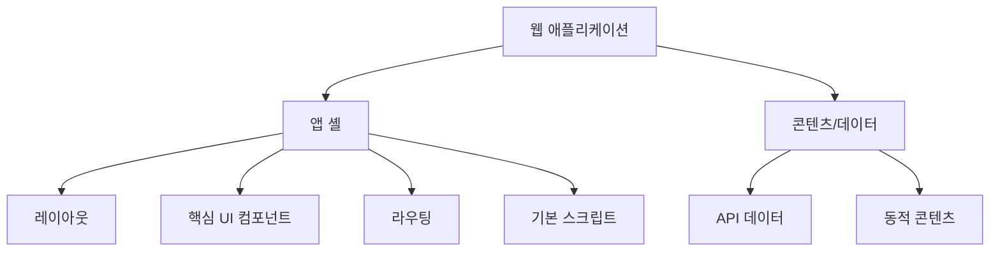
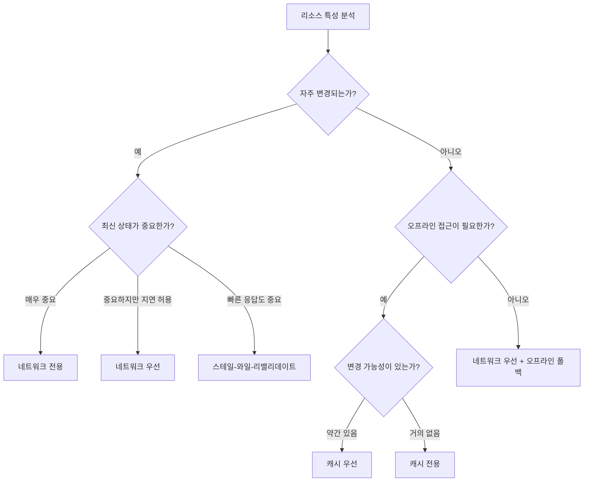

# Chapter 03 서비스 워커와 캐싱

## 03-2 캐싱 전략

### 개요
서비스 워커를 사용할 때 효과적인 캐싱 전략을 선택하는 것은 웹 애플리케이션의 성능과 오프라인 기능을 최적화하는 데 매우 중요합니다. 이 섹션에서는 다양한 캐싱 전략의 특징, 장단점, 그리고 각 전략이 적합한 상황에 대해 알아봅니다. 적절한 캐싱 전략을 이해하고 구현함으로써 사용자 경험을 크게 향상시킬 수 있습니다.

### 캐시 우선 전략 (Cache First)

캐시 우선 전략은 네트워크 요청이 발생할 때 먼저 캐시에서 응답을 찾고, 캐시에 없는 경우에만 네트워크에서 리소스를 가져오는 방식입니다. 이 전략은 성능을 최우선으로 하며, 네트워크 요청을 최소화하는 데 중점을 둡니다.

```javascript
self.addEventListener('fetch', event => {
  event.respondWith(
    caches.match(event.request)
      .then(cachedResponse => {
        // 캐시에서 응답을 찾았으면 반환
        if (cachedResponse) {
          return cachedResponse;
        }
        
        // 캐시에 없으면 네트워크에서 가져옴
        return fetch(event.request)
          .then(response => {
            // 유효한 응답인지 확인
            if (!response || response.status !== 200 || response.type !== 'basic') {
              return response;
            }
            
            // 응답 복제 및 캐시 저장
            const responseToCache = response.clone();
            caches.open('cache-v1')
              .then(cache => {
                cache.put(event.request, responseToCache);
              });
            
            return response;
          });
      })
  );
});
```

#### 장점
- 네트워크 요청 감소로 인한 빠른 응답 시간
- 대역폭 사용량 감소
- 오프라인 상태에서도 캐시된 리소스 사용 가능

#### 단점
- 캐시된 콘텐츠가 오래되었을 수 있음
- 새로운 콘텐츠로 업데이트되지 않을 수 있음
- 캐시 관리가 필요함

#### 적합한 상황
- 정적 자산(CSS, JavaScript, 이미지, 폰트 등)
- 자주 변경되지 않는 콘텐츠
- 오프라인 우선 애플리케이션

### 네트워크 우선 전략 (Network First)

네트워크 우선 전략은 먼저 네트워크에서 리소스를 가져오려고 시도하고, 네트워크 요청이 실패하거나 시간이 초과되면 캐시에서 응답을 제공하는 방식입니다. 이 전략은 최신 콘텐츠를 우선시하면서도 오프라인 기능을 제공합니다.

```javascript
self.addEventListener('fetch', event => {
  event.respondWith(
    fetch(event.request)
      .then(response => {
        // 네트워크 응답 복제 및 캐시 저장
        const responseToCache = response.clone();
        caches.open('cache-v1')
          .then(cache => {
            cache.put(event.request, responseToCache);
          });
        
        return response;
      })
      .catch(() => {
        // 네트워크 요청 실패 시 캐시에서 응답 제공
        return caches.match(event.request);
      })
  );
});
```

#### 장점
- 항상 최신 콘텐츠를 우선적으로 제공
- 네트워크 연결이 없을 때 폴백으로 캐시 사용
- 캐시가 지속적으로 업데이트됨

#### 단점
- 네트워크 요청이 항상 발생하므로 대역폭 사용량이 높음
- 네트워크 응답을 기다려야 하므로 응답 시간이 느릴 수 있음
- 네트워크 연결이 느리거나 불안정한 경우 사용자 경험이 저하될 수 있음

#### 적합한 상황
- 자주 업데이트되는 API 응답
- 최신 데이터가 중요한 콘텐츠(뉴스, 주식 정보 등)
- 네트워크 연결이 대부분 안정적인 환경

### 캐시 전용 전략 (Cache Only)

캐시 전용 전략은 오직 캐시에서만 리소스를 제공하고 네트워크 요청을 전혀 하지 않는 방식입니다. 이 전략은 미리 캐시된 리소스에만 의존하므로, 설치 단계에서 필요한 모든 리소스를 캐시해야 합니다.

```javascript
self.addEventListener('fetch', event => {
  event.respondWith(
    caches.match(event.request)
      .then(cachedResponse => {
        if (cachedResponse) {
          return cachedResponse;
        }
        // 캐시에 없는 경우 오류 응답 반환
        return new Response('Resource not found in cache', {
          status: 404,
          statusText: 'Not Found'
        });
      })
  );
});
```

#### 장점
- 네트워크 요청이 전혀 없어 매우 빠른 응답 시간
- 대역폭 사용량 없음
- 완전한 오프라인 작동 보장

#### 단점
- 콘텐츠가 절대 업데이트되지 않음
- 모든 필요한 리소스를 미리 캐시해야 함
- 캐시되지 않은 리소스에 접근할 수 없음

#### 적합한 상황
- 앱 셸(App Shell) 아키텍처의 핵심 UI 컴포넌트
- 변경되지 않는 정적 자산
- 완전한 오프라인 경험이 필요한 부분

#### 앱 셸(App Shell) 아키텍처란?

앱 셸 아키텍처는 웹 애플리케이션의 최소한의 HTML, CSS, JavaScript를 캐싱하여 사용자에게 즉각적인 로딩 경험을 제공하는 접근 방식입니다. 앱 셸은 네이티브 앱과 유사한 사용자 경험을 제공하기 위한 기본 구조로, 다음과 같은 특징이 있습니다:

- 애플리케이션의 핵심 인프라와 UI 구성 요소를 포함하지만, 특정 데이터는 포함하지 않습니다.
- 오프라인에서도 즉시 로드되며, 콘텐츠는 사용 가능해지면 표시됩니다.
- 반복 방문 시 화면이 즉시 표시되어 사용자 경험이 향상됩니다.
- 데이터는 별도로 로드되어 앱 셸과 분리됩니다.



앱 셸 아키텍처는 Progressive Web App(PWA)의 핵심 개념 중 하나로, 서비스 워커와 캐시 API를 활용하여 구현됩니다. 앱 셸은 변경 빈도가 낮기 때문에 캐시 전용 전략을 사용하여 캐싱하는 것이 적합합니다.

### 네트워크 전용 전략 (Network Only)

네트워크 전용 전략은 항상 네트워크에서만 리소스를 가져오고 캐시를 사용하지 않는 방식입니다. 이 전략은 항상 최신 데이터가 필요하고 캐싱이 적합하지 않은 경우에 사용됩니다.

```javascript
self.addEventListener('fetch', event => {
  event.respondWith(
    fetch(event.request)
      .catch(error => {
        // 네트워크 요청 실패 시 오류 응답 반환
        return new Response('Network request failed', {
          status: 503,
          statusText: 'Service Unavailable'
        });
      })
  );
});
```

#### 장점
- 항상 최신 콘텐츠 제공
- 캐시 관리 오버헤드 없음
- 민감한 데이터가 캐시되지 않음

#### 단점
- 오프라인 상태에서 작동하지 않음
- 네트워크 요청이 항상 발생하므로 대역폭 사용량이 높음
- 네트워크 연결이 느리거나 불안정한 경우 사용자 경험이 저하됨

#### 적합한 상황
- 실시간 데이터(채팅, 실시간 분석 등)
- 개인 정보 또는 민감한 데이터
- 항상 최신 상태여야 하는 결제 정보

### 스테일-와일-리밸리데이트 전략 (Stale-While-Revalidate)

스테일-와일-리밸리데이트 전략은 캐시된 응답을 즉시 반환하면서 동시에 네트워크 요청을 보내 캐시를 업데이트하는 방식입니다. 이 전략은 빠른 응답과 최신 콘텐츠 사이의 균형을 맞추는 데 중점을 둡니다.

```javascript
self.addEventListener('fetch', event => {
  event.respondWith(handleStaleWhileRevalidate(event.request));
});

async function handleStaleWhileRevalidate(request) {
  // 캐시에서 응답 확인
  const cachedResponse = await caches.match(request);
  
  // 백그라운드에서 네트워크 요청 및 캐시 업데이트
  const fetchPromise = fetch(request)
    .then(async (networkResponse) => {
      // 유효한 응답인지 확인
      if (networkResponse && networkResponse.status === 200) {
        const responseToCache = networkResponse.clone();
        const cache = await caches.open('cache-v1');
        cache.put(request, responseToCache);
      }
      return networkResponse;
    })
    .catch(error => {
      console.error('네트워크 요청 실패:', error);
      throw error;
    });
  
  // 캐시된 응답이 있으면 반환, 없으면 네트워크 응답 기다림
  return cachedResponse || fetchPromise;
}
```

#### 장점
- 캐시된 콘텐츠를 즉시 제공하여 빠른 응답 시간
- 백그라운드에서 캐시가 지속적으로 업데이트됨
- 다음 요청 시 최신 콘텐츠 제공

#### 단점
- 캐시된 콘텐츠가 최신 상태가 아닐 수 있음
- 네트워크 요청이 여전히 발생하므로 대역폭 사용
- 구현이 다소 복잡함

#### 적합한 상황
- 블로그 포스트, 뉴스 기사 등 콘텐츠
- 빠른 응답이 중요하지만 최신 상태도 유지해야 하는 경우
- 사용자 인터페이스 요소

### 캐시 폴백 전략 (Cache Fallback)

캐시 폴백 전략은 네트워크 우선 전략의 변형으로, 네트워크 요청이 실패할 경우 캐시로 폴백하고, 캐시에도 없는 경우 기본 오프라인 페이지나 이미지를 제공하는 방식입니다.

```javascript
self.addEventListener('fetch', event => {
  event.respondWith(handleCacheFallback(event.request));
});

async function handleCacheFallback(request) {
  try {
    // 먼저 네트워크에서 시도
    const response = await fetch(request);
    
    // 네트워크 응답 복제 및 캐시 저장
    const cache = await caches.open('cache-v1');
    cache.put(request, response.clone());
    
    return response;
  } catch (error) {
    // 네트워크 실패 시 캐시에서 시도
    const cachedResponse = await caches.match(request);
    if (cachedResponse) return cachedResponse;
    
    // 캐시에도 없는 경우 요청 유형에 따라 기본 응답 제공
    const acceptHeader = request.headers.get('accept');
    
    // HTML 요청인 경우 오프라인 페이지 제공
    if (acceptHeader?.includes('text/html')) {
      const offlineHtml = await caches.match('/offline.html');
      if (offlineHtml) return offlineHtml;
    }
    
    // 이미지 요청인 경우 기본 이미지 제공
    if (request.url.match(/\.(jpe?g|png|gif|svg)$/)) {
      const offlineImage = await caches.match('/images/offline-image.png');
      if (offlineImage) return offlineImage;
    }
    
    // 그 외의 경우 기본 오프라인 응답
    return new Response('Offline content not available', {
      status: 503,
      statusText: 'Service Unavailable'
    });
  }
}
```

#### 장점
- 네트워크 실패 시 사용자 경험 향상
- 리소스 유형별로 다른 폴백 제공 가능
- 오프라인 상태에서도 기본적인 기능 유지

#### 단점
- 구현이 복잡할 수 있음
- 폴백 리소스를 미리 준비해야 함
- 사용자가 오래된 콘텐츠를 볼 수 있음

#### 적합한 상황
- 일반적인 웹 애플리케이션
- 오프라인 경험을 개선하고 싶은 경우
- 네트워크 연결이 불안정한 환경

### 적절한 전략 선택 방법

웹 애플리케이션의 다양한 리소스에 대해 서로 다른 캐싱 전략을 적용하는 것이 일반적입니다. 적절한 전략을 선택하기 위해 고려해야 할 요소들은 다음과 같습니다:

#### 리소스 유형에 따른 전략 선택

| 리소스 유형 | 권장 전략 | 이유 |
|------------|----------|------|
| HTML | 네트워크 우선 | 최신 콘텐츠 제공이 중요 |
| CSS, JS | 캐시 우선 또는 스테일-와일-리밸리데이트 | 성능 향상, 점진적 업데이트 |
| 이미지 | 캐시 우선 | 대역폭 절약, 빠른 로딩 |
| 폰트 | 캐시 전용 | 변경 빈도가 낮음 |
| API 데이터 | 네트워크 우선 또는 스테일-와일-리밸리데이트 | 최신 데이터 중요, 오프라인 폴백 |
| 중요 사용자 데이터 | 네트워크 전용 | 항상 최신 상태 유지 필요 |

#### 결정 프로세스

다음 질문들을 통해 적절한 캐싱 전략을 결정할 수 있습니다:

1. **리소스가 얼마나 자주 변경되나요?**
   - 자주 변경됨 → 네트워크 우선 또는 스테일-와일-리밸리데이트
   - 거의 변경되지 않음 → 캐시 우선 또는 캐시 전용

2. **오프라인 작동이 중요한가요?**
   - 매우 중요 → 캐시 우선 또는 캐시 전용
   - 덜 중요 → 네트워크 우선 또는 네트워크 전용

3. **응답 속도가 중요한가요?**
   - 매우 중요 → 캐시 우선 또는 스테일-와일-리밸리데이트
   - 정확성이 더 중요 → 네트워크 우선

4. **데이터의 민감도는 어떤가요?**
   - 높음 → 네트워크 전용
   - 낮음 → 다른 전략 고려

다음은 리소스 특성에 따른 캐싱 전략 선택 흐름도입니다:



#### 하이브리드 접근법

실제 애플리케이션에서는 여러 전략을 조합하여 사용하는 것이 일반적입니다. 다음은 URL 패턴에 따라 다른 전략을 적용하는 예시입니다:

```javascript
self.addEventListener('fetch', event => {
  const url = new URL(event.request.url);
  
  // HTML 페이지에는 네트워크 우선 전략 적용
  if (event.request.mode === 'navigate') {
    event.respondWith(networkFirst(event.request));
    return;
  }
  
  // API 요청에는 스테일-와일-리밸리데이트 전략 적용
  if (url.pathname.startsWith('/api/')) {
    event.respondWith(staleWhileRevalidate(event.request));
    return;
  }
  
  // 이미지에는 캐시 우선 전략 적용
  if (event.request.destination === 'image') {
    event.respondWith(cacheFirst(event.request));
    return;
  }
  
  // CSS, JS 등 정적 자산에는 캐시 우선 전략 적용
  if (event.request.destination === 'script' || 
      event.request.destination === 'style') {
    event.respondWith(cacheFirst(event.request));
    return;
  }
  
  // 기본적으로 네트워크 우선 전략 적용
  event.respondWith(networkFirst(event.request));
});

// 네트워크 우선 전략 구현
async function networkFirst(request) {
  try {
    // 네트워크에서 리소스 가져오기 시도
    const response = await fetch(request);
    
    // 응답 복제 및 캐시 저장
    const cache = await caches.open('dynamic-cache-v1');
    cache.put(request, response.clone());
    
    return response;
  } catch (error) {
    // 네트워크 실패 시 캐시에서 시도
    const cachedResponse = await caches.match(request);
    if (cachedResponse) return cachedResponse;
    
    // 오프라인 폴백 - 네비게이션 요청인 경우 오프라인 페이지 제공
    if (request.mode === 'navigate') {
      const offlineHtml = await caches.match('/offline.html');
      if (offlineHtml) return offlineHtml;
    }
    
    // 기본 오프라인 응답
    return new Response('Offline content not available');
  }
}

// 캐시 우선 전략 구현
async function cacheFirst(request) {
  // 캐시에서 먼저 확인
  const cachedResponse = await caches.match(request);
  
  // 캐시에 있으면 즉시 반환 (early return)
  if (cachedResponse) return cachedResponse;
  
  try {
    // 캐시에 없으면 네트워크에서 가져오기
    const response = await fetch(request);
    
    // 응답 복제 및 캐시 저장
    const cache = await caches.open('static-cache-v1');
    cache.put(request, response.clone());
    
    return response;
  } catch (error) {
    console.error('네트워크 요청 실패:', error);
    throw error;
  }
}

// 스테일-와일-리밸리데이트 전략 구현
async function staleWhileRevalidate(request) {
  const cachedResponse = await caches.match(request);
  
  // 백그라운드에서 네트워크 요청 및 캐시 업데이트 (비동기적으로 처리)
  fetch(request)
    .then(networkResponse => {
      const cache = caches.open('api-cache-v1')
        .then(cache => cache.put(request, networkResponse.clone()));
      return cache;
    })
    .catch(error => console.error('백그라운드 캐시 업데이트 실패:', error));
  
  // 캐시된 응답이 있으면 즉시 반환, 없으면 네트워크 요청 결과 반환
  return cachedResponse || fetch(request);
}
```

### 7가지 키워드로 정리하는 핵심 포인트
1. **캐시 우선(Cache First)**: 먼저 캐시에서 응답을 찾고, 없는 경우에만 네트워크에서 가져오는 전략으로, 정적 자산에 적합합니다.
2. **네트워크 우선(Network First)**: 먼저 네트워크에서 리소스를 가져오려고 시도하고, 실패 시 캐시에서 응답을 제공하는 전략으로, 최신 데이터가 중요한 경우에 적합합니다.
3. **캐시 전용(Cache Only)**: 오직 캐시에서만 리소스를 제공하는 전략으로, 변경되지 않는 정적 자산에 적합합니다.
4. **네트워크 전용(Network Only)**: 항상 네트워크에서만 리소스를 가져오는 전략으로, 실시간 데이터나 민감한 정보에 적합합니다.
5. **스테일-와일-리밸리데이트(Stale-While-Revalidate)**: 캐시된 응답을 즉시 반환하면서 동시에 캐시를 업데이트하는 전략으로, 빠른 응답과 최신 콘텐츠 사이의 균형이 필요한 경우에 적합합니다.
6. **캐시 폴백(Cache Fallback)**: 네트워크 요청이 실패할 경우 캐시로 폴백하고, 캐시에도 없는 경우 기본 오프라인 콘텐츠를 제공하는 전략입니다.
7. **하이브리드 접근법(Hybrid Approach)**: 리소스 유형과 중요도에 따라 여러 캐싱 전략을 조합하여 사용하는 방식으로, 실제 애플리케이션에서 가장 효과적입니다.

### 확인 문제
1. 정적 자산(CSS, JavaScript, 이미지)에 가장 적합한 캐싱 전략은 무엇인가요?
   - [ ] 네트워크 우선
   - [ ] 캐시 우선
   - [ ] 네트워크 전용
   - [ ] 캐시 폴백

2. 다음 중 스테일-와일-리밸리데이트 전략의 특징이 아닌 것은?
   - [ ] 캐시된 응답을 즉시 반환한다
   - [ ] 백그라운드에서 네트워크 요청을 보낸다
   - [ ] 네트워크 요청이 실패하면 오류를 반환한다
   - [ ] 캐시가 지속적으로 업데이트된다

3. 실시간 채팅 메시지나 금융 거래 데이터와 같은 항상 최신 상태여야 하는 데이터에 가장 적합한 전략은?
   - [ ] 캐시 우선
   - [ ] 네트워크 우선
   - [ ] 네트워크 전용
   - [ ] 캐시 전용

4. 캐시 폴백 전략의 주요 목적은 무엇인가요?
   - [ ] 대역폭 사용량 최소화
   - [ ] 응답 시간 최적화
   - [ ] 오프라인 사용자 경험 향상
   - [ ] 캐시 저장 공간 절약

5. 다음 중 캐싱 전략 선택 시 고려해야 할 요소가 아닌 것은? (복수 응답)
   - [ ] 리소스가 얼마나 자주 변경되는지
   - [ ] 리소스의 파일 크기
   - [ ] 브라우저의 종류
   - [ ] 오프라인 작동의 중요성
   - [ ] 데이터의 민감도

6. 앱 셸(App Shell) 아키텍처의 핵심 UI 컴포넌트에 가장 적합한 캐싱 전략은?
   - [ ] 네트워크 우선
   - [ ] 캐시 전용
   - [ ] 네트워크 전용
   - [ ] 스테일-와일-리밸리데이트

7. 블로그 포스트나 뉴스 기사와 같이 빠른 응답이 중요하지만 최신 상태도 유지해야 하는 콘텐츠에 가장 적합한 전략은?
   - [ ] 캐시 우선
   - [ ] 네트워크 우선
   - [ ] 스테일-와일-리밸리데이트
   - [ ] 캐시 전용

> [정답 및 해설 보기](../answers_and_explanations.md#03-2-캐싱-전략)
