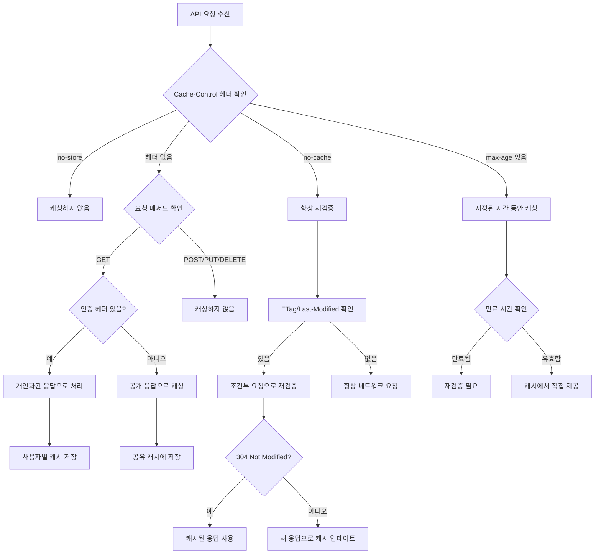

# Chapter 03 서비스 워커와 캐싱

## 03-3 동적 콘텐츠 캐싱

### 개요
동적 콘텐츠 캐싱은 서비스 워커를 사용하여 API 응답이나 동적으로 생성되는 콘텐츠를 효과적으로 캐싱하는 방법을 다룹니다. 정적 자산과 달리 동적 콘텐츠는 자주 변경되거나 사용자별로 다른 내용을 제공하기 때문에 특별한 캐싱 전략이 필요합니다. 이 섹션에서는 API 응답 캐싱, 조건부 캐싱, 캐시 만료 및 갱신, 헤더 기반 캐싱 결정 등 동적 콘텐츠를 효과적으로 캐싱하는 다양한 기법을 알아봅니다.

### API 응답 캐싱

API 응답 캐싱은 서버에서 제공하는 데이터를 캐시하여 네트워크 요청을 줄이고 애플리케이션 성능을 향상시키는 기법입니다. API 응답은 일반적으로 JSON 형식으로 제공되며, 사용자 정보, 제품 목록, 뉴스 피드 등 다양한 데이터를 포함할 수 있습니다.

#### 기본 API 응답 캐싱

다음은 API 응답을 캐싱하는 기본적인 예시입니다:

```javascript
self.addEventListener('fetch', event => {
  // API 요청인지 확인
  if (event.request.url.includes('/api/')) {
    event.respondWith(
      caches.open('api-cache-v1')
        .then(cache => {
          return fetch(event.request)
            .then(response => {
              // 응답 복제 및 캐시 저장
              const responseToCache = response.clone();
              cache.put(event.request, responseToCache);
              return response;
            })
            .catch(() => {
              // 네트워크 요청 실패 시 캐시에서 응답 제공
              return cache.match(event.request);
            });
        })
    );
  }
});
```

#### 타임스탬프 기반 캐싱

API 응답을 캐시할 때 타임스탬프를 함께 저장하여 캐시의 신선도를 관리할 수 있습니다:

```javascript
self.addEventListener('fetch', event => {
  if (event.request.url.includes('/api/')) {
    event.respondWith(
      caches.open('api-cache-v1')
        .then(async cache => {
          // 캐시에서 응답 확인
          const cachedResponse = await cache.match(event.request);
          
          if (cachedResponse) {
            // 캐시된 응답의 타임스탬프 확인
            const cachedData = await cachedResponse.json();
            const cachedTime = cachedData.timestamp || 0;
            const currentTime = Date.now();
            
            // 캐시가 10분(600000ms) 이내인 경우 캐시된 응답 반환
            if (currentTime - cachedTime < 600000) {
              return cachedResponse;
            }
          }
          
          // 캐시가 없거나 오래된 경우 네트워크 요청
          return fetch(event.request)
            .then(response => {
              if (!response || response.status !== 200) {
                return response;
              }
              
              // 응답 복제 및 타임스탬프 추가
              const responseToCache = response.clone();
              responseToCache.json().then(data => {
                // 타임스탬프 추가
                data.timestamp = Date.now();
                
                // 수정된 응답을 캐시에 저장
                const modifiedResponse = new Response(JSON.stringify(data), {
                  headers: responseToCache.headers
                });
                
                cache.put(event.request, modifiedResponse);
              });
              
              return response;
            })
            .catch(() => {
              // 네트워크 요청 실패 시 캐시된 응답 반환(오래되었더라도)
              if (cachedResponse) {
                return cachedResponse;
              }
              
              // 캐시된 응답도 없는 경우 오류 응답 반환
              return new Response(JSON.stringify({ error: 'Network request failed and no cache available' }), {
                headers: { 'Content-Type': 'application/json' }
              });
            });
        })
    );
  }
});
```

### 조건부 캐싱

조건부 캐싱은 특정 조건에 따라 캐싱 여부나 방식을 결정하는 전략입니다. 이는 사용자 인증 상태, 요청 유형, 데이터 특성 등 다양한 조건을 기반으로 할 수 있습니다.

#### 인증 상태에 따른 조건부 캐싱

사용자의 인증 상태에 따라 다른 캐싱 전략을 적용하는 예시입니다:

```javascript
self.addEventListener('fetch', event => {
  // API 요청인지 확인
  if (event.request.url.includes('/api/')) {
    // 인증 헤더 확인
    const hasAuthHeader = event.request.headers.has('Authorization');
    
    if (hasAuthHeader) {
      // 인증된 요청은 네트워크 우선 전략 적용
      event.respondWith(
        fetch(event.request)
          .catch(() => {
            return caches.match(event.request);
          })
      );
    } else {
      // 인증되지 않은 요청은 캐시 우선 전략 적용
      event.respondWith(
        caches.match(event.request)
          .then(cachedResponse => {
            if (cachedResponse) {
              return cachedResponse;
            }
            return fetch(event.request)
              .then(response => {
                const responseToCache = response.clone();
                caches.open('api-public-cache-v1')
                  .then(cache => {
                    cache.put(event.request, responseToCache);
                  });
                return response;
              });
          })
      );
    }
  }
});
```

#### 요청 메서드에 따른 조건부 캐싱

HTTP 요청 메서드에 따라 다른 캐싱 전략을 적용할 수 있습니다:

```javascript
self.addEventListener('fetch', event => {
  if (event.request.url.includes('/api/')) {
    // GET 요청만 캐싱
    if (event.request.method === 'GET') {
      event.respondWith(
        caches.open('api-cache-v1')
          .then(cache => {
            return cache.match(event.request)
              .then(cachedResponse => {
                const fetchPromise = fetch(event.request)
                  .then(networkResponse => {
                    cache.put(event.request, networkResponse.clone());
                    return networkResponse;
                  });
                
                // 스테일-와일-리밸리데이트 전략 적용
                return cachedResponse || fetchPromise;
              });
          })
      );
    } else {
      // POST, PUT, DELETE 등은 항상 네트워크로 요청
      event.respondWith(fetch(event.request));
    }
  }
});
```

#### 데이터 유형에 따른 조건부 캐싱

다음은 API 응답의 데이터 유형에 따라 다른 캐싱 전략을 적용하는 예시입니다:

```javascript
self.addEventListener('fetch', event => {
  const url = new URL(event.request.url);
  
  // 제품 데이터 API (자주 변경되지 않음)
  if (url.pathname.includes('/api/products')) {
    event.respondWith(
      caches.open('products-cache-v1')
        .then(cache => {
          return cache.match(event.request)
            .then(cachedResponse => {
              if (cachedResponse) {
                // 백그라운드에서 캐시 업데이트
                fetch(event.request)
                  .then(response => {
                    cache.put(event.request, response.clone());
                  })
                  .catch(() => {});
                
                return cachedResponse;
              }
              
              return fetch(event.request)
                .then(response => {
                  cache.put(event.request, response.clone());
                  return response;
                });
            });
        })
    );
  }
  
  // 가격 데이터 API (자주 변경됨)
  else if (url.pathname.includes('/api/prices')) {
    event.respondWith(
      fetch(event.request)
        .then(response => {
          // 성공 시 캐시 업데이트
          caches.open('prices-cache-v1')
            .then(cache => {
              cache.put(event.request, response.clone());
            });
          return response;
        })
        .catch(() => {
          // 네트워크 실패 시에만 캐시 사용
          return caches.match(event.request);
        })
    );
  }
});
```

### 캐시 만료 및 갱신

동적 콘텐츠는 시간이 지남에 따라 오래되어 갱신이 필요합니다. 캐시 만료 시간을 설정하고 주기적으로 갱신하는 방법을 알아보겠습니다.

#### 캐시 만료 시간 설정

캐시된 응답에 만료 시간을 설정하는 방법입니다:

```javascript
function fetchAndCache(request, cacheName, maxAgeSeconds) {
  return fetch(request)
    .then(response => {
      if (!response || response.status !== 200) {
        return response;
      }
      
      // 응답 복제 및 메타데이터 추가
      const responseToCache = response.clone();
      const headers = new Headers(responseToCache.headers);
      const expirationTime = Date.now() + (maxAgeSeconds * 1000);
      
      // 커스텀 헤더에 만료 시간 저장
      headers.append('sw-cache-expiration', expirationTime);
      
      // 수정된 응답 생성
      const modifiedResponse = new Response(responseToCache.body, {
        status: responseToCache.status,
        statusText: responseToCache.statusText,
        headers: headers
      });
      
      // 캐시에 저장
      caches.open(cacheName)
        .then(cache => {
          cache.put(request, modifiedResponse);
        });
      
      return response;
    });
}

self.addEventListener('fetch', event => {
  if (event.request.url.includes('/api/')) {
    event.respondWith(
      caches.match(event.request)
        .then(cachedResponse => {
          // 캐시된 응답이 있는지 확인
          if (cachedResponse) {
            // 만료 시간 확인
            const expirationHeader = cachedResponse.headers.get('sw-cache-expiration');
            const expirationTime = parseInt(expirationHeader, 10);
            
            // 만료되지 않았으면 캐시된 응답 반환
            if (expirationTime > Date.now()) {
              return cachedResponse;
            }
          }
          
          // 캐시가 없거나 만료된 경우 네트워크 요청
          // 뉴스 API는 30분(1800초) 캐싱
          return fetchAndCache(event.request, 'api-cache-v1', 1800);
        })
    );
  }
});
```

#### 주기적 캐시 갱신

백그라운드 동기화를 사용하여 주기적으로 캐시를 갱신하는 방법입니다:

```javascript
// 백그라운드 동기화 등록
self.addEventListener('sync', event => {
  if (event.tag === 'refresh-api-cache') {
    event.waitUntil(refreshApiCache());
  }
});

// API 캐시 갱신 함수
async function refreshApiCache() {
  const apiUrls = [
    '/api/news',
    '/api/weather',
    '/api/products'
  ];
  
  const cache = await caches.open('api-cache-v1');
  
  // 각 API 엔드포인트에 대해 새로운 요청 수행
  return Promise.all(
    apiUrls.map(url => {
      return fetch(url)
        .then(response => {
          if (response && response.status === 200) {
            return cache.put(new Request(url), response);
          }
        })
        .catch(error => {
          console.error(`Failed to refresh cache for ${url}:`, error);
        });
    })
  );
}

// 메인 스레드에서 백그라운드 동기화 등록 (참고용)
/*
if ('serviceWorker' in navigator && 'SyncManager' in window) {
  navigator.serviceWorker.ready
    .then(registration => {
      // 1시간마다 캐시 갱신
      setInterval(() => {
        registration.sync.register('refresh-api-cache');
      }, 3600000);
    });
}
*/
```

#### 캐시 버전 관리

API 응답 캐시의 버전을 관리하는 방법입니다:

```javascript
const API_CACHE_NAME = 'api-cache-v2';
const OLD_API_CACHE_NAMES = ['api-cache-v1'];

// 서비스 워커 설치 시 초기 API 데이터 캐싱
self.addEventListener('install', event => {
  event.waitUntil(
    caches.open(API_CACHE_NAME)
      .then(cache => {
        return cache.addAll([
          '/api/initial-data'
        ]);
      })
  );
});

// 서비스 워커 활성화 시 이전 버전의 캐시 삭제
self.addEventListener('activate', event => {
  event.waitUntil(
    caches.keys()
      .then(cacheNames => {
        return Promise.all(
          cacheNames
            .filter(cacheName => OLD_API_CACHE_NAMES.includes(cacheName))
            .map(cacheName => caches.delete(cacheName))
        );
      })
  );
});

// API 요청 처리
self.addEventListener('fetch', event => {
  if (event.request.url.includes('/api/')) {
    event.respondWith(
      caches.open(API_CACHE_NAME)
        .then(cache => {
          return fetch(event.request)
            .then(response => {
              // 네트워크 응답 캐싱
              cache.put(event.request, response.clone());
              return response;
            })
            .catch(() => {
              // 네트워크 실패 시 캐시 사용
              return cache.match(event.request);
            });
        })
    );
  }
});
```

### 헤더 기반 캐싱 결정

HTTP 헤더를 활용하여 캐싱 결정을 내리는 방법을 알아보겠습니다. 서버에서 제공하는 캐싱 지시사항을 존중하면서 효과적인 캐싱 전략을 구현할 수 있습니다.

#### Cache-Control 헤더 활용

서버에서 제공하는 Cache-Control 헤더를 기반으로 캐싱 결정을 내리는 예시입니다:

```javascript
self.addEventListener('fetch', event => {
  if (event.request.url.includes('/api/')) {
    event.respondWith(
      fetch(event.request)
        .then(response => {
          // Cache-Control 헤더 확인
          const cacheControl = response.headers.get('Cache-Control');
          
          // no-store 지시자가 있으면 캐싱하지 않음
          if (cacheControl && cacheControl.includes('no-store')) {
            return response;
          }
          
          // private 지시자가 있으면 인증된 요청인지 확인
          if (cacheControl && cacheControl.includes('private')) {
            // 인증 헤더가 없으면 캐싱하지 않음
            if (!event.request.headers.has('Authorization')) {
              return response;
            }
          }
          
          // max-age 값 추출
          let maxAge = 0;
          if (cacheControl) {
            const maxAgeMatch = cacheControl.match(/max-age=(\d+)/);
            if (maxAgeMatch) {
              maxAge = parseInt(maxAgeMatch[1], 10);
            }
          }
          
          // 응답 복제 및 캐싱
          const responseToCache = response.clone();
          caches.open('api-cache-v1')
            .then(cache => {
              cache.put(event.request, responseToCache);
              
              // max-age가 설정된 경우 만료 시간 후 캐시 삭제
              if (maxAge > 0) {
                setTimeout(() => {
                  cache.delete(event.request);
                }, maxAge * 1000);
              }
            });
          
          return response;
        })
        .catch(() => {
          return caches.match(event.request);
        })
    );
  }
});
```

#### ETag 및 If-None-Match 헤더 활용

ETag와 If-None-Match 헤더를 활용한 조건부 요청으로 효율적인 캐싱을 구현하는 예시입니다:

```javascript
self.addEventListener('fetch', event => {
  if (event.request.url.includes('/api/')) {
    event.respondWith(
      caches.open('api-cache-v1')
        .then(async cache => {
          // 캐시에서 응답 확인
          const cachedResponse = await cache.match(event.request);
          
          if (cachedResponse) {
            // ETag 헤더 확인
            const etag = cachedResponse.headers.get('ETag');
            
            if (etag) {
              // 조건부 요청 생성
              const conditionalRequest = new Request(event.request.url, {
                method: event.request.method,
                headers: new Headers(event.request.headers),
                mode: event.request.mode,
                credentials: event.request.credentials,
                cache: event.request.cache,
                redirect: event.request.redirect,
                referrer: event.request.referrer
              });
              
              // If-None-Match 헤더 추가
              conditionalRequest.headers.set('If-None-Match', etag);
              
              // 조건부 요청 수행
              return fetch(conditionalRequest)
                .then(response => {
                  // 304 Not Modified인 경우 캐시된 응답 사용
                  if (response.status === 304) {
                    return cachedResponse;
                  }
                  
                  // 새로운 응답이 있는 경우 캐시 업데이트
                  cache.put(event.request, response.clone());
                  return response;
                })
                .catch(() => {
                  // 네트워크 오류 시 캐시된 응답 사용
                  return cachedResponse;
                });
            }
          }
          
          // 캐시된 응답이 없거나 ETag가 없는 경우 일반 요청
          return fetch(event.request)
            .then(response => {
              cache.put(event.request, response.clone());
              return response;
            })
            .catch(() => {
              // 네트워크 오류 시 캐시된 응답 반환(있는 경우)
              if (cachedResponse) {
                return cachedResponse;
              }
              
              // 오류 응답 생성
              return new Response('Network error and no cache available', {
                status: 503,
                statusText: 'Service Unavailable'
              });
            });
        })
    );
  }
});
```

#### 동적 콘텐츠 캐싱 결정 흐름도

다음은 헤더와 요청 특성을 기반으로 한 동적 콘텐츠 캐싱 결정 흐름도입니다:



### 좀 더 알아보기: IndexedDB와 함께 사용하기

복잡한 동적 데이터를 효과적으로 관리하기 위해 Cache API와 IndexedDB를 함께 사용하는 방법을 알아보겠습니다.

```javascript
// IndexedDB 열기
function openDB() {
  return new Promise((resolve, reject) => {
    const request = indexedDB.open('api-data', 1);
    
    request.onerror = () => reject(request.error);
    request.onsuccess = () => resolve(request.result);
    
    request.onupgradeneeded = event => {
      const db = event.target.result;
      // 데이터 저장소 생성
      if (!db.objectStoreNames.contains('responses')) {
        const store = db.createObjectStore('responses', { keyPath: 'url' });
        store.createIndex('timestamp', 'timestamp', { unique: false });
      }
    };
  });
}

// API 응답 저장
async function storeApiResponse(url, data) {
  const db = await openDB();
  const transaction = db.transaction('responses', 'readwrite');
  const store = transaction.objectStore('responses');
  
  // 타임스탬프 추가
  const item = {
    url,
    data,
    timestamp: Date.now()
  };
  
  store.put(item);
  return transaction.complete;
}

// API 응답 가져오기
async function getApiResponse(url) {
  const db = await openDB();
  const transaction = db.transaction('responses', 'readonly');
  const store = transaction.objectStore('responses');
  
  return store.get(url);
}

// 오래된 응답 정리
async function cleanOldResponses(maxAgeMs) {
  const db = await openDB();
  const transaction = db.transaction('responses', 'readwrite');
  const store = transaction.objectStore('responses');
  const index = store.index('timestamp');
  
  const cutoffTime = Date.now() - maxAgeMs;
  const range = IDBKeyRange.upperBound(cutoffTime);
  
  index.openCursor(range).onsuccess = event => {
    const cursor = event.target.result;
    if (cursor) {
      store.delete(cursor.primaryKey);
      cursor.continue();
    }
  };
  
  return transaction.complete;
}

// 서비스 워커에서 IndexedDB와 Cache API 함께 사용
self.addEventListener('fetch', event => {
  if (event.request.url.includes('/api/complex-data')) {
    event.respondWith(
      (async () => {
        try {
          // 1. 네트워크 요청 시도
          const networkResponse = await fetch(event.request);
          
          if (networkResponse.ok) {
            // 응답 복제
            const responseToCache = networkResponse.clone();
            
            // 응답 데이터 추출
            const data = await responseToCache.json();
            
            // Cache API에 원본 응답 저장
            const cache = await caches.open('api-cache-v1');
            cache.put(event.request, responseToCache);
            
            // IndexedDB에 구조화된 데이터 저장
            await storeApiResponse(event.request.url, data);
            
            return networkResponse;
          }
        } catch (error) {
          console.log('Network request failed, falling back to cache');
        }
        
        // 2. 네트워크 실패 시 Cache API 확인
        const cachedResponse = await caches.match(event.request);
        if (cachedResponse) {
          return cachedResponse;
        }
        
        // 3. Cache API에 없으면 IndexedDB 확인
        try {
          const dbResponse = await getApiResponse(event.request.url);
          if (dbResponse) {
            // IndexedDB에서 데이터 가져와서 Response 객체 생성
            return new Response(JSON.stringify(dbResponse.data), {
              headers: { 'Content-Type': 'application/json' }
            });
          }
        } catch (error) {
          console.log('IndexedDB retrieval failed');
        }
        
        // 4. 모든 방법 실패 시 오류 응답
        return new Response(JSON.stringify({ error: 'Data not available' }), {
          status: 503,
          headers: { 'Content-Type': 'application/json' }
        });
      })()
    );
  }
});

// 주기적으로 오래된 데이터 정리 (24시간마다)
self.addEventListener('sync', event => {
  if (event.tag === 'clean-old-data') {
    event.waitUntil(
      cleanOldResponses(24 * 60 * 60 * 1000) // 24시간
    );
  }
});
```

### 5가지 키워드로 정리하는 핵심 포인트
1. **타임스탬프 기반 캐싱**: 응답에 타임스탬프를 추가하여 캐시의 신선도를 관리하고 만료 시간을 설정하는 기법입니다.
2. **조건부 캐싱**: 인증 상태, 요청 메서드, 데이터 유형 등 다양한 조건에 따라 캐싱 전략을 동적으로 결정하는 방식입니다.
3. **HTTP 헤더 활용**: Cache-Control, ETag, Last-Modified 등의 HTTP 헤더를 활용하여 서버의 캐싱 지시사항을 존중하는 캐싱 전략입니다.
4. **캐시 만료 및 갱신**: 캐시된 콘텐츠의 만료 시간을 설정하고 주기적으로 갱신하여 최신 상태를 유지하는 방법입니다.
5. **하이브리드 스토리지**: Cache API와 IndexedDB를 함께 사용하여 복잡한 동적 데이터를 효과적으로 관리하는 접근 방식입니다.

### 확인 문제
1. API 응답을 캐싱할 때 가장 중요한 고려사항은 무엇인가요?
   - [ ] 응답 크기
   - [ ] 데이터 신선도
   - [ ] 브라우저 호환성
   - [ ] 네트워크 속도

2. 다음 중 조건부 캐싱에 사용될 수 있는 조건이 아닌 것은?
   - [ ] 사용자 인증 상태
   - [ ] HTTP 요청 메서드
   - [ ] 브라우저 창 크기
   - [ ] 데이터 유형

3. 캐시된 API 응답의 신선도를 관리하는 방법으로 적절한 것은? (복수 응답)
   - [ ] 타임스탬프를 응답에 추가하여 만료 시간 설정
   - [ ] Cache-Control 헤더의 max-age 값 활용
   - [ ] 모든 API 응답을 영구적으로 캐싱
   - [ ] ETag와 If-None-Match 헤더를 활용한 조건부 요청
   - [ ] 주기적으로 백그라운드 동기화를 통해 캐시 갱신

4. 다음 중 ETag 헤더의 주요 목적은 무엇인가요?
   - [ ] 응답 압축 방식 지정
   - [ ] 리소스 변경 여부 확인
   - [ ] 인증 토큰 제공
   - [ ] 캐시 저장 위치 지정

5. IndexedDB와 Cache API를 함께 사용하는 주된 이유는 무엇인가요?
   - [ ] 브라우저 호환성 향상
   - [ ] 더 많은 저장 공간 확보
   - [ ] 구조화된 데이터 쿼리와 원본 응답 모두 관리
   - [ ] 서비스 워커 설치 속도 향상

> [정답 및 해설 보기](../answers_and_explanations.md#03-3-동적-콘텐츠-캐싱)
