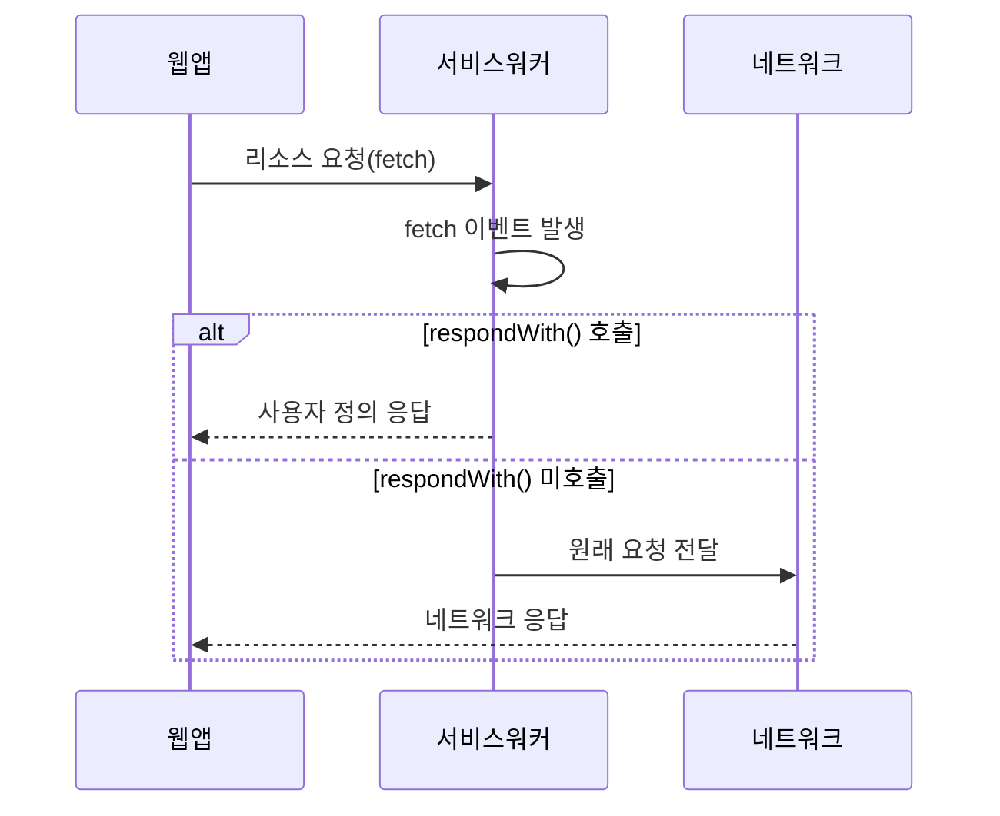

# Chapter 04 서비스 워커와 네트워크 요청

## 04-1 Fetch 이벤트

### 개요
서비스 워커의 가장 강력한 기능 중 하나는 웹 애플리케이션의 네트워크 요청을 가로채고 조작할 수 있는 능력입니다. 이 섹션에서는 Fetch 이벤트의 개념, 동작 방식, 그리고 이를 활용하여 웹 애플리케이션의 네트워크 요청을 제어하는 방법에 대해 알아봅니다. Fetch 이벤트를 이해하고 활용함으로써 오프라인 경험 제공, 성능 최적화, 사용자 정의 응답 생성 등 다양한 기능을 구현할 수 있습니다.

### Fetch 이벤트 기본 개념

Fetch 이벤트는 웹 애플리케이션에서 네트워크 요청이 발생할 때마다 서비스 워커에서 발생하는 이벤트입니다. 이 이벤트를 통해 서비스 워커는 브라우저와 서버 사이의 프록시 역할을 수행하며, 모든 네트워크 요청을 가로채고 제어할 수 있습니다.

```javascript
self.addEventListener('fetch', event => {
  console.log('Fetch 이벤트 발생:', event.request.url);
  
  // 기본적으로 요청을 그대로 통과시킴
  // event.respondWith()를 호출하지 않으면 브라우저의 기본 동작 수행
});
```

Fetch 이벤트의 핵심은 `event.respondWith()` 메서드입니다. 이 메서드를 사용하여 네트워크 요청에 대한 응답을 제어할 수 있습니다. `respondWith()` 메서드는 Response 객체나 Response 객체로 해결되는 Promise를 인자로 받습니다.



#### Fetch 이벤트 객체

Fetch 이벤트 객체는 다음과 같은 중요한 속성과 메서드를 포함합니다:

- `event.request`: 발생한 네트워크 요청에 대한 정보를 담고 있는 Request 객체
- `event.respondWith()`: 요청에 대한 사용자 정의 응답을 제공하는 메서드
- `event.waitUntil()`: 서비스 워커가 응답을 반환한 후에도 백그라운드 작업을 계속할 수 있게 하는 메서드

### Request 객체 이해하기

Fetch 이벤트를 효과적으로 처리하기 위해서는 Request 객체의 구조와 속성을 이해하는 것이 중요합니다. Request 객체는 네트워크 요청에 대한 모든 정보를 포함하고 있습니다.

```javascript
self.addEventListener('fetch', event => {
  const request = event.request;
  
  console.log('URL:', request.url);
  console.log('Method:', request.method);
  console.log('Headers:', request.headers);
  console.log('Mode:', request.mode);
  console.log('Credentials:', request.credentials);
  console.log('Cache mode:', request.cache);
});
```

#### 주요 Request 속성

| 속성 | 설명 | 예시 |
|------|------|------|
| `url` | 요청 URL | `https://example.com/api/data` |
| `method` | HTTP 메서드 | `GET`, `POST`, `PUT` 등 |
| `headers` | HTTP 헤더 | `Content-Type`, `Authorization` 등 |
| `mode` | CORS 모드 | `cors`, `no-cors`, `same-origin` 등 |
| `credentials` | 자격 증명 포함 여부 | `omit`, `same-origin`, `include` |
| `cache` | 캐시 모드 | `default`, `no-store`, `reload` 등 |
| `destination` | 요청 대상 유형 | `document`, `image`, `script` 등 |

#### Request 객체 복제 및 수정

Request 객체는 불변(immutable)이므로 직접 수정할 수 없습니다. 대신, 새로운 Request 객체를 생성하여 원하는 속성을 변경할 수 있습니다.

```javascript
self.addEventListener('fetch', event => {
  const originalRequest = event.request;
  
  // 새로운 헤더를 추가한 Request 객체 생성
  const modifiedRequest = new Request(originalRequest.url, {
    method: originalRequest.method,
    headers: {
      ...Object.fromEntries(originalRequest.headers.entries()),
      'X-Custom-Header': 'custom-value'
    },
    mode: originalRequest.mode,
    credentials: originalRequest.credentials,
    cache: originalRequest.cache,
    redirect: originalRequest.redirect,
    referrer: originalRequest.referrer
  });
  
  event.respondWith(
    fetch(modifiedRequest)
  );
});
```

### 기본적인 Fetch 이벤트 처리

가장 기본적인 Fetch 이벤트 처리는 네트워크 요청을 그대로 전달하는 것입니다. 이는 서비스 워커가 설치되어 있지만 특별한 처리를 하지 않는 경우에 사용됩니다.

```javascript
self.addEventListener('fetch', event => {
  event.respondWith(
    fetch(event.request)
  );
});
```

하지만 이 방식은 네트워크 연결이 없는 경우 오류가 발생합니다. 따라서 실제 애플리케이션에서는 오류 처리를 추가하는 것이 좋습니다.

```javascript
self.addEventListener('fetch', event => {
  event.respondWith(
    fetch(event.request)
      .catch(error => {
        console.error('Fetch 실패:', error);
        return new Response('네트워크 연결을 확인해주세요', {
          status: 503,
          statusText: 'Service Unavailable',
          headers: new Headers({
            'Content-Type': 'text/plain'
          })
        });
      })
  );
});
```

### 조건부 응답 제공하기

Fetch 이벤트 핸들러에서는 요청 URL, 메서드, 헤더 등을 기반으로 조건부 응답을 제공할 수 있습니다. 이를 통해 특정 요청에 대해서만 사용자 정의 응답을 반환하고, 나머지는 기본 동작을 수행하도록 할 수 있습니다.

```javascript
self.addEventListener('fetch', event => {
  const url = new URL(event.request.url);
  
  // API 요청에 대한 사용자 정의 응답
  if (url.pathname.startsWith('/api/')) {
    event.respondWith(
      fetch(event.request)
        .then(response => {
          // API 응답 처리
          return response;
        })
        .catch(error => {
          // API 오류 처리
          return new Response(JSON.stringify({ error: 'API 요청 실패' }), {
            status: 503,
            headers: { 'Content-Type': 'application/json' }
          });
        })
    );
    return;
  }
  
  // 이미지 요청에 대한 사용자 정의 응답
  if (event.request.destination === 'image') {
    event.respondWith(
      fetch(event.request)
        .catch(error => {
          // 이미지 로드 실패 시 대체 이미지 제공
          return caches.match('/images/placeholder.png');
        })
    );
    return;
  }
  
  // 그 외 요청은 기본 동작 수행 (respondWith 호출하지 않음)
});
```

### 사용자 정의 응답 생성하기

Fetch 이벤트 핸들러에서는 네트워크 요청을 하지 않고 직접 Response 객체를 생성하여 반환할 수 있습니다. 이를 통해 완전히 사용자 정의된 응답을 제공할 수 있습니다.

```javascript
self.addEventListener('fetch', event => {
  const url = new URL(event.request.url);
  
  // 특정 경로에 대한 사용자 정의 응답
  if (url.pathname === '/custom-response') {
    const data = {
      message: '이것은 서비스 워커에서 생성된 사용자 정의 응답입니다',
      timestamp: new Date().toISOString()
    };
    
    const jsonResponse = new Response(JSON.stringify(data), {
      status: 200,
      statusText: 'OK',
      headers: new Headers({
        'Content-Type': 'application/json',
        'X-Generated-By': 'Service Worker'
      })
    });
    
    event.respondWith(jsonResponse);
    return;
  }
  
  // HTML 응답 생성
  if (url.pathname === '/generated-page') {
    const html = `
      <!DOCTYPE html>
      <html>
        <head>
          <title>서비스 워커 생성 페이지</title>
          <meta charset="UTF-8">
        </head>
        <body>
          <h1>서비스 워커에서 생성된 페이지</h1>
          <p>현재 시간: ${new Date().toLocaleString()}</p>
        </body>
      </html>
    `;
    
    const htmlResponse = new Response(html, {
      status: 200,
      headers: new Headers({
        'Content-Type': 'text/html'
      })
    });
    
    event.respondWith(htmlResponse);
    return;
  }
});
```

#### Response 객체 생성 옵션

Response 생성자는 다음과 같은 형식을 가집니다:

```javascript
new Response(body, options);
```

- `body`: 응답 본문 (문자열, Blob, ArrayBuffer 등)
- `options`: 응답 옵션 객체
  - `status`: HTTP 상태 코드 (기본값: 200)
  - `statusText`: HTTP 상태 텍스트
  - `headers`: 응답 헤더 (Headers 객체 또는 객체 리터럴)

### Fetch 이벤트와 캐싱 전략 결합하기

Fetch 이벤트 핸들러에서는 앞서 배운 다양한 캐싱 전략을 구현할 수 있습니다. 이를 통해 오프라인 지원, 성능 최적화 등을 실현할 수 있습니다.

```javascript
self.addEventListener('fetch', event => {
  const strategies = {
    cacheFirst: async (request) => {
      const cache = await caches.open('cache-v1');
      const cachedResponse = await cache.match(request);
      
      if (cachedResponse) {
        return cachedResponse;
      }
      
      const networkResponse = await fetch(request);
      cache.put(request, networkResponse.clone());
      return networkResponse;
    },
    
    networkFirst: async (request) => {
      try {
        const networkResponse = await fetch(request);
        const cache = await caches.open('cache-v1');
        cache.put(request, networkResponse.clone());
        return networkResponse;
      } catch (error) {
        const cachedResponse = await caches.match(request);
        if (cachedResponse) {
          return cachedResponse;
        }
        throw error;
      }
    },
    
    staleWhileRevalidate: async (request) => {
      const cache = await caches.open('cache-v1');
      const cachedResponse = await cache.match(request);
      
      const fetchPromise = fetch(request)
        .then(networkResponse => {
          cache.put(request, networkResponse.clone());
          return networkResponse;
        });
      
      return cachedResponse || fetchPromise;
    }
  };
  
  const url = new URL(event.request.url);
  
  // 정적 자산에는 Cache First 전략 적용
  if (
    event.request.destination === 'style' || 
    event.request.destination === 'script' || 
    event.request.destination === 'font'
  ) {
    event.respondWith(strategies.cacheFirst(event.request));
    return;
  }
  
  // API 요청에는 Network First 전략 적용
  if (url.pathname.startsWith('/api/')) {
    event.respondWith(strategies.networkFirst(event.request));
    return;
  }
  
  // HTML 페이지에는 Stale While Revalidate 전략 적용
  if (event.request.mode === 'navigate') {
    event.respondWith(strategies.staleWhileRevalidate(event.request));
    return;
  }
  
  // 기본적으로 네트워크 요청 수행
  event.respondWith(fetch(event.request));
});
```

### 네트워크 요청 변환하기

Fetch 이벤트 핸들러에서는 원래 요청을 변환하여 다른 리소스를 요청하거나, 요청 헤더를 수정하는 등의 작업을 수행할 수 있습니다.

#### URL 변환

```javascript
self.addEventListener('fetch', event => {
  const url = new URL(event.request.url);
  
  // 특정 도메인의 요청을 다른 도메인으로 리다이렉트
  if (url.hostname === 'example.com') {
    const newUrl = new URL(url.pathname, 'https://new-domain.com');
    
    event.respondWith(
      fetch(newUrl.toString(), {
        method: event.request.method,
        headers: event.request.headers,
        body: event.request.body,
        mode: 'cors'
      })
    );
    return;
  }
  
  // 특정 파일 버전 변경 (캐시 버스팅)
  if (url.pathname.endsWith('.js') || url.pathname.endsWith('.css')) {
    // v1 버전을 v2로 변경
    const newUrl = url.toString().replace('/v1/', '/v2/');
    
    event.respondWith(
      fetch(newUrl)
    );
    return;
  }
});
```

#### 응답 변환

Fetch 이벤트 핸들러에서는 네트워크 응답을 가로채서 변환한 후 반환할 수도 있습니다.

```javascript
self.addEventListener('fetch', event => {
  // HTML 응답 변환
  if (event.request.destination === 'document') {
    event.respondWith(
      fetch(event.request)
        .then(response => {
          // 응답이 HTML인지 확인
          if (response.headers.get('content-type').includes('text/html')) {
            return response.text()
              .then(html => {
                // HTML 내용 수정 (예: 오프라인 배너 추가)
                const modifiedHtml = html.replace(
                  '</body>',
                  '<div style="background-color: #ff9; padding: 10px; text-align: center;">서비스 워커에 의해 수정된 페이지</div></body>'
                );
                
                // 새로운 응답 생성
                return new Response(modifiedHtml, {
                  status: response.status,
                  statusText: response.statusText,
                  headers: response.headers
                });
              });
          }
          
          return response;
        })
    );
    return;
  }
  
  // JSON 응답 변환
  if (event.request.url.includes('/api/')) {
    event.respondWith(
      fetch(event.request)
        .then(response => {
          return response.json()
            .then(data => {
              // 데이터 수정 (예: 추가 필드 삽입)
              data.processedBy = 'Service Worker';
              data.timestamp = new Date().toISOString();
              
              // 새로운 응답 생성
              return new Response(JSON.stringify(data), {
                status: response.status,
                statusText: response.statusText,
                headers: response.headers
              });
            });
        })
    );
    return;
  }
});
```

### 오류 처리 및 폴백 응답

네트워크 요청이 실패하는 경우에 대비하여 적절한 오류 처리와 폴백 응답을 제공하는 것이 중요합니다. 이를 통해 오프라인 상태에서도 사용자에게 의미 있는 경험을 제공할 수 있습니다.

```javascript
self.addEventListener('fetch', event => {
  event.respondWith(
    fetch(event.request)
      .catch(error => {
        console.error('Fetch 실패:', error);
        
        // 요청 유형에 따른 폴백 응답 제공
        if (event.request.mode === 'navigate') {
          // HTML 페이지 요청인 경우 오프라인 페이지 제공
          return caches.match('/offline.html')
            .then(response => {
              return response || new Response(
                '<html><body><h1>오프라인 상태입니다</h1><p>인터넷 연결을 확인해주세요.</p></body></html>',
                {
                  status: 503,
                  statusText: 'Service Unavailable',
                  headers: new Headers({
                    'Content-Type': 'text/html'
                  })
                }
              );
            });
        }
        
        if (event.request.destination === 'image') {
          // 이미지 요청인 경우 기본 이미지 제공
          return caches.match('/images/offline-image.png')
            .then(response => {
              return response || new Response(
                'Image unavailable',
                {
                  status: 503,
                  statusText: 'Service Unavailable'
                }
              );
            });
        }
        
        if (event.request.url.includes('/api/')) {
          // API 요청인 경우 JSON 오류 응답 제공
          return new Response(
            JSON.stringify({
              error: true,
              message: '오프라인 상태입니다. 인터넷 연결을 확인해주세요.'
            }),
            {
              status: 503,
              statusText: 'Service Unavailable',
              headers: new Headers({
                'Content-Type': 'application/json'
              })
            }
          );
        }
        
        // 기본 텍스트 오류 응답
        return new Response(
          '오프라인 상태입니다. 인터넷 연결을 확인해주세요.',
          {
            status: 503,
            statusText: 'Service Unavailable',
            headers: new Headers({
              'Content-Type': 'text/plain'
            })
          }
        );
      })
  );
});
```

### 성능 최적화 기법

Fetch 이벤트 핸들러를 활용하여 웹 애플리케이션의 성능을 최적화할 수 있는 몇 가지 기법을 알아보겠습니다.

#### 프리로딩(Preloading)

사용자가 방문할 가능성이 높은 페이지나 리소스를 미리 캐시에 저장하여 빠른 응답을 제공할 수 있습니다.

```javascript
// 현재 페이지에서 링크된 페이지 프리로딩
self.addEventListener('fetch', event => {
  const url = new URL(event.request.url);
  
  // HTML 페이지 요청인 경우
  if (event.request.mode === 'navigate') {
    event.waitUntil(
      fetch(event.request)
        .then(response => {
          // HTML 응답인지 확인
          if (response.headers.get('content-type').includes('text/html')) {
            return response.text()
              .then(html => {
                // HTML에서 링크 추출
                const linkRegex = /<a\s+(?:[^>]*?\s+)?href="([^"]*)"[^>]*>/g;
                const links = [];
                let match;
                
                while ((match = linkRegex.exec(html)) !== null) {
                  const link = new URL(match[1], url.origin).toString();
                  if (link.startsWith(url.origin) && !links.includes(link)) {
                    links.push(link);
                  }
                }
                
                // 추출된 링크 프리로딩 (최대 5개)
                const preloadLinks = links.slice(0, 5);
                preloadLinks.forEach(link => {
                  console.log('프리로딩:', link);
                  fetch(link, { mode: 'no-cors' })
                    .then(linkResponse => {
                      const cache = caches.open('preload-cache');
                      cache.then(c => c.put(link, linkResponse));
                    })
                    .catch(error => {
                      console.error('프리로딩 실패:', link, error);
                    });
                });
              });
          }
        })
        .catch(error => {
          console.error('프리로딩 분석 실패:', error);
        })
    );
  }
  
  // 기본 응답 처리
  event.respondWith(
    caches.match(event.request)
      .then(cachedResponse => {
        return cachedResponse || fetch(event.request);
      })
  );
});
```

#### 조건부 요청

If-Modified-Since 또는 If-None-Match 헤더를 사용하여 조건부 요청을 수행함으로써 불필요한 데이터 전송을 줄일 수 있습니다.

```javascript
self.addEventListener('fetch', event => {
  const url = new URL(event.request.url);
  
  // API 요청에 대한 조건부 요청 처리
  if (url.pathname.startsWith('/api/')) {
    event.respondWith(
      caches.open('api-cache')
        .then(cache => {
          return cache.match(event.request)
            .then(cachedResponse => {
              // 캐시된 응답이 있는 경우
              if (cachedResponse) {
                // ETag 또는 Last-Modified 헤더 추출
                const etag = cachedResponse.headers.get('ETag');
                const lastModified = cachedResponse.headers.get('Last-Modified');
                
                // 조건부 요청을 위한 새 요청 생성
                const conditionalRequest = new Request(event.request.url, {
                  method: event.request.method,
                  headers: new Headers(event.request.headers),
                  mode: event.request.mode,
                  credentials: event.request.credentials,
                  cache: event.request.cache,
                  redirect: event.request.redirect,
                  referrer: event.request.referrer
                });
                
                // 조건부 요청 헤더 추가
                if (etag) {
                  conditionalRequest.headers.set('If-None-Match', etag);
                } else if (lastModified) {
                  conditionalRequest.headers.set('If-Modified-Since', lastModified);
                }
                
                // 조건부 요청 수행
                return fetch(conditionalRequest)
                  .then(networkResponse => {
                    // 304 Not Modified인 경우 캐시된 응답 사용
                    if (networkResponse.status === 304) {
                      return cachedResponse;
                    }
                    
                    // 새로운 응답 캐시 및 반환
                    cache.put(event.request, networkResponse.clone());
                    return networkResponse;
                  })
                  .catch(() => {
                    // 네트워크 오류 시 캐시된 응답 사용
                    return cachedResponse;
                  });
              }
              
              // 캐시된 응답이 없는 경우 일반 요청 수행
              return fetch(event.request)
                .then(networkResponse => {
                  cache.put(event.request, networkResponse.clone());
                  return networkResponse;
                });
            });
        })
    );
    return;
  }
});
```

### 좀 더 알아보기: 스트리밍 응답 처리

서비스 워커에서는 스트리밍 응답을 처리할 수도 있습니다. 이는 대용량 데이터를 처리하거나, 점진적으로 콘텐츠를 로드해야 하는 경우에 유용합니다.

```javascript
self.addEventListener('fetch', event => {
  const url = new URL(event.request.url);
  
  // 스트리밍 API 요청 처리
  if (url.pathname === '/api/stream') {
    event.respondWith(
      fetch(event.request)
        .then(response => {
          // ReadableStream을 사용하여 응답 변환
          const reader = response.body.getReader();
          const stream = new ReadableStream({
            start(controller) {
              function push() {
                reader.read().then(({ done, value }) => {
                  if (done) {
                    controller.close();
                    return;
                  }
                  
                  // 데이터 처리 (예: 로깅)
                  const chunk = value;
                  console.log(`청크 수신: ${chunk.length} 바이트`);
                  
                  // 처리된 데이터 전달
                  controller.enqueue(chunk);
                  push();
                });
              }
              
              push();
            }
          });
          
          // 새로운 응답 생성
          return new Response(stream, {
            status: response.status,
            statusText: response.statusText,
            headers: response.headers
          });
        })
    );
    return;
  }
});
```

### 7가지 키워드로 정리하는 핵심 포인트
1. **Fetch 이벤트**: 웹 애플리케이션의 모든 네트워크 요청을 가로채는 서비스 워커의 핵심 이벤트입니다.
2. **respondWith()**: Fetch 이벤트에서 사용자 정의 응답을 제공하는 메서드로, Response 객체나 Promise를 인자로 받습니다.
3. **Request 객체**: 네트워크 요청에 대한 정보를 담고 있는 객체로, URL, 메서드, 헤더 등의 속성을 포함합니다.
4. **Response 객체**: 네트워크 요청에 대한 응답을 나타내는 객체로, 상태 코드, 헤더, 본문 등을 포함합니다.
5. **조건부 응답**: 요청 URL, 메서드, 헤더 등을 기반으로 다른 응답을 제공하는 기법입니다.
6. **응답 변환**: 네트워크 응답을 가로채서 내용을 수정한 후 반환하는 기법입니다.
7. **오프라인 폴백**: 네트워크 요청이 실패할 경우 대체 콘텐츠를 제공하는 기법으로, 오프라인 사용자 경험을 향상시킵니다.

### 확인 문제
1. Fetch 이벤트에서 사용자 정의 응답을 제공하기 위해 사용하는 메서드는 무엇인가요?
   - [ ] event.preventDefault()
   - [ ] event.waitUntil()
   - [ ] event.respondWith()
   - [ ] event.respond()

2. 다음 중 Request 객체의 속성이 아닌 것은?
   - [ ] url
   - [ ] method
   - [ ] headers
   - [ ] body
   - [ ] statusCode

3. 서비스 워커에서 네트워크 요청을 가로채서 다른 URL로 리다이렉트하는 것을 무엇이라고 하나요?
   - [ ] 요청 변환
   - [ ] URL 리매핑
   - [ ] 응답 변환
   - [ ] 프록시 리다이렉션

4. 다음 중 Fetch 이벤트 핸들러에서 오프라인 상태를 처리하는 올바른 방법은?
   - [ ] fetch() 함수를 사용하지 않는다
   - [ ] navigator.onLine 속성을 확인한다
   - [ ] fetch() 호출 시 catch() 블록을 사용한다
   - [ ] window.addEventListener('offline')을 사용한다

5. 다음 중 서비스 워커의 Fetch 이벤트를 활용한 성능 최적화 기법이 아닌 것은? (복수 응답)
   - [ ] 프리로딩
   - [ ] 조건부 요청
   - [ ] 응답 압축
   - [ ] DOM 조작
   - [ ] 스트리밍 응답 처리

6. 서비스 워커에서 HTML 응답을 가로채서 내용을 수정하는 기법을 무엇이라고 하나요?
   - [ ] HTML 인터셉션
   - [ ] 콘텐츠 스크립팅
   - [ ] 응답 변환
   - [ ] DOM 조작

7. Fetch 이벤트에서 백그라운드 작업을 계속하기 위해 사용하는 메서드는 무엇인가요?
   - [ ] event.continue()
   - [ ] event.waitUntil()
   - [ ] event.background()
   - [ ] event.async()

> [정답 및 해설 보기](../answers_and_explanations.md#04-1-fetch-이벤트)