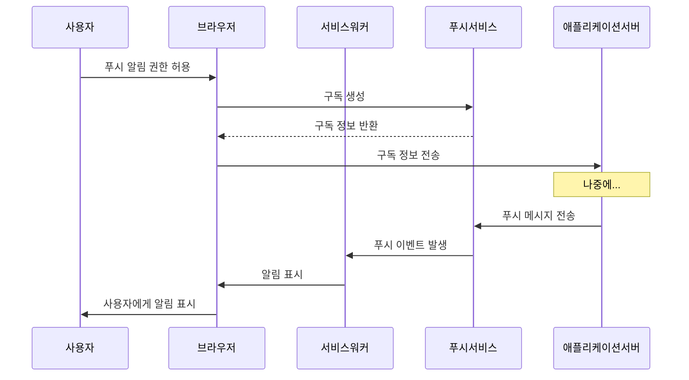

# Chapter 04 서비스 워커와 네트워크 요청

## 04-2 Push 이벤트와 알림

### 개요
서비스 워커의 강력한 기능 중 하나는 웹 애플리케이션이 백그라운드에서도 사용자에게 정보를 전달할 수 있는 Push API와 Notifications API를 활용할 수 있다는 점입니다. 이 섹션에서는 서비스 워커를 통해 푸시 알림을 구현하는 방법, 푸시 이벤트 처리, 그리고 사용자 경험을 향상시키기 위한 다양한 알림 기법에 대해 알아봅니다. 이러한 기능을 통해 웹 애플리케이션은 네이티브 앱과 같은 수준의 사용자 참여도를 달성할 수 있습니다.

### Push API 기본 개념

Push API는 서버에서 웹 애플리케이션으로 메시지를 보낼 수 있게 해주는 웹 표준입니다. 이 API는 서비스 워커와 함께 작동하여 웹 애플리케이션이 활성화되어 있지 않거나 심지어 브라우저가 닫혀 있을 때도 메시지를 수신할 수 있게 합니다.



#### Push API의 주요 구성 요소

1. **PushManager**: 푸시 메시지 구독을 생성하고 관리하는 인터페이스
2. **PushSubscription**: 푸시 서비스에 대한 구독 정보를 포함하는 객체
3. **Push Service**: 브라우저 벤더가 제공하는 서비스로, 애플리케이션 서버에서 클라이언트로 메시지를 전달

### 푸시 알림 구현하기

푸시 알림을 구현하기 위해서는 다음과 같은 단계를 따라야 합니다:

1. 사용자에게 알림 권한 요청
2. 푸시 서비스에 구독 생성
3. 구독 정보를 서버에 전송
4. 서버에서 푸시 메시지 전송
5. 서비스 워커에서 푸시 이벤트 처리

#### 1. 알림 권한 요청

```javascript
// 메인 애플리케이션 코드
function requestNotificationPermission() {
  return Notification.requestPermission().then(permission => {
    if (permission !== 'granted') {
      throw new Error('알림 권한이 거부되었습니다.');
    }
    console.log('알림 권한이 허용되었습니다.');
    return permission;
  });
}
```

#### 2. 푸시 서비스 구독 생성

```javascript
// 메인 애플리케이션 코드
function subscribeToPushService() {
  return navigator.serviceWorker.ready
    .then(registration => {
      // VAPID 공개 키 (서버에서 생성한 키)
      const vapidPublicKey = 'BEl62iUYgUivxIkv69yViEuiBIa-Ib9-SkvMeAtA3LFgDzkrxZJjSgSnfckjBJuBkr3qBUYIHBQFLXYp5Nksh8U';
      const convertedVapidKey = urlBase64ToUint8Array(vapidPublicKey);
      
      // 구독 옵션
      const subscribeOptions = {
        userVisibleOnly: true,  // 항상 true여야 함
        applicationServerKey: convertedVapidKey
      };
      
      // 푸시 서비스 구독
      return registration.pushManager.subscribe(subscribeOptions);
    })
    .then(subscription => {
      console.log('푸시 서비스 구독 성공:', JSON.stringify(subscription));
      
      // 서버에 구독 정보 전송
      return sendSubscriptionToServer(subscription);
    })
    .catch(error => {
      console.error('푸시 서비스 구독 실패:', error);
    });
}

// Base64 문자열을 Uint8Array로 변환하는 유틸리티 함수
function urlBase64ToUint8Array(base64String) {
  const padding = '='.repeat((4 - base64String.length % 4) % 4);
  const base64 = (base64String + padding)
    .replace(/\-/g, '+')
    .replace(/_/g, '/');
  
  const rawData = window.atob(base64);
  const outputArray = new Uint8Array(rawData.length);
  
  for (let i = 0; i < rawData.length; ++i) {
    outputArray[i] = rawData.charCodeAt(i);
  }
  return outputArray;
}
```

#### 3. 구독 정보를 서버에 전송

```javascript
// 메인 애플리케이션 코드
function sendSubscriptionToServer(subscription) {
  return fetch('/api/save-subscription', {
    method: 'POST',
    headers: {
      'Content-Type': 'application/json',
    },
    body: JSON.stringify(subscription)
  })
  .then(response => {
    if (!response.ok) {
      throw new Error('서버 응답이 올바르지 않습니다.');
    }
    return response.json();
  })
  .then(data => {
    console.log('서버에 구독 정보 저장 성공:', data);
  })
  .catch(error => {
    console.error('서버에 구독 정보 저장 실패:', error);
  });
}
```

#### 4. 서버에서 푸시 메시지 전송 (Node.js 예제)

```javascript
// 서버 코드 (Node.js)
const webpush = require('web-push');

// VAPID 키 설정
const vapidKeys = {
  publicKey: 'BEl62iUYgUivxIkv69yViEuiBIa-Ib9-SkvMeAtA3LFgDzkrxZJjSgSnfckjBJuBkr3qBUYIHBQFLXYp5Nksh8U',
  privateKey: 'Xt4Z-2z9wWiVyXYmYhvmGjvjvGOzVT9mF4t1sCfTbkw'
};

webpush.setVapidDetails(
  'mailto:example@example.com',  // 연락처 이메일
  vapidKeys.publicKey,
  vapidKeys.privateKey
);

// 구독 정보 (클라이언트에서 받은 정보)
const subscription = {
  endpoint: 'https://fcm.googleapis.com/fcm/send/...',
  expirationTime: null,
  keys: {
    p256dh: '...',
    auth: '...'
  }
};

// 푸시 메시지 옵션
const options = {
  TTL: 60 * 60  // 초 단위 (1시간)
};

// 푸시 메시지 페이로드
const payload = JSON.stringify({
  title: '새 메시지 알림',
  body: '새로운 메시지가 도착했습니다.',
  icon: '/images/icon.png',
  data: {
    url: '/messages/new'
  }
});

// 푸시 메시지 전송
webpush.sendNotification(subscription, payload, options)
  .then(result => {
    console.log('푸시 메시지 전송 성공:', result);
  })
  .catch(error => {
    console.error('푸시 메시지 전송 실패:', error);
  });
```

#### 5. 서비스 워커에서 푸시 이벤트 처리

```javascript
// 서비스 워커 코드
self.addEventListener('push', event => {
  console.log('푸시 이벤트 수신:', event);
  
  // 페이로드 데이터 추출
  let data = {};
  if (event.data) {
    try {
      data = event.data.json();
    } catch (e) {
      data = {
        title: '새 알림',
        body: event.data.text()
      };
    }
  }
  
  // 알림 옵션
  const options = {
    body: data.body || '새로운 알림이 도착했습니다.',
    icon: data.icon || '/images/default-icon.png',
    badge: data.badge || '/images/badge.png',
    vibrate: data.vibrate || [100, 50, 100],
    data: data.data || {},
    actions: data.actions || [],
    tag: data.tag || 'default',  // 같은 태그의 알림은 덮어씀
    renotify: data.renotify || false  // true면 같은 태그여도 다시 알림
  };
  
  // waitUntil()을 사용하여 서비스 워커가 알림을 표시할 때까지 활성 상태 유지
  event.waitUntil(
    self.registration.showNotification(data.title || '새 알림', options)
  );
});
```

### Notifications API 활용하기

Notifications API는 웹 애플리케이션이 시스템 알림을 표시할 수 있게 해주는 인터페이스입니다. 서비스 워커와 함께 사용하면 애플리케이션이 포그라운드에 없을 때도 알림을 표시할 수 있습니다.

#### 알림 표시하기

```javascript
// 메인 애플리케이션 코드
function showNotification() {
  Notification.requestPermission().then(permission => {
    if (permission === 'granted') {
      navigator.serviceWorker.ready.then(registration => {
        registration.showNotification('알림 제목', {
          body: '알림 내용입니다.',
          icon: '/images/icon.png',
          badge: '/images/badge.png',
          vibrate: [100, 50, 100],
          tag: 'notification-tag',
          actions: [
            {
              action: 'open',
              title: '열기'
            },
            {
              action: 'close',
              title: '닫기'
            }
          ],
          data: {
            url: '/notification-page'
          }
        });
      });
    }
  });
}
```

#### 알림 옵션

| 옵션 | 설명 | 예시 |
|------|------|------|
| `body` | 알림 본문 내용 | `'새로운 메시지가 도착했습니다.'` |
| `icon` | 알림에 표시될 아이콘 | `'/images/icon.png'` |
| `badge` | 공간이 제한된 환경에서 표시될 작은 아이콘 | `'/images/badge.png'` |
| `image` | 알림에 표시될 큰 이미지 | `'/images/notification-image.jpg'` |
| `vibrate` | 진동 패턴 (밀리초 단위) | `[100, 50, 100]` |
| `sound` | 알림 소리 (현재 대부분 브라우저에서 미지원) | `'/sounds/notification.mp3'` |
| `tag` | 알림 그룹화를 위한 태그 | `'message-notification'` |
| `renotify` | 같은 태그의 알림이 있어도 다시 알림 여부 | `true` 또는 `false` |
| `requireInteraction` | 사용자 상호작용 전까지 알림 유지 여부 | `true` 또는 `false` |
| `actions` | 알림에 표시될 버튼 | `[{action: 'open', title: '열기'}]` |
| `silent` | 소리나 진동 없이 조용히 알림 표시 여부 | `true` 또는 `false` |
| `timestamp` | 알림 발생 시간 | `Date.now()` |
| `data` | 알림과 관련된 추가 데이터 | `{url: '/message/123'}` |

### 알림 이벤트 처리하기

서비스 워커에서는 알림 관련 이벤트를 처리할 수 있습니다. 주요 이벤트로는 `notificationclick`과 `notificationclose`가 있습니다.

```javascript
// 서비스 워커 코드
// 알림 클릭 이벤트 처리
self.addEventListener('notificationclick', event => {
  console.log('알림 클릭됨:', event.notification);
  
  // 알림 닫기
  event.notification.close();
  
  // 클릭된 액션 확인
  if (event.action === 'open') {
    console.log('열기 액션 클릭됨');
  } else if (event.action === 'close') {
    console.log('닫기 액션 클릭됨');
    return;  // 아무 작업도 하지 않고 종료
  }
  
  // 알림 데이터에서 URL 추출
  const urlToOpen = event.notification.data && event.notification.data.url
    ? event.notification.data.url
    : '/';
  
  // 클라이언트 창 열기 또는 포커스
  event.waitUntil(
    clients.matchAll({
      type: 'window',
      includeUncontrolled: true
    })
    .then(clientList => {
      // 이미 열린 창이 있는지 확인
      for (const client of clientList) {
        if (client.url.includes(urlToOpen) && 'focus' in client) {
          return client.focus();
        }
      }
      
      // 열린 창이 없으면 새 창 열기
      if (clients.openWindow) {
        return clients.openWindow(urlToOpen);
      }
    })
  );
});

// 알림 닫힘 이벤트 처리
self.addEventListener('notificationclose', event => {
  console.log('알림이 닫힘:', event.notification);
  
  // 필요한 경우 서버에 알림 닫힘 이벤트 기록
  const notificationData = event.notification.data;
  if (notificationData && notificationData.notificationId) {
    // 서버에 알림 닫힘 이벤트 전송
    fetch('/api/notification-closed', {
      method: 'POST',
      headers: {
        'Content-Type': 'application/json'
      },
      body: JSON.stringify({
        notificationId: notificationData.notificationId
      })
    }).catch(error => {
      console.error('알림 닫힘 이벤트 전송 실패:', error);
    });
  }
});
```

### 푸시 구독 관리하기

사용자가 푸시 알림을 구독하거나 구독 취소할 수 있도록 기능을 제공하는 것이 중요합니다.

#### 구독 상태 확인

```javascript
// 메인 애플리케이션 코드
function checkPushSubscription() {
  return navigator.serviceWorker.ready
    .then(registration => {
      return registration.pushManager.getSubscription();
    })
    .then(subscription => {
      if (subscription) {
        console.log('이미 푸시 서비스에 구독되어 있습니다.');
        return true;
      } else {
        console.log('푸시 서비스에 구독되어 있지 않습니다.');
        return false;
      }
    });
}
```

#### 구독 취소

```javascript
// 메인 애플리케이션 코드
function unsubscribeFromPushService() {
  return navigator.serviceWorker.ready
    .then(registration => {
      return registration.pushManager.getSubscription();
    })
    .then(subscription => {
      if (!subscription) {
        throw new Error('구독 정보가 없습니다.');
      }
      
      // 서버에 구독 취소 정보 전송
      return fetch('/api/remove-subscription', {
        method: 'POST',
        headers: {
          'Content-Type': 'application/json'
        },
        body: JSON.stringify(subscription)
      })
      .then(() => {
        // 푸시 서비스 구독 취소
        return subscription.unsubscribe();
      });
    })
    .then(() => {
      console.log('푸시 서비스 구독 취소 성공');
      return true;
    })
    .catch(error => {
      console.error('푸시 서비스 구독 취소 실패:', error);
      return false;
    });
}
```

### 푸시 알림 모범 사례

푸시 알림을 효과적으로 활용하기 위한 몇 가지 모범 사례를 알아보겠습니다.

#### 1. 권한 요청 타이밍

사용자가 웹사이트를 처음 방문했을 때 바로 알림 권한을 요청하는 것은 좋지 않습니다. 대신, 사용자가 특정 작업을 수행한 후에 권한을 요청하는 것이 좋습니다.

```javascript
// 좋은 예: 사용자 액션 후 권한 요청
document.getElementById('subscribe-button').addEventListener('click', () => {
  requestNotificationPermission()
    .then(() => subscribeToPushService());
});

// 나쁜 예: 페이지 로드 시 바로 권한 요청
// window.addEventListener('load', requestNotificationPermission);
```

#### 2. 알림 빈도 조절

너무 많은 알림을 보내면 사용자가 알림을 차단할 수 있습니다. 중요한 정보만 알림으로 전송하고, 사용자가 알림 빈도를 조절할 수 있는 옵션을 제공하세요.

```javascript
// 사용자 설정에 따른 알림 필터링 예제
function shouldSendNotification(notificationType, userPreferences) {
  // 사용자가 해당 유형의 알림을 비활성화했는지 확인
  if (userPreferences.disabledTypes.includes(notificationType)) {
    return false;
  }
  
  // 하루에 보낼 수 있는 최대 알림 수 확인
  if (userPreferences.dailyLimit) {
    const todayNotifications = getTodayNotificationCount(userPreferences.userId);
    if (todayNotifications >= userPreferences.dailyLimit) {
      return false;
    }
  }
  
  return true;
}
```

#### 3. 알림 그룹화

관련된 여러 알림은 `tag` 속성을 사용하여 그룹화하는 것이 좋습니다. 이렇게 하면 사용자의 알림 피로도를 줄일 수 있습니다.

```javascript
// 메시지 알림 그룹화 예제
function showMessageNotification(message) {
  const options = {
    body: message.preview,
    icon: '/images/message-icon.png',
    tag: `message-${message.conversationId}`,  // 대화별로 그룹화
    data: {
      conversationId: message.conversationId,
      messageId: message.id
    }
  };
  
  // 같은 대화의 이전 알림은 이 알림으로 대체됨
  navigator.serviceWorker.ready.then(registration => {
    registration.showNotification(`${message.sender}의 메시지`, options);
  });
}
```

#### 4. 알림 개인화

사용자별로 개인화된 알림을 제공하면 참여도를 높일 수 있습니다.

```javascript
// 개인화된 알림 예제
function sendPersonalizedNotification(user, event) {
  const payload = JSON.stringify({
    title: `${user.firstName}님, ${event.title} 이벤트가 곧 시작됩니다!`,
    body: `${event.startTime}에 시작하는 이벤트에 ${event.attendees.length}명이 참여합니다.`,
    icon: user.preferredIcon || '/images/default-icon.png',
    data: {
      eventId: event.id,
      userId: user.id
    }
  });
  
  webpush.sendNotification(user.subscription, payload);
}
```

### 좀 더 알아보기: 푸시 알림 디버깅

푸시 알림을 디버깅하는 방법에 대해 알아보겠습니다.

#### 크롬 개발자 도구 활용

크롬 개발자 도구의 Application 탭에서 푸시 알림과 관련된 다양한 정보를 확인하고 테스트할 수 있습니다.

1. **Service Workers 패널**: 서비스 워커의 상태와 로그를 확인할 수 있습니다.
2. **Push Messaging 패널**: 푸시 구독 정보를 확인하고 테스트 푸시 메시지를 보낼 수 있습니다.
3. **Clear Storage 패널**: 서비스 워커와 관련된 모든 데이터를 초기화할 수 있습니다.

#### 로컬 테스트를 위한 도구

로컬 개발 환경에서 푸시 알림을 테스트하기 위한 도구들이 있습니다:

1. **web-push 라이브러리**: Node.js 환경에서 푸시 메시지를 보내는 데 사용할 수 있습니다.
2. **Push Companion**: 웹 기반 도구로, 푸시 구독을 테스트하고 푸시 메시지를 보낼 수 있습니다.

```javascript
// web-push를 사용한 로컬 테스트 예제
const webpush = require('web-push');
const fs = require('fs');

// VAPID 키 생성
const vapidKeys = webpush.generateVAPIDKeys();
console.log('VAPID 키:', vapidKeys);

// 키 저장
fs.writeFileSync('vapid-keys.json', JSON.stringify(vapidKeys));

// 테스트 푸시 메시지 전송
webpush.setVapidDetails(
  'mailto:test@example.com',
  vapidKeys.publicKey,
  vapidKeys.privateKey
);

// 구독 정보 (클라이언트에서 받은 정보)
const subscription = JSON.parse(fs.readFileSync('subscription.json'));

// 테스트 메시지 전송
webpush.sendNotification(subscription, JSON.stringify({
  title: '테스트 알림',
  body: '이것은 테스트 푸시 알림입니다.',
  icon: '/images/test-icon.png'
}))
.then(() => console.log('테스트 푸시 메시지 전송 성공'))
.catch(err => console.error('테스트 푸시 메시지 전송 실패:', err));
```

### 8가지 키워드로 정리하는 핵심 포인트
1. **Push API**: 서버에서 웹 애플리케이션으로 메시지를 보낼 수 있게 해주는 웹 표준으로, 서비스 워커와 함께 작동합니다.
2. **Notifications API**: 웹 애플리케이션이 시스템 알림을 표시할 수 있게 해주는 인터페이스입니다.
3. **PushManager**: 푸시 메시지 구독을 생성하고 관리하는 인터페이스입니다.
4. **PushSubscription**: 푸시 서비스에 대한 구독 정보를 포함하는 객체입니다.
5. **VAPID**: 푸시 서비스와 애플리케이션 서버 간의 인증을 위한 표준으로, 공개 키와 비밀 키 쌍을 사용합니다.
6. **push 이벤트**: 서비스 워커에서 푸시 메시지가 수신될 때 발생하는 이벤트입니다.
7. **notificationclick 이벤트**: 사용자가 알림을 클릭했을 때 서비스 워커에서 발생하는 이벤트입니다.
8. **권한 관리**: 푸시 알림을 사용하기 위해 사용자로부터 명시적인 권한을 얻어야 하며, 이를 적절히 관리해야 합니다.

### 확인 문제
1. Push API를 사용하기 위해 필요한 권한은 무엇인가요?
   - [ ] geolocation
   - [ ] microphone
   - [ ] notifications
   - [ ] camera

2. 푸시 메시지 구독을 생성하는 데 사용되는 인터페이스는 무엇인가요?
   - [ ] NotificationManager
   - [ ] PushManager
   - [ ] SubscriptionManager
   - [ ] MessageManager

3. 서비스 워커에서 푸시 메시지를 수신할 때 발생하는 이벤트는 무엇인가요?
   - [ ] message
   - [ ] push
   - [ ] notification
   - [ ] sync

4. VAPID 키의 주요 목적은 무엇인가요?
   - [ ] 푸시 메시지 암호화
   - [ ] 서버와 푸시 서비스 간의 인증
   - [ ] 사용자 식별
   - [ ] 알림 그룹화

5. 다음 중 Notifications API의 옵션이 아닌 것은? (복수 응답)
   - [ ] body
   - [ ] icon
   - [ ] priority
   - [ ] color
   - [ ] frequency

6. 사용자가 알림을 클릭했을 때 서비스 워커에서 발생하는 이벤트는 무엇인가요?
   - [ ] notificationclick
   - [ ] notificationtap
   - [ ] notificationopen
   - [ ] notificationselect

7. 푸시 알림 구현의 올바른 순서는 무엇인가요?
   - [ ] 구독 생성 → 권한 요청 → 서버에 구독 정보 전송 → 푸시 이벤트 처리
   - [ ] 권한 요청 → 구독 생성 → 서버에 구독 정보 전송 → 푸시 이벤트 처리
   - [ ] 서버에 구독 정보 전송 → 권한 요청 → 구독 생성 → 푸시 이벤트 처리
   - [ ] 푸시 이벤트 처리 → 권한 요청 → 구독 생성 → 서버에 구독 정보 전송

8. 다음 중 푸시 알림의 모범 사례가 아닌 것은?
   - [ ] 사용자가 웹사이트를 처음 방문했을 때 바로 알림 권한 요청하기
   - [ ] 관련된 여러 알림을 그룹화하기
   - [ ] 사용자별로 개인화된 알림 제공하기
   - [ ] 알림 빈도를 조절할 수 있는 옵션 제공하기

> [정답 및 해설 보기](../answers_and_explanations.md#04-2-push-이벤트와-알림)