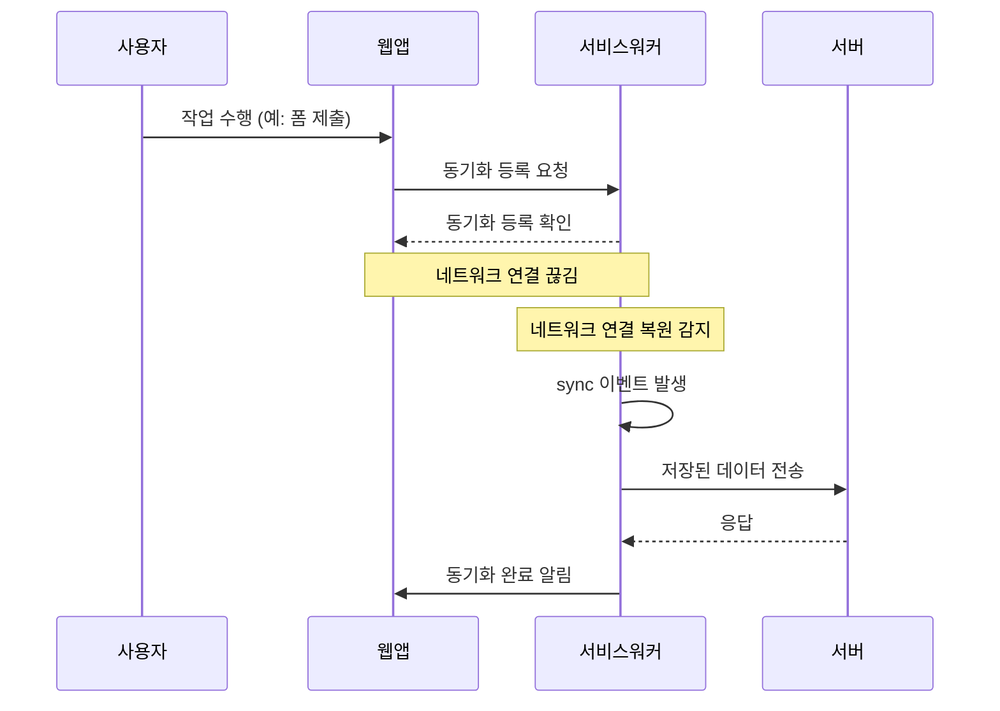

# Chapter 04 서비스 워커와 네트워크 요청

## 04-3 백그라운드 동기화

### 개요
백그라운드 동기화는 서비스 워커의 강력한 기능 중 하나로, 네트워크 연결이 불안정하거나 오프라인 상태에서도 사용자 작업을 저장하고 나중에 네트워크 연결이 복원되면 자동으로 동기화할 수 있게 해줍니다. 이 섹션에서는 Background Sync API의 기본 개념, 구현 방법, 그리고 실제 애플리케이션에서의 활용 사례에 대해 알아봅니다. 이를 통해 오프라인 우선(offline-first) 웹 애플리케이션을 구축하고 사용자 경험을 크게 향상시킬 수 있습니다.

### Background Sync API 기본 개념

Background Sync API는 웹 애플리케이션이 백그라운드에서 데이터를 동기화할 수 있게 해주는 웹 표준입니다. 이 API는 서비스 워커와 함께 작동하여 네트워크 연결이 불안정하거나 없을 때도 사용자 작업을 저장하고, 네트워크 연결이 복원되면 자동으로 동기화할 수 있게 합니다.



#### Background Sync API의 주요 구성 요소

1. **SyncManager**: 동기화 작업을 등록하고 관리하는 인터페이스
2. **sync 이벤트**: 네트워크 연결이 복원되었을 때 서비스 워커에서 발생하는 이벤트
3. **IndexedDB 또는 Cache Storage**: 오프라인 상태에서 데이터를 임시 저장하는 데 사용되는 스토리지 메커니즘

### 백그라운드 동기화 구현하기

백그라운드 동기화를 구현하기 위해서는 다음과 같은 단계를 따라야 합니다:

1. 서비스 워커 등록 및 설치
2. 동기화 이벤트 처리 설정
3. 동기화 작업 등록
4. 오프라인 데이터 저장
5. 네트워크 연결 시 데이터 동기화

#### 1. 서비스 워커 등록 및 설치

```javascript
// 메인 애플리케이션 코드
if ('serviceWorker' in navigator && 'SyncManager' in window) {
  navigator.serviceWorker.register('/service-worker.js')
    .then(registration => {
      console.log('서비스 워커가 등록되었습니다:', registration.scope);
    })
    .catch(error => {
      console.error('서비스 워커 등록 실패:', error);
    });
} else {
  console.warn('백그라운드 동기화가 지원되지 않는 브라우저입니다.');
}
```

#### 2. 동기화 이벤트 처리 설정

```javascript
// 서비스 워커 코드 (service-worker.js)
self.addEventListener('sync', event => {
  console.log('백그라운드 동기화 이벤트 발생:', event);
  
  if (event.tag === 'post-data') {
    event.waitUntil(syncData());
  } else if (event.tag === 'upload-images') {
    event.waitUntil(syncImages());
  }
});

// 데이터 동기화 함수
async function syncData() {
  try {
    // IndexedDB에서 대기 중인 데이터 가져오기
    const db = await openDatabase();
    const data = await getDataFromDB(db);
    
    if (!data.length) {
      return;
    }
    
    // 서버에 데이터 전송
    for (const item of data) {
      try {
        await fetch('/api/data', {
          method: 'POST',
          headers: {
            'Content-Type': 'application/json'
          },
          body: JSON.stringify(item.data)
        });
        
        // 성공적으로 전송된 데이터 삭제
        await deleteDataFromDB(db, item.id);
      } catch (error) {
        console.error('데이터 동기화 실패:', error);
        throw error;  // 재시도를 위해 오류 다시 발생
      }
    }
    
    console.log('모든 데이터가 성공적으로 동기화되었습니다.');
  } catch (error) {
    console.error('동기화 중 오류 발생:', error);
    throw error;  // 브라우저가 나중에 다시 시도하도록 오류 다시 발생
  }
}

// 이미지 동기화 함수
async function syncImages() {
  // 이미지 업로드 동기화 로직
  // ...
}
```

#### 3. 동기화 작업 등록

```javascript
// 메인 애플리케이션 코드
async function registerSync() {
  if ('serviceWorker' in navigator && 'SyncManager' in window) {
    try {
      const registration = await navigator.serviceWorker.ready;
      await registration.sync.register('post-data');
      console.log('백그라운드 동기화가 등록되었습니다.');
      return true;
    } catch (error) {
      console.error('백그라운드 동기화 등록 실패:', error);
      return false;
    }
  } else {
    console.warn('백그라운드 동기화가 지원되지 않는 브라우저입니다.');
    return false;
  }
}

// 폼 제출 이벤트 처리
document.getElementById('data-form').addEventListener('submit', async event => {
  event.preventDefault();
  
  const formData = new FormData(event.target);
  const data = Object.fromEntries(formData.entries());
  
  try {
    // 온라인 상태인 경우 직접 서버에 전송
    if (navigator.onLine) {
      await fetch('/api/data', {
        method: 'POST',
        headers: {
          'Content-Type': 'application/json'
        },
        body: JSON.stringify(data)
      });
      console.log('데이터가 서버에 전송되었습니다.');
    } 
    // 오프라인 상태인 경우 IndexedDB에 저장하고 동기화 등록
    else {
      await saveDataToDB(data);
      const syncRegistered = await registerSync();
      
      if (syncRegistered) {
        console.log('데이터가 저장되었으며 온라인 상태가 되면 자동으로 동기화됩니다.');
      } else {
        console.log('데이터가 저장되었지만 수동으로 동기화해야 합니다.');
      }
    }
    
    // 폼 초기화 및 성공 메시지 표시
    event.target.reset();
    showMessage('데이터가 성공적으로 처리되었습니다.');
  } catch (error) {
    console.error('데이터 처리 중 오류 발생:', error);
    
    // 오류 발생 시 IndexedDB에 저장하고 동기화 등록
    await saveDataToDB(data);
    await registerSync();
    
    showMessage('현재 네트워크 문제가 있지만, 데이터는 저장되었으며 나중에 자동으로 동기화됩니다.');
  }
});
```

#### 4. 오프라인 데이터 저장 (IndexedDB 활용)

```javascript
// IndexedDB 관련 유틸리티 함수
function openDatabase() {
  return new Promise((resolve, reject) => {
    const request = indexedDB.open('SyncDB', 1);
    
    request.onerror = event => {
      reject('데이터베이스 열기 실패');
    };
    
    request.onsuccess = event => {
      resolve(event.target.result);
    };
    
    request.onupgradeneeded = event => {
      const db = event.target.result;
      if (!db.objectStoreNames.contains('pendingData')) {
        db.createObjectStore('pendingData', { keyPath: 'id', autoIncrement: true });
      }
    };
  });
}

async function saveDataToDB(data) {
  const db = await openDatabase();
  return new Promise((resolve, reject) => {
    const transaction = db.transaction(['pendingData'], 'readwrite');
    const store = transaction.objectStore('pendingData');
    
    const request = store.add({
      data: data,
      timestamp: new Date().getTime()
    });
    
    request.onsuccess = () => resolve();
    request.onerror = () => reject('데이터 저장 실패');
  });
}

async function getDataFromDB(db) {
  return new Promise((resolve, reject) => {
    const transaction = db.transaction(['pendingData'], 'readonly');
    const store = transaction.objectStore('pendingData');
    const request = store.getAll();
    
    request.onsuccess = () => resolve(request.result);
    request.onerror = () => reject('데이터 가져오기 실패');
  });
}

async function deleteDataFromDB(db, id) {
  return new Promise((resolve, reject) => {
    const transaction = db.transaction(['pendingData'], 'readwrite');
    const store = transaction.objectStore('pendingData');
    const request = store.delete(id);
    
    request.onsuccess = () => resolve();
    request.onerror = () => reject('데이터 삭제 실패');
  });
}
```

### 주기적 백그라운드 동기화

주기적 백그라운드 동기화(Periodic Background Sync)는 Background Sync API의 확장으로, 웹 애플리케이션이 주기적으로 백그라운드에서 데이터를 업데이트할 수 있게 해줍니다. 이 기능은 뉴스 피드, 날씨 정보, 이메일 등을 백그라운드에서 주기적으로 업데이트하는 데 유용합니다.

#### 주기적 동기화 등록

```javascript
// 메인 애플리케이션 코드
async function registerPeriodicSync() {
  if ('serviceWorker' in navigator && 'periodicSync' in navigator.serviceWorker) {
    try {
      const registration = await navigator.serviceWorker.ready;
      
      // 권한 확인
      const status = await navigator.permissions.query({
        name: 'periodic-background-sync'
      });
      
      if (status.state === 'granted') {
        // 최소 1시간 간격으로 주기적 동기화 등록
        await registration.periodicSync.register('update-content', {
          minInterval: 60 * 60 * 1000  // 1시간 (밀리초 단위)
        });
        
        console.log('주기적 백그라운드 동기화가 등록되었습니다.');
        return true;
      } else {
        console.warn('주기적 백그라운드 동기화 권한이 없습니다.');
        return false;
      }
    } catch (error) {
      console.error('주기적 백그라운드 동기화 등록 실패:', error);
      return false;
    }
  } else {
    console.warn('주기적 백그라운드 동기화가 지원되지 않는 브라우저입니다.');
    return false;
  }
}

// 앱 초기화 시 주기적 동기화 등록
window.addEventListener('load', () => {
  registerPeriodicSync();
});
```

#### 주기적 동기화 이벤트 처리

```javascript
// 서비스 워커 코드 (service-worker.js)
self.addEventListener('periodicsync', event => {
  console.log('주기적 백그라운드 동기화 이벤트 발생:', event.tag);
  
  if (event.tag === 'update-content') {
    event.waitUntil(updateContent());
  }
});

async function updateContent() {
  try {
    // 최신 콘텐츠 가져오기
    const response = await fetch('/api/latest-content');
    const data = await response.json();
    
    // 캐시 업데이트
    const cache = await caches.open('content-cache');
    await cache.put('/api/content', new Response(JSON.stringify(data)));
    
    // 클라이언트에 알림 (열려있는 경우)
    const clients = await self.clients.matchAll();
    clients.forEach(client => {
      client.postMessage({
        type: 'CONTENT_UPDATED',
        timestamp: new Date().toISOString()
      });
    });
    
    console.log('콘텐츠가 성공적으로 업데이트되었습니다.');
  } catch (error) {
    console.error('콘텐츠 업데이트 중 오류 발생:', error);
    throw error;
  }
}
```

### 백그라운드 동기화 활용 사례

백그라운드 동기화는 다양한 웹 애플리케이션 시나리오에서 활용될 수 있습니다. 몇 가지 주요 활용 사례를 살펴보겠습니다.

#### 1. 오프라인 폼 제출

사용자가 오프라인 상태에서 폼을 제출할 때, 데이터를 로컬에 저장하고 네트워크 연결이 복원되면 자동으로 서버에 전송합니다.

```javascript
// 폼 제출 처리
document.getElementById('contact-form').addEventListener('submit', async event => {
  event.preventDefault();
  
  const formData = new FormData(event.target);
  const contactData = Object.fromEntries(formData.entries());
  
  try {
    if (navigator.onLine) {
      // 온라인 상태면 직접 전송
      await sendContactForm(contactData);
      showSuccessMessage('메시지가 전송되었습니다.');
    } else {
      // 오프라인 상태면 저장 후 동기화 등록
      await saveContactData(contactData);
      await navigator.serviceWorker.ready.then(registration => {
        return registration.sync.register('submit-contact-form');
      });
      showSuccessMessage('메시지가 저장되었으며 온라인 상태가 되면 자동으로 전송됩니다.');
    }
    event.target.reset();
  } catch (error) {
    showErrorMessage('메시지 처리 중 오류가 발생했습니다.');
    console.error(error);
  }
});
```

#### 2. 미디어 업로드

사용자가 대용량 미디어 파일(이미지, 비디오 등)을 업로드할 때, 네트워크 연결이 불안정하거나 끊어져도 업로드를 계속할 수 있습니다.

```javascript
// 이미지 업로드 처리
document.getElementById('image-upload').addEventListener('change', async event => {
  const files = event.target.files;
  if (!files.length) return;
  
  showLoadingIndicator();
  
  try {
    // 파일을 IndexedDB에 저장
    for (const file of files) {
      await saveFileToIndexedDB(file);
    }
    
    // 백그라운드 동기화 등록
    const registration = await navigator.serviceWorker.ready;
    await registration.sync.register('upload-images');
    
    showSuccessMessage(`${files.length}개의 이미지가 업로드 대기열에 추가되었습니다.`);
  } catch (error) {
    showErrorMessage('이미지 처리 중 오류가 발생했습니다.');
    console.error(error);
  } finally {
    hideLoadingIndicator();
  }
});
```

#### 3. 메시지 전송

채팅 애플리케이션에서 사용자가 오프라인 상태에서 메시지를 보낼 때, 메시지를 로컬에 저장하고 네트워크 연결이 복원되면 자동으로 전송합니다.

```javascript
// 메시지 전송 처리
document.getElementById('message-form').addEventListener('submit', async event => {
  event.preventDefault();
  
  const messageInput = document.getElementById('message-input');
  const message = messageInput.value.trim();
  
  if (!message) return;
  
  const messageData = {
    text: message,
    timestamp: new Date().toISOString(),
    sender: currentUser.id,
    conversationId: currentConversation.id,
    status: navigator.onLine ? 'sending' : 'pending'
  };
  
  // UI에 메시지 즉시 표시 (낙관적 UI 업데이트)
  displayMessage(messageData);
  messageInput.value = '';
  
  try {
    if (navigator.onLine) {
      // 온라인 상태면 직접 전송
      const sentMessage = await sendMessage(messageData);
      updateMessageStatus(messageData.timestamp, 'sent');
    } else {
      // 오프라인 상태면 저장 후 동기화 등록
      await saveMessageToIndexedDB(messageData);
      await navigator.serviceWorker.ready.then(registration => {
        return registration.sync.register('send-messages');
      });
    }
  } catch (error) {
    updateMessageStatus(messageData.timestamp, 'failed');
    console.error('메시지 전송 실패:', error);
  }
});
```

### 백그라운드 동기화 모범 사례

백그라운드 동기화를 효과적으로 구현하기 위한 몇 가지 모범 사례를 알아보겠습니다.

#### 1. 폴백 메커니즘 구현

백그라운드 동기화가 지원되지 않는 브라우저를 위한 폴백 메커니즘을 구현하세요.

```javascript
async function saveData(data) {
  try {
    // 온라인 상태면 직접 전송 시도
    if (navigator.onLine) {
      try {
        await sendDataToServer(data);
        return { success: true, message: '데이터가 서버에 전송되었습니다.' };
      } catch (error) {
        // 전송 실패 시 로컬에 저장
        console.warn('서버 전송 실패, 로컬에 저장합니다:', error);
      }
    }
    
    // 오프라인이거나 전송 실패 시
    await saveDataToIndexedDB(data);
    
    // 백그라운드 동기화 지원 여부 확인
    if ('serviceWorker' in navigator && 'SyncManager' in window) {
      const registration = await navigator.serviceWorker.ready;
      await registration.sync.register('sync-data');
      return { success: true, message: '데이터가 저장되었으며 자동으로 동기화됩니다.' };
    } else {
      // 백그라운드 동기화 미지원 시 폴백: 온라인 상태 변경 이벤트 리스너 등록
      window.addEventListener('online', async () => {
        const pendingData = await getPendingDataFromIndexedDB();
        for (const item of pendingData) {
          try {
            await sendDataToServer(item.data);
            await removeDataFromIndexedDB(item.id);
          } catch (error) {
            console.error('데이터 동기화 실패:', error);
          }
        }
      });
      return { success: true, message: '데이터가 저장되었으며 온라인 상태가 되면 동기화됩니다.' };
    }
  } catch (error) {
    console.error('데이터 저장 실패:', error);
    return { success: false, message: '데이터 저장에 실패했습니다.' };
  }
}
```

#### 2. 재시도 전략 구현

네트워크 요청이 실패할 경우를 대비한 재시도 전략을 구현하세요.

```javascript
async function syncDataWithRetry(data, maxRetries = 5, initialDelay = 1000) {
  let retries = 0;
  let delay = initialDelay;
  
  while (retries < maxRetries) {
    try {
      const response = await fetch('/api/data', {
        method: 'POST',
        headers: {
          'Content-Type': 'application/json'
        },
        body: JSON.stringify(data)
      });
      
      if (response.ok) {
        return response.json();
      }
      
      // 서버 오류(5xx)인 경우 재시도
      if (response.status >= 500) {
        throw new Error(`서버 오류: ${response.status}`);
      }
      
      // 클라이언트 오류(4xx)인 경우 재시도하지 않음
      return { error: true, status: response.status };
    } catch (error) {
      retries++;
      console.warn(`동기화 시도 ${retries}/${maxRetries} 실패:`, error);
      
      if (retries >= maxRetries) {
        throw new Error('최대 재시도 횟수 초과');
      }
      
      // 지수 백오프 적용
      await new Promise(resolve => setTimeout(resolve, delay));
      delay *= 2;  // 다음 재시도까지 대기 시간 두 배로 증가
    }
  }
}
```

#### 3. 사용자 피드백 제공

백그라운드 동기화 상태에 대한 명확한 피드백을 사용자에게 제공하세요.

```javascript
// 동기화 상태 UI 업데이트
function updateSyncStatusUI(status, detail = '') {
  const statusElement = document.getElementById('sync-status');
  const statusIcon = document.getElementById('sync-icon');
  
  switch (status) {
    case 'pending':
      statusElement.textContent = '동기화 대기 중...';
      statusIcon.className = 'icon icon-pending';
      break;
    case 'syncing':
      statusElement.textContent = '동기화 중...';
      statusIcon.className = 'icon icon-syncing';
      break;
    case 'success':
      statusElement.textContent = '동기화 완료';
      statusIcon.className = 'icon icon-success';
      // 성공 메시지 잠시 후 숨기기
      setTimeout(() => {
        statusElement.textContent = '';
      }, 3000);
      break;
    case 'error':
      statusElement.textContent = `동기화 실패: ${detail}`;
      statusIcon.className = 'icon icon-error';
      break;
  }
}

// 서비스 워커와 메시지 통신
navigator.serviceWorker.addEventListener('message', event => {
  if (event.data && event.data.type === 'SYNC_STATUS') {
    updateSyncStatusUI(event.data.status, event.data.detail);
  }
});
```

### 좀 더 알아보기: 백그라운드 동기화 디버깅

백그라운드 동기화 기능을 디버깅하는 방법에 대해 알아보겠습니다.

#### 크롬 개발자 도구 활용

크롬 개발자 도구의 Application 탭에서 백그라운드 동기화와 관련된 다양한 정보를 확인하고 테스트할 수 있습니다.

1. **Service Workers 패널**: 서비스 워커의 상태와 로그를 확인할 수 있습니다.
2. **Background Sync 패널**: 등록된 동기화 작업을 확인하고 수동으로 트리거할 수 있습니다.
3. **IndexedDB 패널**: 저장된 오프라인 데이터를 확인하고 관리할 수 있습니다.

#### 네트워크 상태 시뮬레이션

개발자 도구의 Network 패널에서 오프라인 모드를 활성화하여 오프라인 상태를 시뮬레이션할 수 있습니다.

```javascript
// 개발 중 네트워크 상태 변경 감지
window.addEventListener('online', () => {
  console.log('온라인 상태로 변경되었습니다.');
});

window.addEventListener('offline', () => {
  console.log('오프라인 상태로 변경되었습니다.');
});
```

#### 로깅 및 디버깅 도구

서비스 워커에서 로깅을 추가하여 동기화 과정을 추적할 수 있습니다.

```javascript
// 서비스 워커 코드
self.addEventListener('sync', event => {
  console.log(`[ServiceWorker] 백그라운드 동기화 이벤트: ${event.tag}`);
  
  if (event.tag === 'sync-data') {
    event.waitUntil(
      syncData()
        .then(() => {
          console.log('[ServiceWorker] 동기화 성공');
          // 클라이언트에 성공 메시지 전송
          return self.clients.matchAll().then(clients => {
            clients.forEach(client => {
              client.postMessage({
                type: 'SYNC_STATUS',
                status: 'success'
              });
            });
          });
        })
        .catch(error => {
          console.error('[ServiceWorker] 동기화 실패:', error);
          // 클라이언트에 오류 메시지 전송
          return self.clients.matchAll().then(clients => {
            clients.forEach(client => {
              client.postMessage({
                type: 'SYNC_STATUS',
                status: 'error',
                detail: error.message
              });
            });
          });
        })
    );
  }
});
```

### 7가지 키워드로 정리하는 핵심 포인트
1. **Background Sync API**: 네트워크 연결이 불안정하거나 없을 때도 데이터 동기화를 가능하게 하는 웹 표준입니다.
2. **SyncManager**: 동기화 작업을 등록하고 관리하는 인터페이스로, 서비스 워커 등록 객체를 통해 접근합니다.
3. **sync 이벤트**: 네트워크 연결이 복원되었을 때 서비스 워커에서 발생하는 이벤트로, 동기화 작업을 처리합니다.
4. **IndexedDB**: 오프라인 상태에서 데이터를 임시 저장하는 데 사용되는 클라이언트 측 데이터베이스입니다.
5. **Periodic Background Sync**: 주기적으로 백그라운드에서 데이터를 업데이트할 수 있게 해주는 확장 API입니다.
6. **폴백 메커니즘**: 백그라운드 동기화가 지원되지 않는 브라우저를 위한 대체 구현 방법입니다.
7. **재시도 전략**: 네트워크 요청이 실패할 경우를 대비한 재시도 로직으로, 안정적인 동기화를 보장합니다.

### 확인 문제
1. Background Sync API의 주요 목적은 무엇인가요?
   - [ ] 서버와 클라이언트 간의 실시간 통신
   - [ ] 오프라인 상태에서 저장된 데이터를 온라인 상태가 되면 동기화
   - [ ] 웹 페이지의 백그라운드 색상 동기화
   - [ ] 여러 기기 간의 설정 동기화

2. 백그라운드 동기화 작업을 등록하기 위해 사용하는 메서드는 무엇인가요?
   - [ ] navigator.serviceWorker.register()
   - [ ] registration.sync.register()
   - [ ] self.addEventListener('sync')
   - [ ] window.requestSync()

3. 서비스 워커에서 백그라운드 동기화 이벤트를 처리하기 위해 리스닝해야 하는 이벤트는 무엇인가요?
   - [ ] background
   - [ ] sync
   - [ ] online
   - [ ] synchronize

4. 오프라인 상태에서 데이터를 임시 저장하는 데 가장 적합한 스토리지 메커니즘은 무엇인가요?
   - [ ] LocalStorage
   - [ ] SessionStorage
   - [ ] Cookies
   - [ ] IndexedDB

5. 주기적 백그라운드 동기화(Periodic Background Sync)를 등록하기 위해 사용하는 API는 무엇인가요?
   - [ ] registration.sync.register()
   - [ ] registration.periodicSync.register()
   - [ ] navigator.periodicSync.register()
   - [ ] self.registerPeriodicSync()

6. 다음 중 백그라운드 동기화의 장점이 아닌 것은? (복수 응답)
   - [ ] 오프라인 상태에서도 사용자 작업을 저장할 수 있다
   - [ ] 네트워크 연결이 불안정한 환경에서 데이터 손실을 방지한다
   - [ ] 서버의 부하를 줄일 수 있다
   - [ ] 실시간 양방향 통신이 가능하다
   - [ ] 서비스 워커 없이도 사용할 수 있다

7. 백그라운드 동기화 작업이 실패했을 때 브라우저는 어떻게 대응하나요?
   - [ ] 즉시 오류를 발생시키고 더 이상 시도하지 않는다
   - [ ] 사용자에게 오류 메시지를 표시하고 수동 재시도를 요청한다
   - [ ] 일정 시간 후에 자동으로 재시도한다
   - [ ] 항상 성공할 때까지 무한정 재시도한다

8. 다음 중 백그라운드 동기화를 구현할 때의 모범 사례는 무엇인가요? (복수 응답)
   - [ ] 모든 네트워크 요청에 백그라운드 동기화 적용하기
   - [ ] 백그라운드 동기화 지원 여부에 관계없이 동일한 코드 사용하기
   - [ ] 동기화 상태에 대한 명확한 피드백 제공하기
   - [ ] 백그라운드 동기화가 지원되지 않는 브라우저를 위한 폴백 구현하기
   - [ ] 네트워크 요청 실패 시 재시도 전략 구현하기

> [정답 및 해설 보기](../answers_and_explanations.md#04-3-백그라운드-동기화)