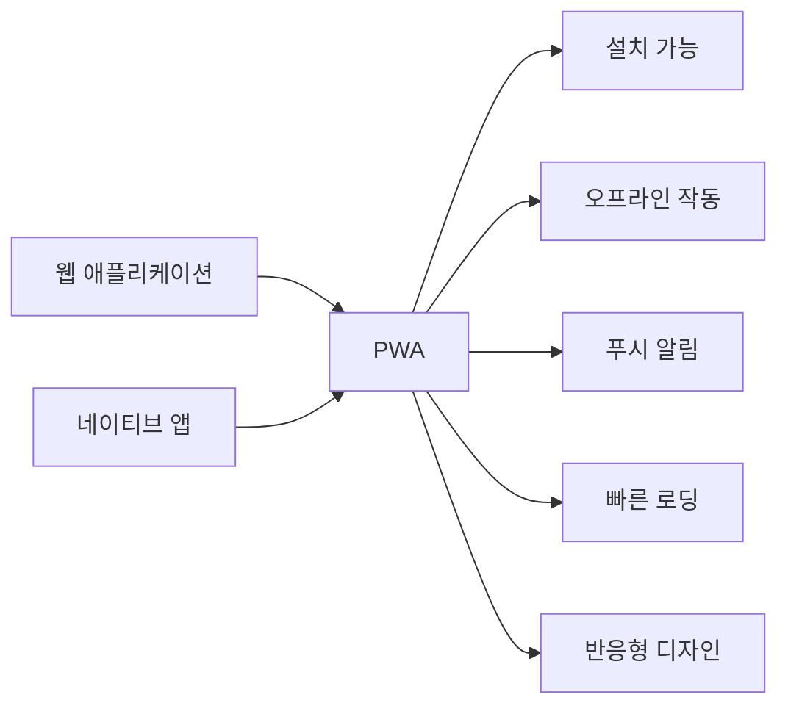
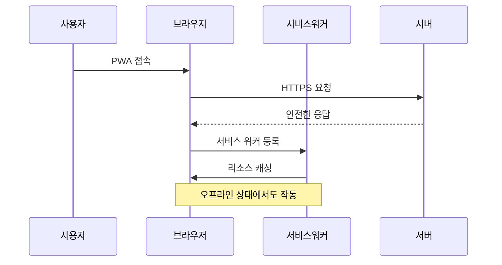
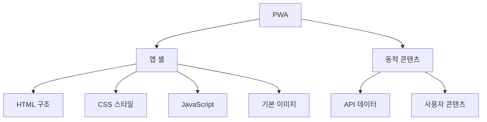

# Chapter 05 프로그레시브 웹 앱(PWA)

## 05-1 PWA 개요

### 개요
프로그레시브 웹 앱(Progressive Web App, PWA)은 웹과 네이티브 앱의 장점을 결합한 현대적인 웹 애플리케이션입니다. 이 섹션에서는 PWA의 기본 개념, 핵심 특성, 그리고 서비스 워커가 PWA에서 어떤 역할을 하는지 알아봅니다. PWA를 통해 개발자는 설치 가능하고, 오프라인에서도 작동하며, 네이티브 앱과 유사한 사용자 경험을 제공하는 웹 애플리케이션을 구축할 수 있습니다.

### PWA란 무엇인가?

프로그레시브 웹 앱(PWA)은 최신 웹 기술을 활용하여 네이티브 앱과 같은 사용자 경험을 제공하는 웹 애플리케이션입니다. PWA는 2015년 Google의 엔지니어 Alex Russell과 디자이너 Frances Berriman에 의해 처음 소개되었으며, 웹의 개방성과 접근성을 유지하면서도 네이티브 앱의 기능과 사용자 경험을 제공하는 것을 목표로 합니다.



PWA는 단순한 기술이나 프레임워크가 아니라, 웹 애플리케이션을 구축하는 새로운 접근 방식입니다. 이는 다음과 같은 핵심 원칙을 따릅니다:

1. **프로그레시브(Progressive)**: 모든 사용자에게 기본 경험을 제공하고, 브라우저가 지원하는 기능에 따라 점진적으로 향상된 경험을 제공합니다.
2. **반응형(Responsive)**: 모든 디바이스, 화면 크기, 방향에 맞게 조정됩니다.
3. **연결 독립적(Connectivity Independent)**: 오프라인이나 느린 네트워크에서도 작동합니다.
4. **앱과 유사(App-like)**: 네이티브 앱과 유사한 상호작용과 탐색 경험을 제공합니다.
5. **최신 상태 유지(Fresh)**: 서비스 워커를 통해 항상 최신 상태를 유지합니다.
6. **안전(Safe)**: HTTPS를 통해 제공되어 보안을 유지합니다.
7. **발견 가능(Discoverable)**: 웹 매니페스트와 서비스 워커 등록을 통해 검색 엔진에서 식별 가능합니다.
8. **설치 가능(Installable)**: 홈 화면에 추가하여 앱처럼 실행할 수 있습니다.
9. **링크 가능(Linkable)**: URL을 통해 쉽게 공유할 수 있습니다.

#### 웹 앱과 네이티브 앱의 비교

PWA의 개념을 더 잘 이해하기 위해, 전통적인 웹 애플리케이션과 네이티브 앱의 장단점을 비교해 보겠습니다:

| 특성 | 웹 애플리케이션 | 네이티브 앱 | PWA |
|------|----------------|------------|-----|
| 설치 | 불필요 | 앱 스토어 통해 필요 | 홈 화면에 추가 가능 |
| 업데이트 | 자동 | 수동 또는 자동 | 자동 |
| 오프라인 작동 | 제한적 | 가능 | 가능 |
| 푸시 알림 | 제한적 | 가능 | 가능 |
| 하드웨어 접근 | 제한적 | 완전한 접근 | 점점 확장 중 |
| 개발 비용 | 낮음 | 높음 | 중간 |
| 크로스 플랫폼 | 기본 지원 | 별도 개발 필요 | 기본 지원 |
| 검색 엔진 최적화 | 좋음 | 제한적 | 좋음 |
| 배포 | 즉시 | 앱 스토어 승인 필요 | 즉시 |

PWA는 이러한 두 세계의 장점을 결합하여, 개발 및 유지 관리가 쉬운 웹 기술을 사용하면서도 네이티브 앱과 유사한 사용자 경험을 제공합니다.

### PWA의 핵심 구성 요소

PWA를 구현하기 위해서는 다음과 같은 핵심 구성 요소가 필요합니다:

#### 1. 서비스 워커

서비스 워커는 PWA의 가장 중요한 구성 요소 중 하나로, 다음과 같은 기능을 제공합니다:

- **오프라인 작동**: 네트워크 요청을 가로채고 캐시된 리소스를 제공하여 오프라인 상태에서도 애플리케이션이 작동하도록 합니다.
- **백그라운드 동기화**: 오프라인 상태에서 수행된 작업을 온라인 상태가 되면 자동으로 동기화합니다.
- **푸시 알림**: 서버에서 보낸 알림을 수신하고 사용자에게 표시합니다.
- **성능 최적화**: 캐싱 전략을 통해 애플리케이션의 로딩 속도를 향상시킵니다.

```javascript
// 서비스 워커 등록 예시
if ('serviceWorker' in navigator) {
  window.addEventListener('load', () => {
    navigator.serviceWorker.register('/service-worker.js')
      .then(registration => {
        console.log('서비스 워커가 등록되었습니다:', registration.scope);
      })
      .catch(error => {
        console.error('서비스 워커 등록 실패:', error);
      });
  });
}
```

#### 2. 웹 앱 매니페스트

웹 앱 매니페스트(Web App Manifest)는 JSON 파일로, 애플리케이션의 이름, 아이콘, 테마 색상 등 PWA의 외관과 동작을 정의합니다. 이를 통해 사용자는 홈 화면에 애플리케이션을 추가하고 전체 화면으로 실행할 수 있습니다.

```json
{
  "name": "My PWA App",
  "short_name": "PWA",
  "description": "프로그레시브 웹 앱 예시",
  "start_url": "/index.html",
  "display": "standalone",
  "background_color": "#ffffff",
  "theme_color": "#4285f4",
  "icons": [
    {
      "src": "/images/icon-192x192.png",
      "sizes": "192x192",
      "type": "image/png"
    },
    {
      "src": "/images/icon-512x512.png",
      "sizes": "512x512",
      "type": "image/png"
    }
  ]
}
```

HTML 문서의 `<head>` 섹션에 다음과 같이 매니페스트 파일을 연결합니다:

```html
<link rel="manifest" href="/manifest.json">
```

#### 3. HTTPS

PWA는 보안을 위해 HTTPS를 통해 제공되어야 합니다. HTTPS는 다음과 같은 이유로 중요합니다:

- 서비스 워커는 보안상의 이유로 HTTPS 환경에서만 작동합니다(localhost 제외).
- 사용자 데이터의 보안과 프라이버시를 보호합니다.
- 중간자 공격을 방지합니다.
- 많은 최신 웹 API(지오로케이션, 푸시 알림 등)는 보안 컨텍스트에서만 사용할 수 있습니다.



### PWA의 주요 특징

#### 설치 가능성

PWA는 홈 화면에 추가하여 네이티브 앱처럼 실행할 수 있습니다. 이를 위해서는 다음 조건을 충족해야 합니다:

1. 유효한 웹 앱 매니페스트 파일이 있어야 합니다.
2. HTTPS를 통해 제공되어야 합니다.
3. 서비스 워커가 등록되어 있어야 합니다.
4. 최소한 하나의 오프라인 페이지가 있어야 합니다.
5. 적절한 아이콘이 정의되어 있어야 합니다.

브라우저는 이러한 조건이 충족되면 자동으로 설치 프롬프트를 표시하거나, 개발자가 직접 설치 버튼을 구현할 수 있습니다:

```javascript
// 설치 프롬프트 처리 예시
let deferredPrompt;

window.addEventListener('beforeinstallprompt', (e) => {
  // 기본 프롬프트 표시 방지
  e.preventDefault();
  // 이벤트 저장
  deferredPrompt = e;
  // 설치 버튼 표시
  showInstallButton();
});

// 설치 버튼 클릭 시
installButton.addEventListener('click', async () => {
  if (!deferredPrompt) return;
  // 프롬프트 표시
  deferredPrompt.prompt();
  // 사용자 응답 대기
  const { outcome } = await deferredPrompt.userChoice;
  console.log(`사용자 응답: ${outcome}`);
  // 이벤트 참조 해제
  deferredPrompt = null;
  // 설치 버튼 숨기기
  hideInstallButton();
});
```

#### 오프라인 기능

PWA의 가장 중요한 특징 중 하나는 오프라인 상태에서도 작동할 수 있다는 점입니다. 서비스 워커를 사용하여 필요한 리소스를 캐싱하고, 네트워크 연결이 없을 때도 애플리케이션이 작동하도록 할 수 있습니다.

```javascript
// 오프라인 기능을 위한 서비스 워커 예시
self.addEventListener('install', event => {
  event.waitUntil(
    caches.open('pwa-cache-v1').then(cache => {
      return cache.addAll([
        '/',
        '/index.html',
        '/styles/main.css',
        '/scripts/main.js',
        '/images/logo.png',
        '/offline.html'
      ]);
    })
  );
});

self.addEventListener('fetch', event => {
  event.respondWith(
    caches.match(event.request).then(response => {
      // 캐시에서 찾으면 캐시된 응답 반환
      if (response) {
        return response;
      }
      
      // 캐시에 없으면 네트워크 요청
      return fetch(event.request).catch(() => {
        // 네트워크 요청 실패 시 오프라인 페이지 제공
        if (event.request.mode === 'navigate') {
          return caches.match('/offline.html');
        }
      });
    })
  );
});
```

#### 푸시 알림

PWA는 Push API와 Notifications API를 사용하여 사용자에게 푸시 알림을 보낼 수 있습니다. 이를 통해 사용자 참여도를 높이고 중요한 정보를 실시간으로 전달할 수 있습니다.

```javascript
// 푸시 알림 권한 요청 예시
function requestNotificationPermission() {
  Notification.requestPermission().then(permission => {
    if (permission === 'granted') {
      console.log('알림 권한이 허용되었습니다.');
      subscribeToPushNotifications();
    }
  });
}

// 푸시 알림 구독 예시
async function subscribeToPushNotifications() {
  const registration = await navigator.serviceWorker.ready;
  const subscription = await registration.pushManager.subscribe({
    userVisibleOnly: true,
    applicationServerKey: urlBase64ToUint8Array('YOUR_PUBLIC_VAPID_KEY')
  });
  
  // 구독 정보를 서버에 전송
  await fetch('/api/subscribe', {
    method: 'POST',
    headers: {
      'Content-Type': 'application/json',
    },
    body: JSON.stringify(subscription)
  });
}
```

#### 앱 셸 아키텍처

앱 셸(App Shell) 아키텍처는 PWA의 성능을 최적화하기 위한 디자인 패턴입니다. 이는 애플리케이션의 핵심 인프라와 UI를 동적 콘텐츠와 분리하여, 초기 로딩 속도를 향상시키고 일관된 사용자 경험을 제공합니다.



앱 셸은 서비스 워커를 통해 캐시되어 즉시 로드되고, 동적 콘텐츠는 필요에 따라 로드됩니다. 이 접근 방식은 다음과 같은 이점을 제공합니다:

1. **빠른 초기 로딩**: 앱 셸이 캐시되어 즉시 표시됩니다.
2. **일관된 UI**: 콘텐츠가 로드되는 동안에도 기본 UI가 표시됩니다.
3. **네트워크 효율성**: 변경되지 않는 셸 구성 요소를 반복해서 다운로드할 필요가 없습니다.
4. **오프라인 경험**: 기본 UI는 오프라인 상태에서도 작동합니다.

### PWA의 이점

#### 개발자 관점

PWA는 개발자에게 다음과 같은 이점을 제공합니다:

1. **단일 코드베이스**: 여러 플랫폼에서 작동하는 하나의 애플리케이션을 개발할 수 있습니다.
2. **빠른 배포**: 앱 스토어 승인 과정 없이 즉시 업데이트를 배포할 수 있습니다.
3. **웹 기술 활용**: HTML, CSS, JavaScript와 같은 친숙한 웹 기술을 사용할 수 있습니다.
4. **비용 효율성**: 여러 플랫폼용 앱을 별도로 개발하는 것보다 비용이 적게 듭니다.
5. **검색 엔진 최적화**: 웹 기반이므로 검색 엔진에 의해 색인화될 수 있습니다.

#### 사용자 관점

PWA는 사용자에게 다음과 같은 이점을 제공합니다:

1. **빠른 로딩**: 캐싱을 통해 빠른 로딩 속도를 제공합니다.
2. **오프라인 작동**: 네트워크 연결 없이도 기본 기능을 사용할 수 있습니다.
3. **설치 간소화**: 앱 스토어를 통하지 않고 홈 화면에 직접 추가할 수 있습니다.
4. **자동 업데이트**: 항상 최신 버전을 사용할 수 있습니다.
5. **적은 저장 공간**: 네이티브 앱보다 일반적으로 적은 저장 공간을 사용합니다.
6. **푸시 알림**: 중요한 정보를 실시간으로 받을 수 있습니다.
7. **네이티브 앱과 유사한 경험**: 전체 화면 모드, 스플래시 화면 등 네이티브 앱과 유사한 경험을 제공합니다.

### 좀 더 알아보기: PWA 지원 현황

PWA 기술은 계속 발전하고 있으며, 주요 브라우저와 플랫폼의 지원도 확대되고 있습니다. 현재 PWA 지원 현황은 다음과 같습니다:

#### 브라우저 지원

대부분의 현대 브라우저는 PWA의 핵심 기능을 지원합니다:

- **Chrome**: 데스크톱과 모바일에서 완전한 지원
- **Firefox**: 대부분의 기능 지원
- **Safari**: iOS 11.3부터 기본 지원 시작, 일부 기능 제한적 지원
- **Edge**: 완전한 지원
- **Opera**: 완전한 지원
- **Samsung Internet**: 완전한 지원

#### 플랫폼 통합

PWA는 다양한 플랫폼에 통합되고 있습니다:

1. **Android**: Play Store에 PWA 등록 가능, 앱 서랍에 표시
2. **iOS**: 홈 화면에 추가 가능, 일부 기능 제한적 지원
3. **Windows**: Microsoft Store에 PWA 등록 가능, 네이티브 앱처럼 실행
4. **macOS**: Safari를 통해 설치 가능, 제한적 통합
5. **Chrome OS**: 완전한 통합, 네이티브 앱과 동일한 경험 제공

PWA 기술은 계속 발전하고 있으며, 향후 더 많은 기능과 플랫폼 지원이 추가될 것으로 예상됩니다.

### 6가지 키워드로 정리하는 핵심 포인트
1. **프로그레시브 웹 앱**: 웹과 네이티브 앱의 장점을 결합한 현대적인 웹 애플리케이션입니다.
2. **서비스 워커**: PWA의 핵심 구성 요소로, 오프라인 기능, 백그라운드 동기화, 푸시 알림 등을 가능하게 합니다.
3. **웹 앱 매니페스트**: PWA의 외관과 동작을 정의하는 JSON 파일로, 설치 가능성을 제공합니다.
4. **오프라인 기능**: 서비스 워커와 캐싱 전략을 통해 네트워크 연결 없이도 작동할 수 있습니다.
5. **앱 셸 아키텍처**: 핵심 UI와 동적 콘텐츠를 분리하여 성능을 최적화하는 디자인 패턴입니다.
6. **크로스 플랫폼**: 하나의 코드베이스로 여러 플랫폼에서 일관된 사용자 경험을 제공합니다.

### 확인 문제
1. PWA의 핵심 구성 요소가 아닌 것은?
   - [ ] 서비스 워커
   - [ ] 웹 앱 매니페스트
   - [ ] HTTPS
   - [ ] 데이터베이스 관리 시스템

2. PWA가 설치 가능하기 위한 필수 조건이 아닌 것은?
   - [ ] 유효한 웹 앱 매니페스트
   - [ ] 서비스 워커 등록
   - [ ] HTTPS 제공
   - [ ] 서버 사이드 렌더링

3. 다음 중 PWA의 특징으로 올바른 것은? (복수 응답)
   - [ ] 항상 인터넷 연결이 필요하다
   - [ ] 홈 화면에 추가할 수 있다
   - [ ] 푸시 알림을 보낼 수 있다
   - [ ] 앱 스토어를 통해서만 설치할 수 있다
   - [ ] 오프라인에서도 작동할 수 있다

4. 앱 셸 아키텍처의 주요 목적은 무엇인가요?
   - [ ] 서버 부하 감소
   - [ ] 초기 로딩 속도 향상
   - [ ] 데이터베이스 최적화
   - [ ] 배터리 사용량 감소

5. 웹 앱 매니페스트에 포함되지 않는 정보는?
   - [ ] 앱 이름
   - [ ] 아이콘 경로
   - [ ] 서비스 워커 스크립트
   - [ ] 테마 색상

6. PWA의 개발자 관점에서의 이점이 아닌 것은?
   - [ ] 단일 코드베이스로 여러 플랫폼 지원
   - [ ] 앱 스토어 승인 없이 즉시 배포
   - [ ] 하드웨어에 대한 완전한 접근
   - [ ] 웹 기술 활용

7. 서비스 워커가 PWA에서 수행하는 역할이 아닌 것은?
   - [ ] 오프라인 작동 지원
   - [ ] 푸시 알림 처리
   - [ ] 백그라운드 동기화
   - [ ] 직접적인 DOM 조작

> [정답 및 해설 보기](../answers_and_explanations.md#05-1-pwa-개요)