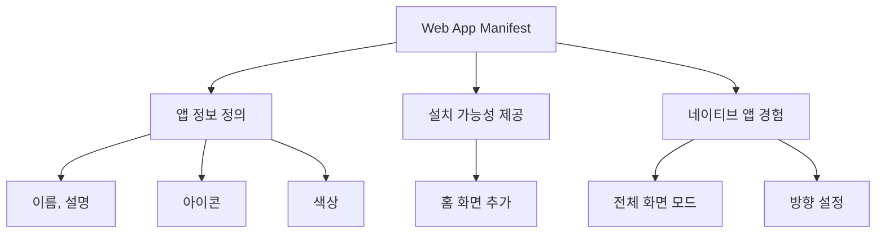
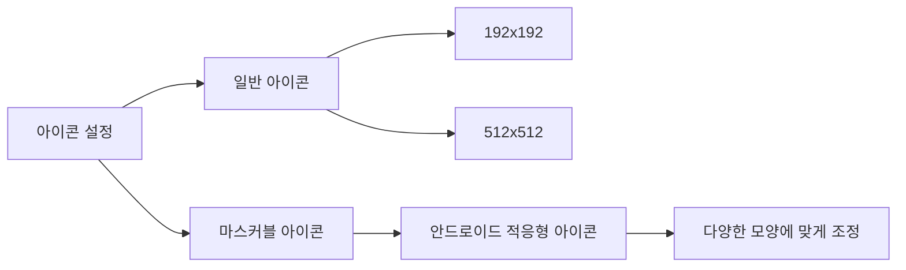
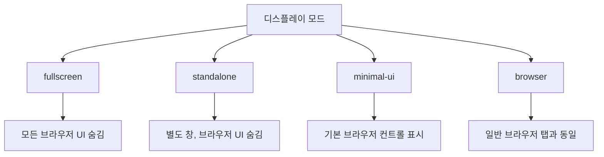

# Chapter 05 프로그레시브 웹 앱(PWA)

## 05-2 매니페스트 파일

### 개요
웹 앱 매니페스트(Web App Manifest)는 프로그레시브 웹 앱(PWA)의 핵심 구성 요소 중 하나로, 웹 애플리케이션의 외관과 동작을 정의하는 JSON 파일입니다. 이 섹션에서는 매니페스트 파일의 기본 개념, 구성 방법, 그리고 이를 통해 어떻게 네이티브 앱과 유사한 설치 경험을 제공할 수 있는지 알아봅니다. 매니페스트 파일을 올바르게 구성함으로써 사용자는 웹 애플리케이션을 홈 화면에 추가하고 전체 화면으로 실행할 수 있습니다.

### Web App Manifest 소개

웹 앱 매니페스트는 W3C에서 표준화한 기술로, 웹 애플리케이션이 네이티브 앱처럼 동작하고 보이도록 하는 메타데이터를 제공합니다. 이 JSON 파일은 애플리케이션의 이름, 아이콘, 테마 색상, 시작 URL 등 다양한 정보를 포함합니다.



매니페스트 파일의 주요 목적은 다음과 같습니다:

1. **설치 가능성 제공**: 사용자가 웹 애플리케이션을 홈 화면에 추가할 수 있게 합니다.
2. **브랜딩 강화**: 애플리케이션의 이름, 아이콘, 테마 색상 등을 통해 일관된 브랜드 경험을 제공합니다.
3. **사용자 경험 향상**: 전체 화면 모드, 화면 방향 설정 등을 통해 네이티브 앱과 유사한 경험을 제공합니다.
4. **시작 컨텍스트 정의**: 애플리케이션이 시작될 때의 URL, 화면 방향 등을 지정합니다.

웹 애플리케이션에 매니페스트 파일을 추가하는 방법은 간단합니다. HTML 문서의 `<head>` 섹션에 다음과 같이 링크 태그를 추가하면 됩니다:

```html
<link rel="manifest" href="/manifest.json">
```

브라우저는 이 링크를 통해 매니페스트 파일을 로드하고, 파일에 정의된 정보를 기반으로 애플리케이션의 설치 가능성과 외관을 결정합니다.

### 매니페스트 파일 구성

#### 기본 정보 설정

매니페스트 파일의 기본 구조는 다음과 같은 핵심 속성들로 구성됩니다:

```json
{
  "name": "My Progressive Web App",
  "short_name": "MyPWA",
  "description": "이것은 프로그레시브 웹 앱 예시입니다",
  "id": "/index.html",
  "start_url": "/index.html",
  "scope": "/",
  "background_color": "#ffffff",
  "theme_color": "#4285f4",
  "display": "standalone",
  "orientation": "portrait"
}
```

각 속성의 의미와 역할은 다음과 같습니다:

1. **name**: 애플리케이션의 전체 이름으로, 설치 프롬프트와 스플래시 화면에 표시됩니다.
2. **short_name**: 홈 화면에 표시될 짧은 이름으로, 공간이 제한된 경우 사용됩니다.
3. **description**: 애플리케이션에 대한 간략한 설명으로, 설치 프롬프트에 표시될 수 있습니다.
4. **id**: 애플리케이션의 고유 식별자로, 기본값은 start_url입니다.
5. **start_url**: 애플리케이션이 시작될 때 로드할 URL입니다.
6. **scope**: 애플리케이션의 네비게이션 범위를 정의합니다.
7. **background_color**: 스플래시 화면과 브라우저 UI의 배경색입니다.
8. **theme_color**: 브라우저 UI(주소 표시줄 등)의 색상입니다.
9. **display**: 애플리케이션의 표시 모드를 지정합니다.
10. **orientation**: 애플리케이션의 기본 화면 방향을 지정합니다.

이러한 기본 정보는 사용자가 애플리케이션을 처음 접할 때의 경험을 결정하는 중요한 요소입니다.

#### 아이콘 설정

아이콘은 홈 화면, 작업 전환기, 스플래시 화면 등 다양한 곳에서 애플리케이션을 나타내는 시각적 요소입니다. 매니페스트 파일에서는 다양한 크기와 해상도의 아이콘을 정의할 수 있습니다:

```json
{
  "icons": [
    {
      "src": "/images/icon-192x192.png",
      "sizes": "192x192",
      "type": "image/png",
      "purpose": "any"
    },
    {
      "src": "/images/icon-512x512.png",
      "sizes": "512x512",
      "type": "image/png",
      "purpose": "any"
    },
    {
      "src": "/images/maskable-icon-192x192.png",
      "sizes": "192x192",
      "type": "image/png",
      "purpose": "maskable"
    }
  ]
}
```

아이콘 속성의 주요 특징은 다음과 같습니다:

1. **src**: 아이콘 이미지의 경로입니다.
2. **sizes**: 아이콘의 크기를 지정합니다(예: "192x192").
3. **type**: 이미지의 MIME 타입입니다(예: "image/png").
4. **purpose**: 아이콘의 용도를 지정합니다.
   - **any**: 일반적인 용도의 아이콘
   - **maskable**: 적응형 아이콘(Android의 경우 다양한 모양에 맞게 조정됨)
   - **monochrome**: 단색 아이콘

PWA를 제대로 지원하기 위해서는 최소한 192x192와 512x512 크기의 아이콘을 제공하는 것이 좋습니다. 또한 Android의 적응형 아이콘을 지원하기 위해 'maskable' 용도의 아이콘도 제공하는 것이 좋습니다.



#### 디스플레이 모드

디스플레이 모드는 애플리케이션이 사용자에게 어떻게 표시될지를 결정합니다. 매니페스트 파일의 `display` 속성을 통해 다음과 같은 모드 중 하나를 선택할 수 있습니다:

```json
{
  "display": "standalone"
}
```

주요 디스플레이 모드는 다음과 같습니다:

1. **fullscreen**: 가능한 모든 화면 공간을 사용하며, 브라우저 UI를 완전히 숨깁니다.
2. **standalone**: 네이티브 앱과 유사하게 표시되며, 브라우저 UI를 숨기고 별도의 창으로 실행됩니다.
3. **minimal-ui**: 기본적인 브라우저 컨트롤(뒤로 가기, 새로고침 등)을 표시합니다.
4. **browser**: 일반적인 브라우저 탭에서와 같이 표시됩니다.

대부분의 PWA는 네이티브 앱과 유사한 경험을 제공하기 위해 `standalone` 모드를 사용합니다. 이 모드에서는 주소 표시줄과 같은 브라우저 UI 요소가 숨겨지고, 애플리케이션은 별도의 창으로 실행됩니다.



#### 시작 URL 및 방향

`start_url` 속성은 애플리케이션이 시작될 때 로드할 URL을 지정합니다. 이 URL은 사용자가 홈 화면에서 애플리케이션을 실행할 때 열리는 페이지입니다.

```json
{
  "start_url": "/index.html?source=pwa"
}
```

쿼리 파라미터(예: `?source=pwa`)를 추가하여 애플리케이션이 홈 화면에서 시작되었는지 추적할 수 있습니다. 이는 분석 목적으로 유용합니다.

`orientation` 속성은 애플리케이션의 기본 화면 방향을 지정합니다:

```json
{
  "orientation": "portrait"
}
```

가능한 값은 다음과 같습니다:
- **portrait**: 세로 방향
- **landscape**: 가로 방향
- **portrait-primary**, **portrait-secondary**: 기본 및 보조 세로 방향
- **landscape-primary**, **landscape-secondary**: 기본 및 보조 가로 방향
- **natural**: 기기의 자연스러운 방향
- **any**: 모든 방향 허용

애플리케이션의 성격에 따라 적절한 방향을 선택하는 것이 중요합니다. 예를 들어, 게임이나 동영상 플레이어는 가로 방향이 적합할 수 있고, 뉴스 앱이나 소셜 미디어 앱은 세로 방향이 적합할 수 있습니다.

### 홈 화면 설치 경험 최적화

PWA의 주요 특징 중 하나는 사용자가 애플리케이션을 홈 화면에 추가할 수 있다는 것입니다. 이 과정을 최적화하여 사용자에게 더 나은 설치 경험을 제공할 수 있습니다.

#### 설치 기준

브라우저가 PWA 설치 프롬프트를 표시하기 위해서는 다음과 같은 기준을 충족해야 합니다:

1. 유효한 웹 앱 매니페스트 파일이 있어야 합니다.
2. HTTPS를 통해 제공되어야 합니다.
3. 서비스 워커가 등록되어 있어야 합니다.
4. 최소한 하나의 192x192 아이콘이 있어야 합니다.
5. `name` 또는 `short_name`과 `start_url`이 정의되어 있어야 합니다.
6. `display` 값이 `standalone`, `fullscreen` 또는 `minimal-ui` 중 하나여야 합니다.

이러한 기준을 충족하면 브라우저는 사용자가 애플리케이션을 일정 시간 사용한 후 자동으로 설치 프롬프트를 표시합니다.

#### 커스텀 설치 버튼

기본 설치 프롬프트 외에도, 개발자는 커스텀 설치 버튼을 구현하여 사용자에게 더 명확한 설치 경로를 제공할 수 있습니다:

```javascript
// 설치 프롬프트 이벤트 저장
let deferredPrompt;

window.addEventListener('beforeinstallprompt', (e) => {
  // 기본 프롬프트 표시 방지
  e.preventDefault();
  // 이벤트 저장
  deferredPrompt = e;
  // 설치 버튼 표시
  showInstallButton();
});

// 설치 버튼 클릭 시
function installApp() {
  // 설치 버튼 숨기기
  hideInstallButton();
  
  // 설치 프롬프트 표시
  deferredPrompt.prompt();
  
  // 사용자 응답 처리
  deferredPrompt.userChoice.then((choiceResult) => {
    if (choiceResult.outcome === 'accepted') {
      console.log('사용자가 설치를 수락했습니다.');
    } else {
      console.log('사용자가 설치를 거부했습니다.');
    }
    // 이벤트 참조 해제
    deferredPrompt = null;
  });
}

// 설치 완료 감지
window.addEventListener('appinstalled', (evt) => {
  console.log('애플리케이션이 설치되었습니다.');
  // 설치 관련 UI 업데이트
  updateAppInstalledUI();
});
```

이 코드는 `beforeinstallprompt` 이벤트를 캡처하여 기본 프롬프트를 방지하고, 대신 사용자가 애플리케이션 내에서 설치 버튼을 클릭할 때 프롬프트를 표시합니다. 이를 통해 개발자는 설치 경험을 더 잘 제어하고 사용자에게 적절한 시점에 설치를 유도할 수 있습니다.

#### 플랫폼별 고려사항

다양한 플랫폼에서 최적의 설치 경험을 제공하기 위해 고려해야 할 사항들이 있습니다:

1. **iOS (Safari)**:
   - iOS에서는 `apple-mobile-web-app-capable` 메타 태그를 추가하여 전체 화면 모드를 활성화할 수 있습니다.
   - `apple-mobile-web-app-status-bar-style`을 사용하여 상태 표시줄 스타일을 지정할 수 있습니다.
   - `apple-touch-icon`을 사용하여 iOS 홈 화면 아이콘을 지정할 수 있습니다.

   ```html
   <meta name="apple-mobile-web-app-capable" content="yes">
   <meta name="apple-mobile-web-app-status-bar-style" content="black-translucent">
   <link rel="apple-touch-icon" href="/images/icons/apple-touch-icon.png">
   ```

2. **Android (Chrome)**:
   - Android에서는 매니페스트 파일의 `theme_color`가 상태 표시줄 색상을 결정합니다.
   - `maskable` 아이콘을 제공하여 다양한 기기 형태에 맞게 조정되도록 할 수 있습니다.

3. **Windows (Edge)**:
   - Windows에서는 `msapplication-*` 메타 태그를 사용하여 타일 색상 등을 지정할 수 있습니다.

   ```html
   <meta name="msapplication-TileColor" content="#2b5797">
   <meta name="msapplication-TileImage" content="/images/icons/mstile-144x144.png">
   ```

이러한 플랫폼별 최적화를 통해 모든 기기에서 일관된 브랜딩과 사용자 경험을 제공할 수 있습니다.

### 5가지 키워드로 정리하는 핵심 포인트
1. **웹 앱 매니페스트**: PWA의 외관과 동작을 정의하는 JSON 파일로, 설치 가능성을 제공합니다.
2. **설치 가능성**: 매니페스트 파일을 통해 웹 앱을 홈 화면에 추가하고 네이티브 앱처럼 실행할 수 있습니다.
3. **디스플레이 모드**: fullscreen, standalone, minimal-ui, browser 등 앱이 표시되는 방식을 결정합니다.
4. **아이콘 설정**: 다양한 크기와 용도(any, maskable)의 아이콘을 제공하여 모든 플랫폼에서 최적의 시각적 표현을 보장합니다.
5. **플랫폼 최적화**: iOS, Android, Windows 등 다양한 플랫폼에 맞는 추가 메타 태그와 설정으로 일관된 사용자 경험을 제공합니다.

### 확인 문제
1. 웹 앱 매니페스트 파일에서 홈 화면에 표시될 짧은 이름을 지정하는 속성은 무엇인가요?
   - [ ] name
   - [ ] app_name
   - [ ] short_name
   - [ ] display_name

2. PWA가 설치 가능하기 위한 필수 조건이 아닌 것은?
   - [ ] 유효한 웹 앱 매니페스트 파일
   - [ ] 서비스 워커 등록
   - [ ] 데이터베이스 연결
   - [ ] HTTPS 제공

3. 매니페스트 파일에서 애플리케이션이 표시되는 방식을 결정하는 속성은?
   - [ ] view
   - [ ] mode
   - [ ] display
   - [ ] appearance

4. 다음 중 웹 앱 매니페스트의 디스플레이 모드가 아닌 것은?
   - [ ] fullscreen
   - [ ] standalone
   - [ ] minimal-ui
   - [ ] windowed

5. 매니페스트 파일에서 아이콘의 용도를 'maskable'로 지정하는 이유는 무엇인가요?
   - [ ] 아이콘을 흑백으로 표시하기 위해
   - [ ] 아이콘에 그림자 효과를 추가하기 위해
   - [ ] 다양한 모양의 적응형 아이콘을 지원하기 위해
   - [ ] 아이콘 크기를 자동으로 조정하기 위해

6. 다음 중 PWA 설치 프롬프트를 캡처하는 JavaScript 이벤트는?
   - [ ] oninstallprompt
   - [ ] beforeinstallprompt
   - [ ] installprompt
   - [ ] pwainstall

7. 웹 앱 매니페스트 파일을 HTML 문서에 연결하는 올바른 방법은?
   - [ ] `<script src="/manifest.json"></script>`
   - [ ] `<meta name="manifest" content="/manifest.json">`
   - [ ] `<link rel="manifest" href="/manifest.json">`
   - [ ] `<import manifest from="/manifest.json">`

> [정답 및 해설 보기](../answers_and_explanations.md#05-2-매니페스트-파일)