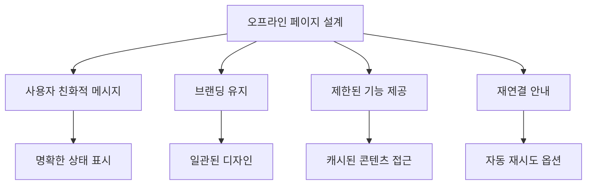
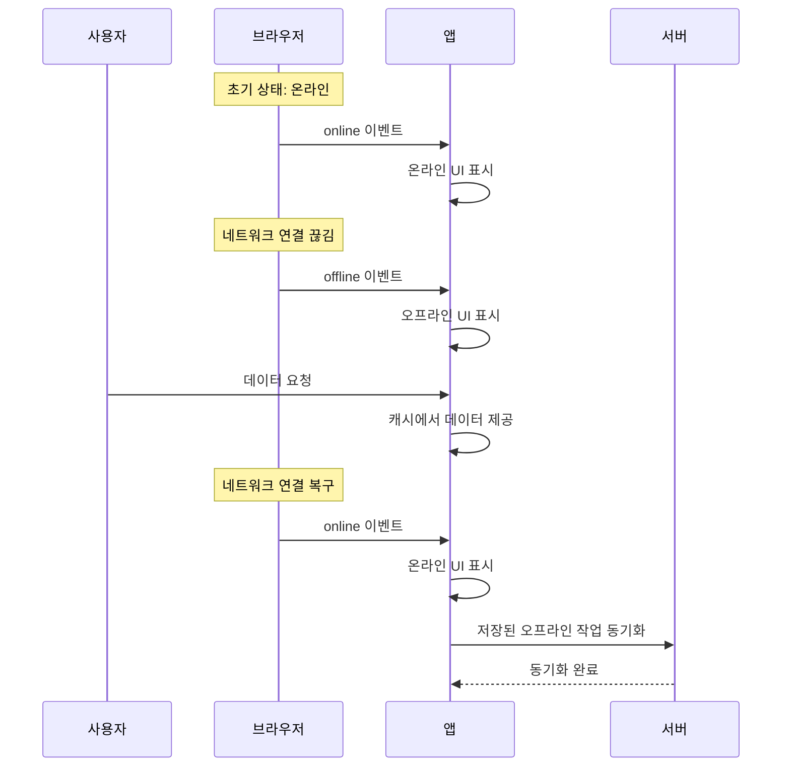
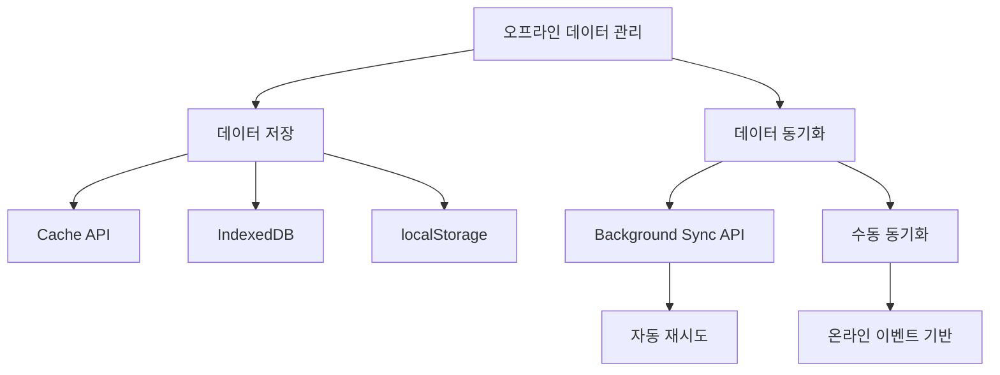

# Chapter 05 프로그레시브 웹 앱(PWA)

## 05-3 오프라인 경험 구현

### 개요
오프라인 경험은 프로그레시브 웹 앱(PWA)의 핵심 기능 중 하나로, 네트워크 연결이 없거나 불안정한 상황에서도 사용자가 웹 애플리케이션을 이용할 수 있게 합니다. 이 섹션에서는 오프라인 페이지 설계, 네트워크 상태 감지, 오프라인 데이터 저장 및 동기화, 그리고 사용자 경험 최적화 방법에 대해 알아봅니다. 서비스 워커와 다양한 스토리지 API를 활용하여 효과적인 오프라인 경험을 구현하는 방법을 배우게 됩니다.

### 오프라인 페이지 설계

오프라인 페이지는 사용자가 네트워크 연결 없이 웹 애플리케이션에 접근할 때 표시되는 페이지로, 사용자에게 현재 상태를 알리고 제한된 기능을 제공합니다. 효과적인 오프라인 페이지 설계는 사용자 경험을 크게 향상시킬 수 있습니다.



#### 기본 오프라인 페이지 구현

가장 기본적인 오프라인 페이지는 서비스 워커의 `fetch` 이벤트 핸들러에서 네트워크 요청이 실패할 때 제공되는 정적 HTML 페이지입니다:

```javascript
// 서비스 워커 설치 시 오프라인 페이지 캐싱
self.addEventListener('install', event => {
  event.waitUntil(
    caches.open('offline-cache-v1').then(cache => {
      return cache.addAll([
        '/offline.html',
        '/styles/offline.css',
        '/images/offline-icon.svg'
      ]);
    })
  );
});

// 네트워크 요청 실패 시 오프라인 페이지 제공
self.addEventListener('fetch', event => {
  event.respondWith(
    fetch(event.request)
      .catch(() => {
        // HTML 페이지 요청인 경우에만 오프라인 페이지 제공
        if (event.request.mode === 'navigate') {
          return caches.match('/offline.html');
        }
        
        // 이미지 요청인 경우 기본 오프라인 이미지 제공
        if (event.request.destination === 'image') {
          return caches.match('/images/offline-icon.svg');
        }
        
        // 그 외의 경우 실패 응답 반환
        return new Response('오프라인 상태입니다', {
          status: 503,
          statusText: 'Service Unavailable',
          headers: new Headers({
            'Content-Type': 'text/plain'
          })
        });
      })
  );
});
```

오프라인 HTML 페이지(`offline.html`)는 다음과 같이 구성할 수 있습니다:

```html
<!DOCTYPE html>
<html lang="ko">
<head>
  <meta charset="UTF-8">
  <meta name="viewport" content="width=device-width, initial-scale=1.0">
  <title>오프라인 - 내 앱</title>
  <link rel="stylesheet" href="/styles/offline.css">
</head>
<body>
  <div class="offline-container">
    
    <h1>현재 오프라인 상태입니다</h1>
    <p>인터넷 연결을 확인하고 다시 시도해 주세요.</p>
    <button id="retry-button">다시 시도</button>
  </div>
  
  <script>
    // 다시 시도 버튼 클릭 시 페이지 새로고침
    document.getElementById('retry-button').addEventListener('click', () => {
      window.location.reload();
    });
    
    // 온라인 상태가 되면 자동으로 페이지 새로고침
    window.addEventListener('online', () => {
      window.location.reload();
    });
  </script>
</body>
</html>
```

#### 고급 오프라인 경험 설계

보다 고급 오프라인 경험을 제공하기 위해서는 다음과 같은 요소들을 고려해야 합니다:

1. **컨텍스트 유지**: 사용자가 어떤 페이지에서 오프라인 상태가 되었는지 기억하고, 온라인 상태가 되면 해당 페이지로 복귀할 수 있도록 합니다.

2. **부분적 기능 제공**: 완전한 오프라인 페이지 대신, 캐시된 데이터를 기반으로 제한된 기능을 제공합니다. 예를 들어, 뉴스 앱에서는 이전에 로드된 기사를 읽을 수 있게 합니다.

3. **오프라인 상태 표시**: 앱 내에 오프라인 상태를 명확하게 표시하여 사용자가 현재 상태를 인지할 수 있게 합니다.

4. **오프라인 작업 큐**: 사용자가 오프라인 상태에서 수행한 작업(예: 폼 제출, 댓글 작성)을 저장하고, 온라인 상태가 되면 자동으로 처리합니다.

```javascript
// 오프라인 상태 배너 표시 예시
function updateOfflineStatus() {
  const offlineBanner = document.getElementById('offline-banner');
  
  if (!navigator.onLine) {
    offlineBanner.classList.add('visible');
    document.body.classList.add('offline-mode');
  } else {
    offlineBanner.classList.remove('visible');
    document.body.classList.remove('offline-mode');
  }
}

window.addEventListener('online', updateOfflineStatus);
window.addEventListener('offline', updateOfflineStatus);
document.addEventListener('DOMContentLoaded', updateOfflineStatus);
```

### 오프라인 상태 감지

오프라인 경험을 효과적으로 구현하기 위해서는 네트워크 연결 상태를 정확하게 감지하고 변화에 대응해야 합니다. 웹 애플리케이션에서 오프라인 상태를 감지하는 방법에는 여러 가지가 있습니다.

#### navigator.onLine 속성

가장 기본적인 방법은 `navigator.onLine` 속성을 사용하는 것입니다. 이 속성은 브라우저가 네트워크에 연결되어 있는지 여부를 불리언 값으로 반환합니다:

```javascript
if (navigator.onLine) {
  console.log('온라인 상태입니다.');
} else {
  console.log('오프라인 상태입니다.');
}
```

그러나 `navigator.onLine`은 실제 인터넷 연결 상태가 아닌 네트워크 인터페이스의 상태만 확인하므로, 때로는 부정확할 수 있습니다. 예를 들어, Wi-Fi에 연결되어 있지만 인터넷 접속이 불가능한 경우에도 `true`를 반환할 수 있습니다.

#### 온라인/오프라인 이벤트

브라우저는 네트워크 상태가 변경될 때 `online`과 `offline` 이벤트를 발생시킵니다:

```javascript
window.addEventListener('online', () => {
  console.log('온라인 상태가 되었습니다.');
  // 온라인 상태에 따른 UI 업데이트
  updateOnlineStatus(true);
});

window.addEventListener('offline', () => {
  console.log('오프라인 상태가 되었습니다.');
  // 오프라인 상태에 따른 UI 업데이트
  updateOnlineStatus(false);
});

function updateOnlineStatus(isOnline) {
  const statusIndicator = document.getElementById('status-indicator');
  
  if (isOnline) {
    statusIndicator.textContent = '온라인';
    statusIndicator.className = 'status-online';
    // 오프라인 상태에서 저장된 데이터 동기화
    syncOfflineData();
  } else {
    statusIndicator.textContent = '오프라인';
    statusIndicator.className = 'status-offline';
    // 오프라인 모드 활성화
    enableOfflineMode();
  }
}
```



#### 네트워크 요청을 통한 연결 확인

더 정확한 연결 상태 확인을 위해 실제 네트워크 요청을 수행하는 방법도 있습니다:

```javascript
async function checkNetworkConnection() {
  try {
    // 작은 파일을 요청하여 연결 상태 확인
    const response = await fetch('/connectivity-check.json', {
      // 캐시 사용 방지
      cache: 'no-store',
      // 헤더만 가져오기
      method: 'HEAD'
    });
    
    return response.ok;
  } catch (error) {
    console.log('네트워크 연결 확인 중 오류:', error);
    return false;
  }
}

// 주기적으로 연결 상태 확인
setInterval(async () => {
  const isConnected = await checkNetworkConnection();
  updateOnlineStatus(isConnected);
}, 30000); // 30초마다 확인
```

이 방법은 실제 서버와의 통신 가능 여부를 확인하므로 더 정확하지만, 추가적인 네트워크 요청이 발생한다는 단점이 있습니다.

### 오프라인 데이터 저장 및 동기화

오프라인 경험의 핵심은 데이터를 로컬에 저장하고 네트워크 연결이 복구되면 서버와 동기화하는 것입니다. 웹 애플리케이션에서 오프라인 데이터를 관리하기 위한 다양한 API와 전략이 있습니다.

#### 데이터 저장 옵션

1. **Cache API**: 서비스 워커와 함께 사용하여 HTTP 요청과 응답을 저장합니다. 주로 정적 자산과 API 응답을 캐싱하는 데 적합합니다.

2. **IndexedDB**: 대용량의 구조화된 데이터를 저장하기 위한 클라이언트 측 데이터베이스입니다. 복잡한 데이터 구조와 쿼리를 지원합니다.

3. **localStorage/sessionStorage**: 간단한 키-값 쌍을 저장하는 데 사용됩니다. 용량이 제한적이고 동기적으로 작동하므로 소량의 데이터에 적합합니다.

4. **Web Storage API**: 오프라인 작업을 위한 데이터를 저장하고 관리하는 API입니다.

```javascript
// IndexedDB를 사용한 오프라인 데이터 저장 예시
class OfflineStore {
  constructor() {
    this.dbPromise = this.openDatabase();
  }
  
  async openDatabase() {
    return new Promise((resolve, reject) => {
      const request = indexedDB.open('offline-data', 1);
      
      request.onerror = event => reject(event.target.error);
      
      request.onsuccess = event => resolve(event.target.result);
      
      request.onupgradeneeded = event => {
        const db = event.target.result;
        
        // 오프라인 작업을 저장할 객체 저장소 생성
        if (!db.objectStoreNames.contains('offlineActions')) {
          const store = db.createObjectStore('offlineActions', { 
            keyPath: 'id', 
            autoIncrement: true 
          });
          store.createIndex('timestamp', 'timestamp');
          store.createIndex('type', 'type');
        }
        
        // 캐시된 데이터를 저장할 객체 저장소 생성
        if (!db.objectStoreNames.contains('cachedData')) {
          const store = db.createObjectStore('cachedData', { 
            keyPath: 'key' 
          });
          store.createIndex('timestamp', 'timestamp');
        }
      };
    });
  }
  
  // 오프라인 작업 저장
  async saveOfflineAction(action) {
    const db = await this.dbPromise;
    const tx = db.transaction('offlineActions', 'readwrite');
    const store = tx.objectStore('offlineActions');
    
    await store.add({
      ...action,
      timestamp: new Date().getTime(),
      synced: false
    });
    
    return tx.complete;
  }
  
  // 데이터 캐싱
  async cacheData(key, data) {
    const db = await this.dbPromise;
    const tx = db.transaction('cachedData', 'readwrite');
    const store = tx.objectStore('cachedData');
    
    await store.put({
      key,
      data,
      timestamp: new Date().getTime()
    });
    
    return tx.complete;
  }
  
  // 캐시된 데이터 검색
  async getCachedData(key) {
    const db = await this.dbPromise;
    const tx = db.transaction('cachedData', 'readonly');
    const store = tx.objectStore('cachedData');
    
    return store.get(key);
  }
  
  // 미동기화 작업 가져오기
  async getUnsyncedActions() {
    const db = await this.dbPromise;
    const tx = db.transaction('offlineActions', 'readonly');
    const store = tx.objectStore('offlineActions');
    const index = store.index('timestamp');
    
    return index.getAll(IDBKeyRange.only(0));
  }
  
  // 작업 동기화 완료 표시
  async markActionSynced(id) {
    const db = await this.dbPromise;
    const tx = db.transaction('offlineActions', 'readwrite');
    const store = tx.objectStore('offlineActions');
    
    const action = await store.get(id);
    action.synced = true;
    await store.put(action);
    
    return tx.complete;
  }
}

// 사용 예시
const offlineStore = new OfflineStore();

// 오프라인 폼 제출 처리
async function handleFormSubmit(formData) {
  try {
    // 온라인 상태면 직접 서버에 전송
    if (navigator.onLine) {
      await sendToServer(formData);
    } else {
      // 오프라인 상태면 로컬에 저장
      await offlineStore.saveOfflineAction({
        type: 'form_submission',
        data: formData,
        url: '/api/submit'
      });
      
      // 사용자에게 알림
      showNotification('오프라인 상태입니다. 연결이 복구되면 자동으로 제출됩니다.');
    }
  } catch (error) {
    console.error('폼 제출 처리 중 오류:', error);
  }
}
```

#### 백그라운드 동기화

Background Sync API를 사용하면 사용자가 오프라인 상태에서 수행한 작업을 온라인 상태가 되었을 때 자동으로 동기화할 수 있습니다:

```javascript
// 서비스 워커에서 동기화 이벤트 처리
self.addEventListener('sync', event => {
  if (event.tag === 'sync-forms') {
    event.waitUntil(syncOfflineForms());
  }
});

// 오프라인 폼 데이터 동기화
async function syncOfflineForms() {
  const offlineStore = new OfflineStore();
  const unsyncedActions = await offlineStore.getUnsyncedActions();
  
  for (const action of unsyncedActions) {
    if (action.type === 'form_submission') {
      try {
        // 서버에 데이터 전송
        const response = await fetch(action.url, {
          method: 'POST',
          headers: {
            'Content-Type': 'application/json'
          },
          body: JSON.stringify(action.data)
        });
        
        if (response.ok) {
          // 동기화 완료 표시
          await offlineStore.markActionSynced(action.id);
        }
      } catch (error) {
        console.error('폼 동기화 중 오류:', error);
        // 오류 발생 시 다음 동기화 시도를 위해 실패 상태로 남겨둠
        return Promise.reject(error);
      }
    }
  }
  
  // 모든 작업이 성공적으로 동기화됨
  return Promise.resolve();
}

// 메인 스크립트에서 동기화 등록
async function registerSync() {
  if ('serviceWorker' in navigator && 'SyncManager' in window) {
    try {
      const registration = await navigator.serviceWorker.ready;
      await registration.sync.register('sync-forms');
      console.log('백그라운드 동기화가 등록되었습니다.');
    } catch (error) {
      console.error('백그라운드 동기화 등록 실패:', error);
    }
  } else {
    console.log('백그라운드 동기화가 지원되지 않습니다.');
  }
}
```



#### 충돌 해결 전략

오프라인 상태에서 데이터를 수정하고 온라인 상태가 되었을 때 서버의 데이터와 충돌이 발생할 수 있습니다. 이를 해결하기 위한 몇 가지 전략이 있습니다:

1. **클라이언트 우선**: 클라이언트의 변경 사항을 우선시하여 서버 데이터를 덮어씁니다.
2. **서버 우선**: 서버의 데이터를 우선시하여 클라이언트 변경 사항을 무시합니다.
3. **타임스탬프 기반**: 가장 최근에 수정된 데이터를 우선시합니다.
4. **병합 전략**: 가능한 경우 두 변경 사항을 병합합니다.
5. **사용자 선택**: 충돌이 발생하면 사용자에게 어떤 버전을 유지할지 선택하게 합니다.

```javascript
// 타임스탬프 기반 충돌 해결 예시
async function resolveConflict(clientData, serverData) {
  if (clientData.lastModified > serverData.lastModified) {
    // 클라이언트 데이터가 더 최신
    return clientData;
  } else {
    // 서버 데이터가 더 최신
    return serverData;
  }
}

// 병합 전략 예시
async function mergeData(clientData, serverData) {
  // 두 데이터셋의 필드를 병합
  return {
    ...serverData,
    ...clientData,
    // 충돌 필드에 대한 특별 처리
    mergedField: resolveFieldConflict(clientData.field, serverData.field)
  };
}
```

### 사용자 경험 최적화

오프라인 기능을 구현하는 것만으로는 충분하지 않습니다. 사용자가 오프라인 상태를 인지하고 효과적으로 대응할 수 있도록 사용자 경험을 최적화해야 합니다.

#### 오프라인 상태 표시

사용자에게 현재 네트워크 상태를 명확하게 알려주는 것이 중요합니다:

```css
/* 오프라인 상태 표시 스타일 */
.offline-indicator {
  display: none;
  background-color: #f44336;
  color: white;
  padding: 8px 16px;
  text-align: center;
  position: fixed;
  top: 0;
  left: 0;
  right: 0;
  z-index: 1000;
}

.offline-indicator.visible {
  display: block;
}

/* 오프라인 모드에서의 UI 변경 */
body.offline-mode .online-only {
  display: none;
}

body.offline-mode .offline-only {
  display: block;
}
```

```html
<!-- 오프라인 상태 표시 HTML -->
<div id="offline-indicator" class="offline-indicator">
  <span>현재 오프라인 상태입니다. 일부 기능이 제한될 수 있습니다.</span>
</div>

<!-- 온라인/오프라인 상태에 따른 조건부 콘텐츠 -->
<div class="online-only">
  <!-- 온라인 상태에서만 표시될 콘텐츠 -->
  <button id="sync-button">데이터 동기화</button>
</div>

<div class="offline-only" style="display: none;">
  <!-- 오프라인 상태에서만 표시될 콘텐츠 -->
  <p>오프라인 모드에서는 저장된 데이터만 볼 수 있습니다.</p>
</div>
```

#### 점진적 향상 기법

모든 사용자에게 기본적인 경험을 제공하고, 서비스 워커와 오프라인 기능을 지원하는 브라우저에서는 향상된 경험을 제공하는 점진적 향상 기법을 적용합니다:

```javascript
// 점진적 향상 기법 적용 예시
function enhanceExperience() {
  // 기본 기능 구현
  setupBasicFunctionality();
  
  // 서비스 워커 지원 확인
  if ('serviceWorker' in navigator) {
    // 서비스 워커 등록
    registerServiceWorker();
    
    // 오프라인 상태 감지 기능 추가
    setupOfflineDetection();
    
    // IndexedDB 지원 확인
    if ('indexedDB' in window) {
      // 오프라인 데이터 저장소 초기화
      initOfflineStore();
      
      // 백그라운드 동기화 지원 확인
      if ('SyncManager' in window) {
        // 백그라운드 동기화 설정
        setupBackgroundSync();
      } else {
        // 수동 동기화 대체 구현
        setupManualSync();
      }
    } else {
      // localStorage 대체 구현
      setupLocalStorageFallback();
    }
  }
}
```

#### 오프라인 우선(Offline-First) 접근법

오프라인 우선 접근법은 네트워크 연결을 부가적인 향상으로 간주하고, 기본적으로 오프라인 상태에서도 작동하도록 애플리케이션을 설계하는 방식입니다:

1. **로컬 데이터 우선**: 항상 로컬 데이터를 먼저 로드하고 표시한 후, 필요한 경우 네트워크에서 데이터를 가져와 업데이트합니다.

2. **낙관적 UI 업데이트**: 사용자 작업이 성공할 것으로 가정하고 UI를 즉시 업데이트한 후, 백그라운드에서 서버와 동기화합니다.

3. **점진적 로딩**: 핵심 콘텐츠를 먼저 로드하고 표시한 후, 추가 데이터는 네트워크 상태에 따라 점진적으로 로드합니다.

```javascript
// 오프라인 우선 데이터 로딩 예시
async function loadData(resourceUrl) {
  const offlineStore = new OfflineStore();
  
  try {
    // 1. 먼저 캐시에서 데이터 로드
    const cachedData = await offlineStore.getCachedData(resourceUrl);
    
    if (cachedData) {
      // 캐시된 데이터로 UI 업데이트
      updateUI(cachedData.data);
    }
    
    // 2. 온라인 상태면 서버에서 최신 데이터 가져오기
    if (navigator.onLine) {
      try {
        const response = await fetch(resourceUrl);
        const freshData = await response.json();
        
        // 서버 데이터로 UI 업데이트
        updateUI(freshData);
        
        // 캐시 업데이트
        await offlineStore.cacheData(resourceUrl, freshData);
      } catch (networkError) {
        console.log('네트워크 요청 실패, 캐시된 데이터 사용:', networkError);
      }
    }
  } catch (error) {
    console.error('데이터 로딩 중 오류:', error);
    showErrorMessage('데이터를 로드할 수 없습니다.');
  }
}
```

#### 사용자 피드백 제공

오프라인 상태와 관련된 작업에 대해 명확한 피드백을 제공하는 것이 중요합니다:

```javascript
// 오프라인 작업 피드백 예시
function showOfflineActionFeedback(action, status) {
  const feedbackElement = document.createElement('div');
  feedbackElement.className = `feedback ${status}`;
  
  switch (status) {
    case 'pending':
      feedbackElement.textContent = `${action}이(가) 오프라인 상태에서 저장되었습니다. 온라인 상태가 되면 자동으로 처리됩니다.`;
      break;
    case 'syncing':
      feedbackElement.textContent = `${action}을(를) 서버와 동기화 중입니다...`;
      break;
    case 'success':
      feedbackElement.textContent = `${action}이(가) 성공적으로 동기화되었습니다.`;
      break;
    case 'error':
      feedbackElement.textContent = `${action} 동기화 중 오류가 발생했습니다. 나중에 다시 시도합니다.`;
      break;
  }
  
  // 피드백 요소를 페이지에 추가
  document.getElementById('feedback-container').appendChild(feedbackElement);
  
  // 일정 시간 후 피드백 제거 (성공/오류 메시지만)
  if (status === 'success' || status === 'error') {
    setTimeout(() => {
      feedbackElement.classList.add('fade-out');
      setTimeout(() => feedbackElement.remove(), 500);
    }, 3000);
  }
  
  return feedbackElement;
}
```

### 4가지 키워드로 정리하는 핵심 포인트
1. **오프라인 페이지 설계**: 네트워크 연결 없이도 사용자에게 의미 있는 경험을 제공하는 페이지를 설계하고 구현합니다.
2. **네트워크 상태 감지**: navigator.onLine 속성, 온라인/오프라인 이벤트, 네트워크 요청을 통해 연결 상태를 정확하게 감지합니다.
3. **오프라인 데이터 관리**: Cache API, IndexedDB, Background Sync API 등을 활용하여 오프라인 데이터를 저장하고 동기화합니다.
4. **사용자 경험 최적화**: 오프라인 상태 표시, 점진적 향상 기법, 오프라인 우선 접근법을 통해 사용자 경험을 향상시킵니다.

### 확인 문제
1. 오프라인 페이지를 제공하기 위해 서비스 워커에서 처리해야 하는 이벤트는?
   - [ ] install
   - [ ] activate
   - [ ] fetch
   - [ ] push

2. 네트워크 연결 상태가 변경될 때 발생하는 이벤트가 아닌 것은?
   - [ ] online
   - [ ] offline
   - [ ] connectionchange
   - [ ] navigate

3. 오프라인 데이터 저장에 가장 적합한 API는? (복수 응답)
   - [ ] localStorage
   - [ ] IndexedDB
   - [ ] Cache API
   - [ ] Cookies
   - [ ] Web SQL

4. 다음 중 오프라인 우선(Offline-First) 접근법의 특징이 아닌 것은?
   - [ ] 로컬 데이터를 먼저 로드하고 표시한다
   - [ ] 네트워크 요청이 항상 우선시된다
   - [ ] 사용자 작업을 로컬에 저장한 후 나중에 동기화한다
   - [ ] 핵심 콘텐츠를 먼저 로드하고 추가 데이터는 점진적으로 로드한다

5. 오프라인 상태에서 수행한 작업을 온라인 상태가 되었을 때 자동으로 동기화하는 API는?
   - [ ] Sync API
   - [ ] Background Sync API
   - [ ] Web Sync API
   - [ ] Offline Sync API

6. 오프라인 경험 구현 시 충돌 해결 전략이 아닌 것은?
   - [ ] 클라이언트 우선 전략
   - [ ] 서버 우선 전략
   - [ ] 타임스탬프 기반 전략
   - [ ] 네트워크 우선 전략

7. 다음 중 효과적인 오프라인 페이지 설계의 요소가 아닌 것은?
   - [ ] 사용자 친화적인 오류 메시지
   - [ ] 자동 새로고침 기능
   - [ ] 캐시된 콘텐츠 접근 제공
   - [ ] 브랜딩 유지

> [정답 및 해설 보기](../answers_and_explanations.md#05-3-오프라인-경험-구현)