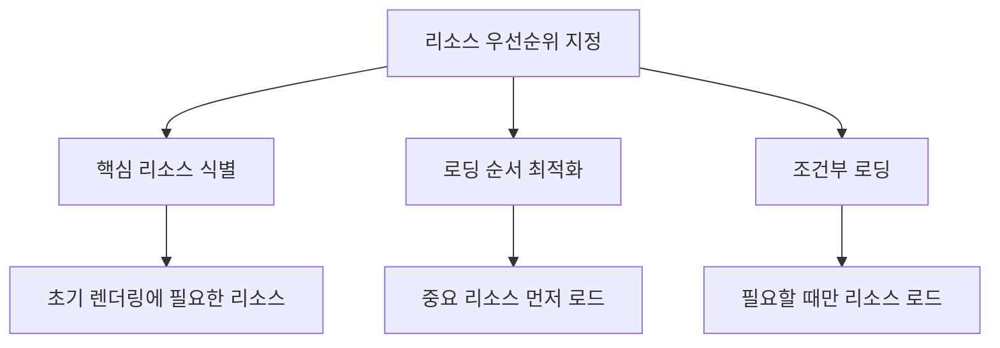
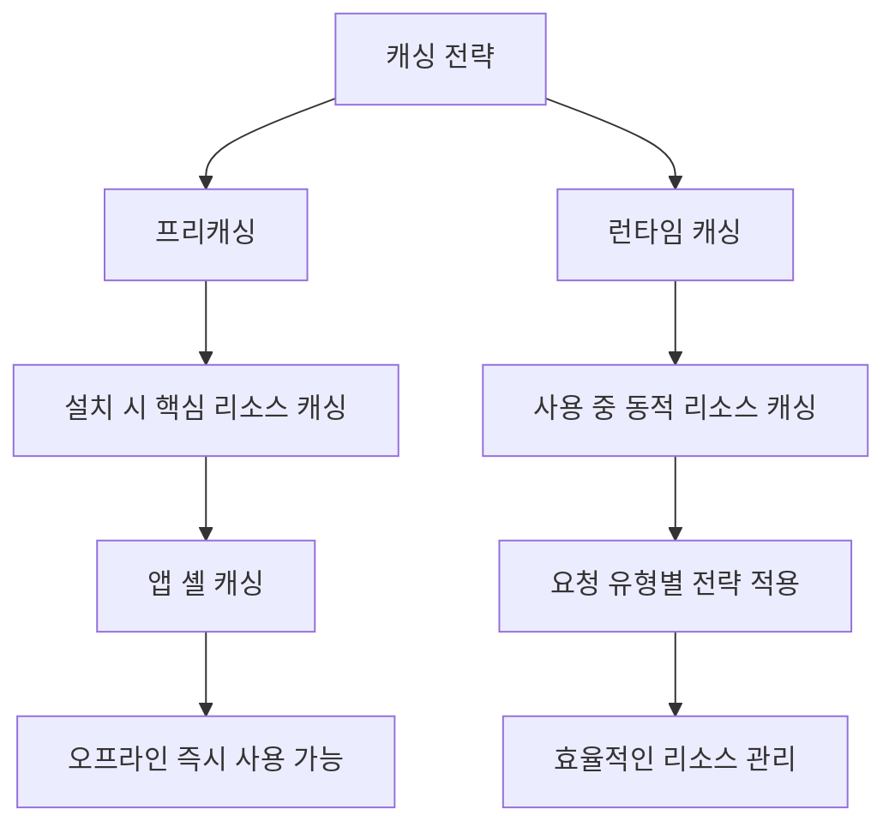
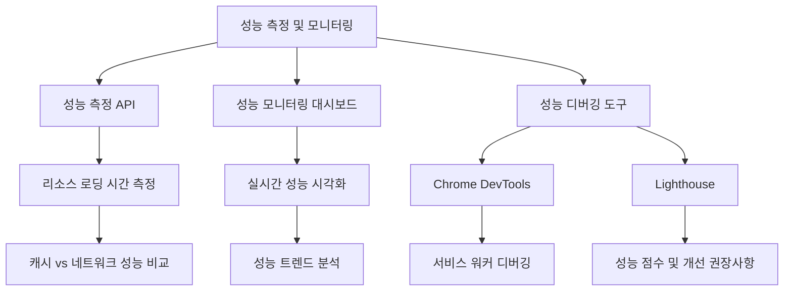

# Chapter 06 서비스 워커 고급 주제

## 06-1 성능 최적화

### 개요
서비스 워커를 활용한 성능 최적화는 웹 애플리케이션의 로딩 속도와 사용자 경험을 크게 향상시킬 수 있습니다. 이 섹션에서는 리소스 우선순위 지정, 프리캐싱과 런타임 캐싱, 네트워크 요청 최적화, 그리고 성능 측정 및 모니터링 방법에 대해 알아봅니다. 이러한 기법들을 통해 서비스 워커의 잠재력을 최대한 활용하여 웹 애플리케이션의 성능을 개선하는 방법을 배우게 됩니다.

### 리소스 우선순위 지정

웹 애플리케이션의 성능을 최적화하기 위해서는 중요한 리소스에 우선순위를 부여하는 것이 중요합니다. 서비스 워커를 통해 리소스의 로딩 순서와 방식을 제어함으로써 사용자가 중요한 콘텐츠를 더 빨리 볼 수 있도록 할 수 있습니다.



#### 핵심 리소스 식별

웹 애플리케이션에서 가장 중요한 리소스를 식별하는 것이 첫 번째 단계입니다:

1. **초기 렌더링 리소스**: 페이지의 초기 렌더링에 필요한 HTML, CSS, JavaScript 파일
2. **핵심 이미지**: 로고, 히어로 이미지 등 페이지의 주요 시각적 요소
3. **중요 API 데이터**: 페이지 콘텐츠를 구성하는 데 필요한 데이터

#### 로딩 순서 최적화

서비스 워커의 `fetch` 이벤트 핸들러를 사용하여 리소스 로딩 순서를 최적화할 수 있습니다:

```javascript
self.addEventListener('fetch', event => {
  const url = new URL(event.request.url);
  
  // 리소스 유형에 따라 우선순위 부여
  if (isHighPriorityResource(url.pathname)) {
    // 고우선순위 리소스는 네트워크 우선 전략 사용
    event.respondWith(
      networkFirst(event.request)
    );
  } else if (isMediumPriorityResource(url.pathname)) {
    // 중간 우선순위 리소스는 스테일-와일-리밸리데이트 전략 사용
    event.respondWith(
      staleWhileRevalidate(event.request)
    );
  } else {
    // 저우선순위 리소스는 캐시 우선 전략 사용
    event.respondWith(
      cacheFirst(event.request)
    );
  }
});

// 리소스 우선순위 판단 함수
function isHighPriorityResource(pathname) {
  return (
    pathname.endsWith('.html') ||
    pathname.endsWith('main.css') ||
    pathname.endsWith('critical.js') ||
    pathname.includes('/api/critical-data')
  );
}

function isMediumPriorityResource(pathname) {
  return (
    pathname.endsWith('.css') ||
    pathname.endsWith('.js') ||
    pathname.includes('/api/')
  );
}
```

#### 리소스 힌트 활용

서비스 워커와 함께 리소스 힌트를 활용하면 브라우저에게 리소스의 중요도를 알려줄 수 있습니다:

```html
<!-- 중요한 리소스 미리 로드 -->
<link rel="preload" href="/styles/main.css" as="style">
<link rel="preload" href="/scripts/critical.js" as="script">
<link rel="preload" href="/api/critical-data" as="fetch" crossorigin>

<!-- 곧 필요할 리소스 미리 가져오기 -->
<link rel="prefetch" href="/images/large-hero.jpg">

<!-- 다른 페이지 미리 가져오기 -->
<link rel="prefetch" href="/next-likely-page.html">
```

서비스 워커에서 이러한 리소스 힌트를 보완할 수 있습니다:

```javascript
// 서비스 워커 활성화 시 다음 페이지 미리 캐싱
self.addEventListener('activate', event => {
  event.waitUntil(
    prefetchNextPages()
  );
});

async function prefetchNextPages() {
  const cache = await caches.open('prefetch-cache');
  
  // 사용자가 다음에 방문할 가능성이 높은 페이지 미리 캐싱
  return cache.addAll([
    '/next-likely-page.html',
    '/popular-category.html'
  ]);
}
```

### 프리캐싱과 런타임 캐싱

서비스 워커를 사용한 캐싱 전략은 크게 프리캐싱(Precaching)과 런타임 캐싱(Runtime Caching)으로 나눌 수 있습니다. 두 전략을 적절히 조합하면 웹 애플리케이션의 성능을 크게 향상시킬 수 있습니다.

#### 프리캐싱

프리캐싱은 서비스 워커가 설치될 때 미리 정의된 리소스를 캐시에 저장하는 방식입니다. 주로 애플리케이션의 핵심 리소스를 대상으로 합니다:

```javascript
const CACHE_NAME = 'app-shell-v1';
const PRECACHE_ASSETS = [
  '/',
  '/index.html',
  '/styles/main.css',
  '/scripts/app.js',
  '/images/logo.svg',
  '/offline.html'
];

self.addEventListener('install', event => {
  event.waitUntil(
    caches.open(CACHE_NAME)
      .then(cache => {
        console.log('프리캐싱 시작');
        return cache.addAll(PRECACHE_ASSETS);
      })
      .then(() => {
        console.log('프리캐싱 완료');
        return self.skipWaiting();
      })
  );
});
```

프리캐싱의 장점:
- 애플리케이션 첫 로드 후 즉시 오프라인 사용 가능
- 반복 방문 시 빠른 로딩 속도
- 네트워크 요청 감소로 데이터 사용량 절약

#### 런타임 캐싱

런타임 캐싱은 사용자가 애플리케이션을 사용하는 동안 요청되는 리소스를 동적으로 캐시하는 방식입니다:

```javascript
self.addEventListener('fetch', event => {
  // API 요청에 대한 런타임 캐싱
  if (event.request.url.includes('/api/')) {
    event.respondWith(
      caches.open('api-cache').then(cache => {
        return fetch(event.request)
          .then(response => {
            // 유효한 응답만 캐시
            if (response.ok) {
              // 응답 복제 후 캐시 저장
              cache.put(event.request, response.clone());
            }
            return response;
          })
          .catch(() => {
            // 네트워크 실패 시 캐시에서 조회
            return cache.match(event.request);
          });
      })
    );
  }
  
  // 이미지에 대한 런타임 캐싱
  else if (event.request.destination === 'image') {
    event.respondWith(
      caches.open('image-cache').then(cache => {
        return cache.match(event.request)
          .then(cachedResponse => {
            // 캐시에 있으면 캐시된 응답 반환
            if (cachedResponse) {
              return cachedResponse;
            }
            
            // 캐시에 없으면 네트워크에서 가져와 캐시
            return fetch(event.request)
              .then(networkResponse => {
                cache.put(event.request, networkResponse.clone());
                return networkResponse;
              });
          });
      })
    );
  }
});
```

런타임 캐싱의 장점:
- 사용자의 실제 사용 패턴에 따라 필요한 리소스만 캐시
- 동적 콘텐츠 캐싱 가능
- 캐시 공간 효율적 사용

#### 효과적인 캐싱 전략 조합

프리캐싱과 런타임 캐싱을 효과적으로 조합하는 방법:

```javascript
// 캐시 이름 정의
const STATIC_CACHE = 'static-v1';
const DYNAMIC_CACHE = 'dynamic-v1';
const API_CACHE = 'api-v1';

// 프리캐싱할 정적 자산
const STATIC_ASSETS = [
  '/',
  '/index.html',
  '/styles/main.css',
  '/scripts/app.js',
  '/images/logo.svg',
  '/offline.html'
];

// 설치 이벤트: 정적 자산 프리캐싱
self.addEventListener('install', event => {
  event.waitUntil(
    caches.open(STATIC_CACHE)
      .then(cache => cache.addAll(STATIC_ASSETS))
      .then(() => self.skipWaiting())
  );
});

// 활성화 이벤트: 이전 캐시 정리
self.addEventListener('activate', event => {
  const currentCaches = [STATIC_CACHE, DYNAMIC_CACHE, API_CACHE];
  
  event.waitUntil(
    caches.keys()
      .then(cacheNames => {
        return cacheNames.filter(
          cacheName => !currentCaches.includes(cacheName)
        );
      })
      .then(cachesToDelete => {
        return Promise.all(
          cachesToDelete.map(cacheToDelete => {
            return caches.delete(cacheToDelete);
          })
        );
      })
      .then(() => self.clients.claim())
  );
});

// Fetch 이벤트: 리소스 유형별 캐싱 전략 적용
self.addEventListener('fetch', event => {
  const url = new URL(event.request.url);
  
  // 1. API 요청 처리
  if (url.pathname.startsWith('/api/')) {
    event.respondWith(handleApiRequest(event.request));
  }
  // 2. 이미지 처리
  else if (event.request.destination === 'image') {
    event.respondWith(handleImageRequest(event.request));
  }
  // 3. 정적 자산 처리
  else if (STATIC_ASSETS.includes(url.pathname) || 
           url.pathname.endsWith('.css') || 
           url.pathname.endsWith('.js')) {
    event.respondWith(handleStaticAsset(event.request));
  }
  // 4. 기타 요청 처리
  else {
    event.respondWith(handleOtherRequest(event.request));
  }
});

// API 요청 처리 함수: 네트워크 우선, 캐시 폴백
async function handleApiRequest(request) {
  const cache = await caches.open(API_CACHE);
  
  try {
    const response = await fetch(request);
    if (response.ok) {
      cache.put(request, response.clone());
    }
    return response;
  } catch (error) {
    const cachedResponse = await cache.match(request);
    return cachedResponse || new Response(
      JSON.stringify({ error: 'Network error' }), 
      { 
        status: 503,
        headers: { 'Content-Type': 'application/json' } 
      }
    );
  }
}

// 이미지 요청 처리 함수: 캐시 우선, 네트워크 폴백
async function handleImageRequest(request) {
  const cache = await caches.open(DYNAMIC_CACHE);
  const cachedResponse = await cache.match(request);
  
  if (cachedResponse) {
    return cachedResponse;
  }
  
  try {
    const networkResponse = await fetch(request);
    cache.put(request, networkResponse.clone());
    return networkResponse;
  } catch (error) {
    // 이미지를 찾을 수 없는 경우 기본 이미지 반환
    return cache.match('/images/placeholder.png');
  }
}

// 정적 자산 처리 함수: 캐시 우선, 네트워크 폴백
async function handleStaticAsset(request) {
  const cachedResponse = await caches.match(request);
  return cachedResponse || fetch(request);
}

// 기타 요청 처리 함수: 스테일-와일-리밸리데이트
async function handleOtherRequest(request) {
  const cache = await caches.open(DYNAMIC_CACHE);
  const cachedResponse = await cache.match(request);
  
  const fetchPromise = fetch(request)
    .then(networkResponse => {
      cache.put(request, networkResponse.clone());
      return networkResponse;
    });
  
  return cachedResponse || fetchPromise;
}
```



### 네트워크 요청 최적화

서비스 워커를 통해 네트워크 요청을 최적화하면 웹 애플리케이션의 성능과 사용자 경험을 크게 향상시킬 수 있습니다. 다양한 기법을 통해 네트워크 요청의 수, 크기, 타이밍을 최적화할 수 있습니다.

#### 요청 병합 및 배치 처리

여러 개의 작은 요청을 하나의 큰 요청으로 병합하거나 배치 처리하면 네트워크 오버헤드를 줄일 수 있습니다:

```javascript
// 요청 배치 처리 예시
self.addEventListener('fetch', event => {
  const url = new URL(event.request.url);
  
  // API 요청이 개별 항목을 요청하는 경우
  if (url.pathname.match(/\/api\/items\/\d+$/)) {
    event.respondWith(handleItemRequest(event.request));
  }
});

// 개별 항목 요청을 배치 요청으로 처리
async function handleItemRequest(request) {
  const url = new URL(request.url);
  const itemId = url.pathname.match(/\/items\/(\d+)$/)[1];
  
  // 캐시에서 배치 데이터 확인
  const cache = await caches.open('api-cache');
  const batchCacheKey = new Request('/api/items/batch');
  const batchResponse = await cache.match(batchCacheKey);
  
  if (batchResponse) {
    // 배치 데이터에서 개별 항목 추출
    const batchData = await batchResponse.json();
    const item = batchData.find(item => item.id === parseInt(itemId));
    
    if (item) {
      return new Response(JSON.stringify(item), {
        headers: { 'Content-Type': 'application/json' }
      });
    }
  }
  
  // 캐시에 없으면 배치 데이터 가져오기
  try {
    const batchRequest = new Request('/api/items/batch');
    const networkResponse = await fetch(batchRequest);
    
    if (networkResponse.ok) {
      // 배치 응답 캐싱
      cache.put(batchCacheKey, networkResponse.clone());
      
      // 배치 데이터에서 요청된 항목 추출
      const batchData = await networkResponse.json();
      const item = batchData.find(item => item.id === parseInt(itemId));
      
      if (item) {
        return new Response(JSON.stringify(item), {
          headers: { 'Content-Type': 'application/json' }
        });
      }
    }
    
    // 배치 요청에서 항목을 찾지 못한 경우 개별 요청
    return fetch(request);
  } catch (error) {
    // 네트워크 오류 시 개별 요청 시도
    return fetch(request);
  }
}
```

#### 조건부 요청 활용

HTTP 조건부 요청 헤더(`If-Modified-Since`, `If-None-Match`)를 활용하여 불필요한 데이터 전송을 줄일 수 있습니다:

```javascript
self.addEventListener('fetch', event => {
  if (event.request.url.includes('/api/data')) {
    event.respondWith(conditionalFetch(event.request));
  }
});

async function conditionalFetch(request) {
  const cache = await caches.open('api-cache');
  const cachedResponse = await cache.match(request);
  
  // 새 요청 생성 (원본 요청 복제)
  const newRequest = new Request(request.url, {
    method: request.method,
    headers: request.headers,
    mode: request.mode,
    credentials: request.credentials
  });
  
  // 캐시된 응답이 있으면 조건부 헤더 추가
  if (cachedResponse) {
    const etag = cachedResponse.headers.get('ETag');
    const lastModified = cachedResponse.headers.get('Last-Modified');
    
    if (etag) {
      newRequest.headers.set('If-None-Match', etag);
    }
    
    if (lastModified) {
      newRequest.headers.set('If-Modified-Since', lastModified);
    }
  }
  
  try {
    const networkResponse = await fetch(newRequest);
    
    // 304 Not Modified인 경우 캐시된 응답 사용
    if (networkResponse.status === 304 && cachedResponse) {
      return cachedResponse;
    }
    
    // 새 응답 캐싱 및 반환
    if (networkResponse.ok) {
      cache.put(request, networkResponse.clone());
    }
    
    return networkResponse;
  } catch (error) {
    // 네트워크 오류 시 캐시된 응답 반환
    return cachedResponse || new Response('Network error', { status: 503 });
  }
}
```

#### 응답 압축 및 최적화

서비스 워커에서 응답을 가로채 최적화할 수 있습니다:

```javascript
self.addEventListener('fetch', event => {
  if (event.request.destination === 'image') {
    event.respondWith(optimizeImageResponse(event.request));
  }
});

async function optimizeImageResponse(request) {
  // 이미지 크기 파라미터 추출
  const url = new URL(request.url);
  const width = url.searchParams.get('width');
  const height = url.searchParams.get('height');
  
  // 크기 파라미터가 있는 경우 최적화된 이미지 요청
  if (width || height) {
    const optimizedUrl = new URL(request.url);
    optimizedUrl.pathname = '/image-optimizer' + optimizedUrl.pathname;
    
    try {
      return fetch(optimizedUrl.toString());
    } catch (error) {
      // 최적화 서비스 실패 시 원본 요청
      return fetch(request);
    }
  }
  
  // 크기 파라미터가 없으면 원본 요청
  return fetch(request);
}
```

#### 프리로딩 및 프리커넥팅

서비스 워커 활성화 시 중요한 리소스를 미리 로드하거나 중요한 도메인에 미리 연결하여 성능을 향상시킬 수 있습니다:

```javascript
self.addEventListener('activate', event => {
  event.waitUntil(
    Promise.all([
      preloadCriticalResources(),
      preconnectToImportantDomains()
    ])
  );
});

async function preloadCriticalResources() {
  // 중요 리소스 미리 로드
  const criticalResources = [
    '/api/initial-data',
    '/images/hero.jpg'
  ];
  
  const cache = await caches.open('preload-cache');
  return Promise.all(
    criticalResources.map(url => {
      // 이미 캐시되어 있는지 확인
      return cache.match(url)
        .then(cachedResponse => {
          if (!cachedResponse) {
            // 캐시되어 있지 않으면 가져와서 캐싱
            return fetch(url)
              .then(response => {
                if (response.ok) {
                  return cache.put(url, response);
                }
              })
              .catch(() => {
                // 프리로드 실패는 무시
              });
          }
        });
    })
  );
}

function preconnectToImportantDomains() {
  const importantDomains = [
    'https://api.example.com',
    'https://cdn.example.com'
  ];
  
  return Promise.all(
    importantDomains.map(domain => {
      return new Promise(resolve => {
        const link = document.createElement('link');
        link.rel = 'preconnect';
        link.href = domain;
        link.onload = link.onerror = resolve;
        document.head.appendChild(link);
      });
    })
  );
}
```

### 성능 측정 및 모니터링

서비스 워커의 성능을 지속적으로 측정하고 모니터링하는 것은 최적화 전략의 효과를 평가하고 개선하는 데 중요합니다. 다양한 API와 도구를 활용하여 성능 데이터를 수집하고 분석할 수 있습니다.

#### 성능 측정 API 활용

Web Performance API를 사용하여 서비스 워커의 성능을 측정할 수 있습니다:

```javascript
// 서비스 워커에서 성능 측정
self.addEventListener('fetch', event => {
  const url = new URL(event.request.url);
  
  // 중요 리소스에 대한 성능 측정
  if (isImportantResource(url.pathname)) {
    event.respondWith(
      measureFetchPerformance(event.request)
    );
  } else {
    // 일반 요청 처리
    event.respondWith(
      fetch(event.request)
    );
  }
});

async function measureFetchPerformance(request) {
  const startTime = Date.now();
  let source = 'network';
  
  try {
    // 캐시 확인
    const cache = await caches.open('performance-cache');
    const cachedResponse = await cache.match(request);
    
    if (cachedResponse) {
      source = 'cache';
      const endTime = Date.now();
      recordPerformanceMetric(request.url, endTime - startTime, source);
      return cachedResponse;
    }
    
    // 네트워크 요청
    const fetchStartTime = Date.now();
    const networkResponse = await fetch(request);
    
    if (networkResponse.ok) {
      cache.put(request, networkResponse.clone());
    }
    
    const endTime = Date.now();
    recordPerformanceMetric(request.url, endTime - fetchStartTime, source);
    
    return networkResponse;
  } catch (error) {
    const endTime = Date.now();
    recordPerformanceMetric(request.url, endTime - startTime, 'error');
    throw error;
  }
}

function recordPerformanceMetric(url, duration, source) {
  // 클라이언트에게 성능 메트릭 전송
  self.clients.matchAll().then(clients => {
    clients.forEach(client => {
      client.postMessage({
        type: 'PERFORMANCE_METRIC',
        url,
        duration,
        source,
        timestamp: Date.now()
      });
    });
  });
}

function isImportantResource(pathname) {
  return (
    pathname.endsWith('.html') ||
    pathname.endsWith('main.css') ||
    pathname.endsWith('app.js') ||
    pathname.includes('/api/critical')
  );
}
```

클라이언트 측에서 성능 메트릭 수신 및 처리:

```javascript
// 클라이언트 측 코드
navigator.serviceWorker.addEventListener('message', event => {
  if (event.data.type === 'PERFORMANCE_METRIC') {
    // 성능 메트릭 처리
    logPerformanceMetric(event.data);
    
    // 분석 서비스로 전송
    sendToAnalyticsService(event.data);
  }
});

function logPerformanceMetric(metric) {
  console.log(`Resource: ${metric.url}`);
  console.log(`Duration: ${metric.duration}ms`);
  console.log(`Source: ${metric.source}`);
  console.log(`Timestamp: ${new Date(metric.timestamp).toISOString()}`);
}

function sendToAnalyticsService(metric) {
  // 분석 서비스로 데이터 전송
  fetch('/analytics/performance', {
    method: 'POST',
    headers: {
      'Content-Type': 'application/json'
    },
    body: JSON.stringify(metric)
  }).catch(error => {
    console.error('성능 메트릭 전송 실패:', error);
  });
}
```

#### 성능 모니터링 대시보드

수집된 성능 데이터를 시각화하고 분석하기 위한 대시보드를 구현할 수 있습니다:

```javascript
// 성능 대시보드 구현 예시
class PerformanceDashboard {
  constructor() {
    this.metrics = [];
    this.initDashboard();
    this.setupServiceWorkerListener();
  }
  
  initDashboard() {
    // 대시보드 UI 초기화
    this.container = document.getElementById('performance-dashboard');
    
    if (!this.container) {
      this.container = document.createElement('div');
      this.container.id = 'performance-dashboard';
      document.body.appendChild(this.container);
    }
    
    this.container.innerHTML = `
      <h2>서비스 워커 성능 대시보드</h2>
      <div class="metrics-summary">
        <div class="metric-card">
          <h3>평균 응답 시간</h3>
          <div id="avg-response-time">-</div>
        </div>
        <div class="metric-card">
          <h3>캐시 히트율</h3>
          <div id="cache-hit-rate">-</div>
        </div>
        <div class="metric-card">
          <h3>오류율</h3>
          <div id="error-rate">-</div>
        </div>
      </div>
      <div class="metrics-chart">
        <canvas id="performance-chart"></canvas>
      </div>
      <div class="metrics-table">
        <table>
          <thead>
            <tr>
              <th>URL</th>
              <th>소스</th>
              <th>응답 시간</th>
              <th>타임스탬프</th>
            </tr>
          </thead>
          <tbody id="metrics-table-body">
          </tbody>
        </table>
      </div>
    `;
  }
  
  setupServiceWorkerListener() {
    // 서비스 워커 메시지 리스너 설정
    navigator.serviceWorker.addEventListener('message', event => {
      if (event.data.type === 'PERFORMANCE_METRIC') {
        this.addMetric(event.data);
        this.updateDashboard();
      }
    });
  }
  
  addMetric(metric) {
    this.metrics.push(metric);
    
    // 최대 100개 메트릭만 유지
    if (this.metrics.length > 100) {
      this.metrics.shift();
    }
  }
  
  updateDashboard() {
    // 요약 메트릭 업데이트
    this.updateSummaryMetrics();
    
    // 차트 업데이트
    this.updateChart();
    
    // 테이블 업데이트
    this.updateTable();
  }
  
  updateSummaryMetrics() {
    // 평균 응답 시간 계산
    const avgResponseTime = this.metrics.reduce(
      (sum, metric) => sum + metric.duration, 0
    ) / this.metrics.length;
    
    // 캐시 히트율 계산
    const cacheHits = this.metrics.filter(
      metric => metric.source === 'cache'
    ).length;
    const cacheHitRate = (cacheHits / this.metrics.length) * 100;
    
    // 오류율 계산
    const errors = this.metrics.filter(
      metric => metric.source === 'error'
    ).length;
    const errorRate = (errors / this.metrics.length) * 100;
    
    // UI 업데이트
    document.getElementById('avg-response-time').textContent = 
      `${avgResponseTime.toFixed(2)}ms`;
    document.getElementById('cache-hit-rate').textContent = 
      `${cacheHitRate.toFixed(2)}%`;
    document.getElementById('error-rate').textContent = 
      `${errorRate.toFixed(2)}%`;
  }
  
  updateChart() {
    // 차트 라이브러리를 사용하여 성능 차트 업데이트
    // (예: Chart.js)
  }
  
  updateTable() {
    const tableBody = document.getElementById('metrics-table-body');
    
    // 테이블 초기화
    tableBody.innerHTML = '';
    
    // 최근 10개 메트릭만 표시
    const recentMetrics = this.metrics.slice(-10).reverse();
    
    recentMetrics.forEach(metric => {
      const row = document.createElement('tr');
      
      // URL 열
      const urlCell = document.createElement('td');
      urlCell.textContent = new URL(metric.url).pathname;
      row.appendChild(urlCell);
      
      // 소스 열
      const sourceCell = document.createElement('td');
      sourceCell.textContent = metric.source;
      row.appendChild(sourceCell);
      
      // 응답 시간 열
      const durationCell = document.createElement('td');
      durationCell.textContent = `${metric.duration}ms`;
      row.appendChild(durationCell);
      
      // 타임스탬프 열
      const timestampCell = document.createElement('td');
      timestampCell.textContent = new Date(metric.timestamp).toLocaleTimeString();
      row.appendChild(timestampCell);
      
      tableBody.appendChild(row);
    });
  }
}

// 대시보드 초기화
document.addEventListener('DOMContentLoaded', () => {
  new PerformanceDashboard();
});
```

#### 성능 디버깅 및 최적화

Chrome DevTools와 Lighthouse를 활용하여 서비스 워커 성능을 디버깅하고 최적화할 수 있습니다:

1. **Chrome DevTools 활용**:
   - Application 탭에서 서비스 워커 상태 확인
   - Network 탭에서 캐시된 응답 확인 (Size 열에 "from ServiceWorker" 표시)
   - Performance 탭에서 서비스 워커 활동 분석

2. **Lighthouse 성능 감사**:
   - PWA 카테고리에서 서비스 워커 관련 항목 확인
   - Performance 카테고리에서 전반적인 성능 점수 확인
   - 개선 권장사항 검토 및 적용

3. **워크박스(Workbox) 활용**:
   워크박스는 서비스 워커 개발을 단순화하고 최적화하는 라이브러리로, 성능 최적화에 도움이 됩니다:

```javascript
// workbox-config.js
module.exports = {
  globDirectory: 'build/',
  globPatterns: [
    '**/*.{html,css,js,json,png,jpg,svg}'
  ],
  swDest: 'build/sw.js',
  // 런타임 캐싱 설정
  runtimeCaching: [{
    // API 요청에 대한 네트워크 우선 전략
    urlPattern: /\/api\//,
    handler: 'NetworkFirst',
    options: {
      cacheName: 'api-cache',
      expiration: {
        maxEntries: 50,
        maxAgeSeconds: 60 * 60 // 1시간
      }
    }
  }, {
    // 이미지에 대한 캐시 우선 전략
    urlPattern: /\.(?:png|jpg|jpeg|svg|gif)$/,
    handler: 'CacheFirst',
    options: {
      cacheName: 'image-cache',
      expiration: {
        maxEntries: 60,
        maxAgeSeconds: 30 * 24 * 60 * 60 // 30일
      }
    }
  }, {
    // 폰트에 대한 스테일-와일-리밸리데이트 전략
    urlPattern: /\.(?:woff|woff2|ttf|otf|eot)$/,
    handler: 'StaleWhileRevalidate',
    options: {
      cacheName: 'font-cache',
      expiration: {
        maxEntries: 20,
        maxAgeSeconds: 60 * 60 * 24 * 365 // 1년
      }
    }
  }]
};
```



### 5가지 키워드로 정리하는 핵심 포인트
1. **리소스 우선순위 지정**: 중요한 리소스를 식별하고 우선순위를 부여하여 핵심 콘텐츠를 빠르게 로드합니다.
2. **프리캐싱과 런타임 캐싱**: 서비스 워커 설치 시 핵심 리소스를 미리 캐싱하고, 사용 중에 필요한 리소스를 동적으로 캐싱하여 성능을 최적화합니다.
3. **네트워크 요청 최적화**: 요청 병합, 조건부 요청, 응답 압축 등의 기법을 통해 네트워크 요청의 효율성을 높입니다.
4. **성능 측정 및 모니터링**: Web Performance API와 모니터링 도구를 활용하여 서비스 워커의 성능을 지속적으로 측정하고 개선합니다.
5. **점진적 향상**: 기본 기능을 모든 사용자에게 제공하고, 서비스 워커를 지원하는 브라우저에서는 향상된 성능과 기능을 제공합니다.

### 확인 문제
1. 서비스 워커를 사용한 리소스 우선순위 지정 방법으로 올바르지 않은 것은?
   - [ ] fetch 이벤트에서 리소스 유형에 따라 다른 캐싱 전략 적용
   - [ ] 중요 리소스에 preload 리소스 힌트 사용
   - [ ] 서비스 워커 설치 시 중요 리소스 프리캐싱
   - [ ] 모든 리소스에 항상 네트워크 우선 전략 적용

2. 프리캐싱과 런타임 캐싱의 차이점으로 올바른 것은?
   - [ ] 프리캐싱은 HTML 파일만 대상으로 하고, 런타임 캐싱은 이미지만 대상으로 한다
   - [ ] 프리캐싱은 서비스 워커 설치 시 발생하고, 런타임 캐싱은 사용자가 리소스를 요청할 때 발생한다
   - [ ] 프리캐싱은 캐시 우선 전략만 사용하고, 런타임 캐싱은 네트워크 우선 전략만 사용한다
   - [ ] 프리캐싱은 오프라인 사용을 위한 것이고, 런타임 캐싱은 온라인 사용을 위한 것이다

3. 네트워크 요청 최적화 기법으로 올바른 것은? (복수 응답)
   - [ ] 여러 개의 작은 요청을 하나의 배치 요청으로 병합
   - [ ] 조건부 요청 헤더(If-Modified-Since, If-None-Match) 활용
   - [ ] 모든 API 응답을 무기한 캐싱
   - [ ] 중요한 도메인에 미리 연결(preconnect)
   - [ ] 모든 이미지 요청 차단

4. 서비스 워커 성능 측정 및 모니터링에 사용할 수 있는 도구는? (복수 응답)
   - [ ] Chrome DevTools
   - [ ] Web Performance API
   - [ ] Lighthouse
   - [ ] CSS Validator
   - [ ] Network Monitor

5. 다음 중 서비스 워커를 사용한 성능 최적화의 이점이 아닌 것은?
   - [ ] 반복 방문 시 페이지 로딩 속도 향상
   - [ ] 네트워크 요청 감소로 데이터 사용량 절약
   - [ ] 서버 부하 감소
   - [ ] 서버 측 데이터베이스 쿼리 최적화

> [정답 및 해설 보기](../answers_and_explanations.md#06-1-성능-최적화)