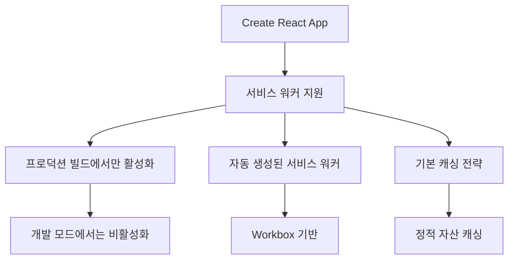
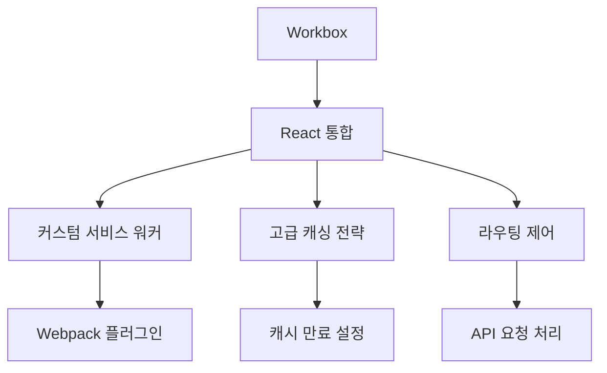
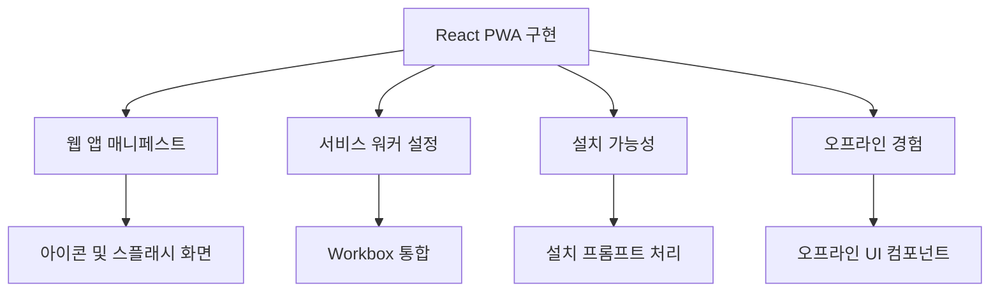
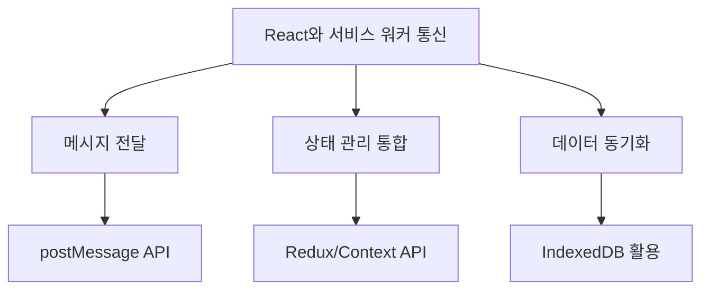

# Chapter 06 서비스 워커와 프레임워크

## 06-1 React에서 서비스 워커 활용

### 개요
React 애플리케이션에서 서비스 워커를 활용하면 오프라인 기능, 성능 최적화, 푸시 알림 등 다양한 PWA 기능을 구현할 수 있습니다. 이 섹션에서는 Create React App의 내장 서비스 워커 기능, Workbox와의 통합, React 애플리케이션에서 PWA 구현 방법, 그리고 React 상태 관리와 서비스 워커 간의 통신 방법에 대해 알아봅니다. 이를 통해 React 개발자는 현대적인 웹 애플리케이션에 서비스 워커의 강력한 기능을 효과적으로 통합할 수 있습니다.

### Create React App의 서비스 워커

Create React App(CRA)은 React 애플리케이션을 빠르게 시작할 수 있는 공식 도구로, 서비스 워커 지원 기능을 내장하고 있습니다. CRA로 생성된 프로젝트는 기본적인 서비스 워커 설정을 포함하고 있어, 개발자가 쉽게 PWA 기능을 활성화할 수 있습니다.



#### CRA의 서비스 워커 활성화하기

CRA 버전 4 이전에는 `src/index.js` 파일에서 `serviceWorker.register()` 함수를 호출하여 서비스 워커를 활성화할 수 있었습니다. 그러나 CRA 버전 4부터는 서비스 워커 관련 코드가 `src/service-worker.js`와 `src/serviceWorkerRegistration.js` 파일로 분리되었습니다.

CRA 프로젝트에서 서비스 워커를 활성화하는 방법은 다음과 같습니다:

1. 프로젝트 생성 시 PWA 템플릿 사용:
```bash
npx create-react-app my-app --template cra-template-pwa
```

2. 기존 CRA 프로젝트에 PWA 기능 추가:
```bash
npm install workbox-webpack-plugin --save-dev
```

3. `src/index.js` 파일에서 서비스 워커 등록:
```javascript
import React from 'react';
import ReactDOM from 'react-dom';
import './index.css';
import App from './App';
import * as serviceWorkerRegistration from './serviceWorkerRegistration';

ReactDOM.render(
  <React.StrictMode>
    <App />
  </React.StrictMode>,
  document.getElementById('root')
);

// 서비스 워커 등록 (PWA 기능 활성화)
serviceWorkerRegistration.register();
```

#### CRA 서비스 워커의 기본 기능

CRA에서 생성된 서비스 워커는 다음과 같은 기본 기능을 제공합니다:

1. **정적 자산 캐싱**: JavaScript, CSS, HTML, 이미지 등의 정적 파일을 자동으로 캐싱합니다.
2. **네트워크 우선 전략**: 기본적으로 네트워크 요청을 먼저 시도하고, 실패할 경우 캐시로 폴백합니다.
3. **자동 업데이트**: 새 버전의 앱이 배포되면 서비스 워커가 자동으로 업데이트됩니다.
4. **오프라인 지원**: 기본적인 오프라인 경험을 제공합니다.

```javascript
// src/service-worker.js 예시 (CRA v4+)
import { clientsClaim } from 'workbox-core';
import { ExpirationPlugin } from 'workbox-expiration';
import { precacheAndRoute, createHandlerBoundToURL } from 'workbox-precaching';
import { registerRoute } from 'workbox-routing';
import { StaleWhileRevalidate } from 'workbox-strategies';

clientsClaim();

// 빌드 과정에서 생성된 자산을 프리캐싱
precacheAndRoute(self.__WB_MANIFEST);

// 단일 페이지 애플리케이션 처리
const fileExtensionRegexp = new RegExp('/[^/?]+\\.[^/]+$');
registerRoute(
  ({ request, url }) => {
    if (request.mode !== 'navigate') {
      return false;
    }
    if (url.pathname.startsWith('/_')) {
      return false;
    }
    if (url.pathname.match(fileExtensionRegexp)) {
      return false;
    }
    return true;
  },
  createHandlerBoundToURL(process.env.PUBLIC_URL + '/index.html')
);

// 이미지 캐싱
registerRoute(
  ({ request }) => request.destination === 'image',
  new StaleWhileRevalidate({
    cacheName: 'images',
    plugins: [
      new ExpirationPlugin({
        maxEntries: 50,
        maxAgeSeconds: 30 * 24 * 60 * 60, // 30일
      }),
    ],
  })
);

// 서비스 워커 활성화 시 모든 클라이언트 제어
self.addEventListener('message', (event) => {
  if (event.data && event.data.type === 'SKIP_WAITING') {
    self.skipWaiting();
  }
});
```

#### 서비스 워커 업데이트 처리

CRA에서 생성된 서비스 워커는 새 버전의 앱이 배포될 때 자동으로 업데이트됩니다. 그러나 사용자에게 업데이트 알림을 표시하고 새로고침을 유도하는 것이 좋은 사용자 경험을 제공하는 방법입니다.

```javascript
// src/index.js
import * as serviceWorkerRegistration from './serviceWorkerRegistration';

// 서비스 워커 등록 및 업데이트 처리
serviceWorkerRegistration.register({
  onUpdate: registration => {
    const waitingServiceWorker = registration.waiting;
    if (waitingServiceWorker) {
      waitingServiceWorker.addEventListener('statechange', event => {
        if (event.target.state === 'activated') {
          window.location.reload();
        }
      });
      waitingServiceWorker.postMessage({ type: 'SKIP_WAITING' });
    }
  },
  onSuccess: registration => {
    console.log('서비스 워커가 성공적으로 등록되었습니다.');
  }
});
```

### Workbox와 React 통합

Workbox는 Google에서 개발한 서비스 워커 라이브러리 모음으로, 서비스 워커 개발을 단순화하고 최적화합니다. CRA는 내부적으로 Workbox를 사용하지만, 더 세밀한 제어가 필요한 경우 Workbox를 직접 통합할 수 있습니다.



#### Workbox 직접 통합하기

CRA의 기본 서비스 워커 설정을 넘어서는 기능이 필요한 경우, Workbox를 직접 통합할 수 있습니다:

1. 필요한 Workbox 패키지 설치:
```bash
npm install workbox-webpack-plugin workbox-routing workbox-strategies workbox-expiration workbox-cacheable-response --save-dev
```

2. 커스텀 서비스 워커 파일 생성 (`src/custom-service-worker.js`):
```javascript
import { registerRoute } from 'workbox-routing';
import { StaleWhileRevalidate, CacheFirst, NetworkFirst } from 'workbox-strategies';
import { ExpirationPlugin } from 'workbox-expiration';
import { CacheableResponsePlugin } from 'workbox-cacheable-response';

// 정적 자산 캐싱 (CSS, JS, 웹 폰트)
registerRoute(
  ({ request }) => 
    request.destination === 'style' || 
    request.destination === 'script' || 
    request.destination === 'font',
  new CacheFirst({
    cacheName: 'static-assets',
    plugins: [
      new ExpirationPlugin({
        maxEntries: 60,
        maxAgeSeconds: 30 * 24 * 60 * 60, // 30일
      }),
    ],
  })
);

// 이미지 캐싱
registerRoute(
  ({ request }) => request.destination === 'image',
  new CacheFirst({
    cacheName: 'images',
    plugins: [
      new ExpirationPlugin({
        maxEntries: 60,
        maxAgeSeconds: 30 * 24 * 60 * 60, // 30일
      }),
    ],
  })
);

// API 요청 캐싱
registerRoute(
  ({ url }) => url.pathname.startsWith('/api/'),
  new NetworkFirst({
    cacheName: 'api-responses',
    plugins: [
      new ExpirationPlugin({
        maxEntries: 50,
        maxAgeSeconds: 5 * 60, // 5분
      }),
      new CacheableResponsePlugin({
        statuses: [0, 200],
      }),
    ],
  })
);
```

3. Webpack 설정 커스터마이징 (CRA의 eject 없이 `react-app-rewired` 사용):
```bash
npm install react-app-rewired customize-cra --save-dev
```

4. `config-overrides.js` 파일 생성:
```javascript
const { override, adjustWorkbox } = require('customize-cra');
const path = require('path');

module.exports = override(
  adjustWorkbox(wb => {
    wb.importScripts = [
      // 커스텀 서비스 워커 스크립트 추가
      'custom-service-worker.js'
    ];
    return wb;
  })
);
```

5. `package.json` 스크립트 수정:
```json
{
  "scripts": {
    "start": "react-app-rewired start",
    "build": "react-app-rewired build",
    "test": "react-app-rewired test"
  }
}
```

#### 고급 캐싱 전략 구현

Workbox를 사용하면 다양한 리소스 유형에 맞는 고급 캐싱 전략을 쉽게 구현할 수 있습니다:

```javascript
// API 응답에 대한 스테일-와일-리밸리데이트 전략
registerRoute(
  ({ url }) => url.pathname.startsWith('/api/products'),
  new StaleWhileRevalidate({
    cacheName: 'product-api',
    plugins: [
      new ExpirationPlugin({
        maxEntries: 50,
        maxAgeSeconds: 10 * 60, // 10분
      }),
    ],
  })
);

// 자주 변경되지 않는 사용자 프로필 이미지에 대한 캐시 우선 전략
registerRoute(
  ({ url }) => url.pathname.startsWith('/images/profiles'),
  new CacheFirst({
    cacheName: 'profile-images',
    plugins: [
      new ExpirationPlugin({
        maxEntries: 20,
        maxAgeSeconds: 7 * 24 * 60 * 60, // 7일
      }),
    ],
  })
);

// 중요한 HTML 문서에 대한 네트워크 우선 전략
registerRoute(
  ({ request }) => request.mode === 'navigate',
  new NetworkFirst({
    cacheName: 'pages',
    plugins: [
      new ExpirationPlugin({
        maxEntries: 30,
        maxAgeSeconds: 24 * 60 * 60, // 1일
      }),
    ],
  })
);
```

### React 애플리케이션에서 PWA 구현

React 애플리케이션을 완전한 PWA로 만들기 위해서는 서비스 워커 외에도 여러 요소가 필요합니다. 웹 앱 매니페스트, 오프라인 경험, 설치 가능성 등을 구현하여 네이티브 앱과 유사한 경험을 제공할 수 있습니다.



#### 웹 앱 매니페스트 설정

CRA 프로젝트에서는 `public/manifest.json` 파일을 수정하여 웹 앱 매니페스트를 설정할 수 있습니다:

```json
{
  "short_name": "React App",
  "name": "React PWA Example",
  "icons": [
    {
      "src": "favicon.ico",
      "sizes": "64x64 32x32 24x24 16x16",
      "type": "image/x-icon"
    },
    {
      "src": "logo192.png",
      "type": "image/png",
      "sizes": "192x192"
    },
    {
      "src": "logo512.png",
      "type": "image/png",
      "sizes": "512x512"
    },
    {
      "src": "maskable_icon.png",
      "type": "image/png",
      "sizes": "512x512",
      "purpose": "maskable"
    }
  ],
  "start_url": ".",
  "display": "standalone",
  "theme_color": "#000000",
  "background_color": "#ffffff"
}
```

#### 설치 가능성 구현

사용자가 앱을 설치할 수 있도록 설치 버튼과 프롬프트 처리 로직을 구현합니다:

```jsx
// src/components/InstallPWA.js
import React, { useState, useEffect } from 'react';

function InstallPWA() {
  const [supportsPWA, setSupportsPWA] = useState(false);
  const [promptInstall, setPromptInstall] = useState(null);

  useEffect(() => {
    const handler = e => {
      e.preventDefault();
      setSupportsPWA(true);
      setPromptInstall(e);
    };
    
    window.addEventListener('beforeinstallprompt', handler);
    
    return () => window.removeEventListener('beforeinstallprompt', handler);
  }, []);

  const handleInstallClick = e => {
    if (!promptInstall) {
      return;
    }
    
    promptInstall.prompt();
    
    promptInstall.userChoice.then(choiceResult => {
      if (choiceResult.outcome === 'accepted') {
        console.log('사용자가 설치를 수락했습니다.');
      } else {
        console.log('사용자가 설치를 거부했습니다.');
      }
      
      setPromptInstall(null);
    });
  };

  if (!supportsPWA) {
    return null;
  }

  return (
    <button
      className="install-button"
      onClick={handleInstallClick}
    >
      앱 설치하기
    </button>
  );
}

export default InstallPWA;
```

#### 오프라인 경험 구현

React 컴포넌트를 사용하여 오프라인 상태를 감지하고 사용자에게 알리는 UI를 구현합니다:

```jsx
// src/components/OfflineIndicator.js
import React, { useState, useEffect } from 'react';
import './OfflineIndicator.css';

function OfflineIndicator() {
  const [isOnline, setIsOnline] = useState(navigator.onLine);

  useEffect(() => {
    const handleOnline = () => setIsOnline(true);
    const handleOffline = () => setIsOnline(false);

    window.addEventListener('online', handleOnline);
    window.addEventListener('offline', handleOffline);

    return () => {
      window.removeEventListener('online', handleOnline);
      window.removeEventListener('offline', handleOffline);
    };
  }, []);

  if (isOnline) {
    return null;
  }

  return (
    <div className="offline-indicator">
      <span>현재 오프라인 상태입니다. 일부 기능이 제한될 수 있습니다.</span>
    </div>
  );
}

export default OfflineIndicator;
```

```css
/* src/components/OfflineIndicator.css */
.offline-indicator {
  position: fixed;
  top: 0;
  left: 0;
  right: 0;
  background-color: #f44336;
  color: white;
  text-align: center;
  padding: 8px 16px;
  z-index: 1000;
  box-shadow: 0 2px 4px rgba(0, 0, 0, 0.2);
}
```

#### 앱 셸 아키텍처 구현

React 애플리케이션에서 앱 셸 아키텍처를 구현하여 빠른 초기 로딩과 일관된 사용자 경험을 제공합니다:

```jsx
// src/components/AppShell.js
import React, { Suspense } from 'react';
import { BrowserRouter as Router, Route, Switch } from 'react-router-dom';
import Header from './Header';
import Footer from './Footer';
import Navigation from './Navigation';
import OfflineIndicator from './OfflineIndicator';
import LoadingFallback from './LoadingFallback';

// 지연 로딩을 위한 컴포넌트 임포트
const Home = React.lazy(() => import('../pages/Home'));
const About = React.lazy(() => import('../pages/About'));
const Products = React.lazy(() => import('../pages/Products'));
const Contact = React.lazy(() => import('../pages/Contact'));

function AppShell() {
  return (
    <Router>
      <OfflineIndicator />
      <Header />
      <Navigation />
      <main className="content">
        <Suspense fallback={<LoadingFallback />}>
          <Switch>
            <Route exact path="/" component={Home} />
            <Route path="/about" component={About} />
            <Route path="/products" component={Products} />
            <Route path="/contact" component={Contact} />
          </Switch>
        </Suspense>
      </main>
      <Footer />
    </Router>
  );
}

export default AppShell;
```

### 상태 관리와 서비스 워커 통신

React 애플리케이션과 서비스 워커 간의 통신은 상태 관리와 데이터 동기화에 중요합니다. 메시지 전달(postMessage)을 통해 서비스 워커와 React 애플리케이션 간에 데이터를 주고받을 수 있습니다.



#### 메시지 전달 구현

서비스 워커와 React 애플리케이션 간의 메시지 전달을 구현합니다:

```javascript
// 서비스 워커에서 메시지 전송
self.clients.matchAll().then(clients => {
  clients.forEach(client => {
    client.postMessage({
      type: 'CACHE_UPDATED',
      payload: {
        url: '/api/data',
        timestamp: Date.now()
      }
    });
  });
});

// React 애플리케이션에서 메시지 수신
useEffect(() => {
  const handleMessage = event => {
    if (event.data && event.data.type === 'CACHE_UPDATED') {
      console.log('캐시가 업데이트되었습니다:', event.data.payload);
      // 상태 업데이트 또는 다른 작업 수행
    }
  };

  navigator.serviceWorker.addEventListener('message', handleMessage);
  
  return () => {
    navigator.serviceWorker.removeEventListener('message', handleMessage);
  };
}, []);

// React 애플리케이션에서 서비스 워커로 메시지 전송
const sendMessageToSW = message => {
  if (navigator.serviceWorker.controller) {
    navigator.serviceWorker.controller.postMessage(message);
  }
};

// 사용 예시
sendMessageToSW({
  type: 'CLEAR_CACHE',
  payload: {
    cacheName: 'api-responses'
  }
});
```

#### Redux와 서비스 워커 통합

Redux와 서비스 워커를 통합하여 오프라인 상태에서도 상태 관리를 유지합니다:

```javascript
// src/redux/middleware/offlineMiddleware.js
import { saveToIndexedDB, getFromIndexedDB } from '../../utils/indexedDB';

const offlineMiddleware = store => next => action => {
  // 온라인 상태 확인
  if (navigator.onLine) {
    // 온라인 상태에서는 정상적으로 액션 처리
    return next(action);
  }

  // 오프라인 상태에서 API 요청 액션 처리
  if (action.type === 'API_REQUEST') {
    // 오프라인 큐에 액션 저장
    saveToIndexedDB('offlineActions', {
      action,
      timestamp: Date.now()
    });
    
    // 사용자에게 오프라인 상태 알림
    return next({
      type: 'OFFLINE_ACTION_QUEUED',
      payload: {
        originalAction: action
      }
    });
  }

  // 다른 액션은 정상 처리
  return next(action);
};

// 온라인 상태가 되었을 때 오프라인 액션 처리
const processOfflineActions = async store => {
  const offlineActions = await getFromIndexedDB('offlineActions');
  
  if (offlineActions && offlineActions.length > 0) {
    // 저장된 액션을 순서대로 디스패치
    for (const item of offlineActions) {
      store.dispatch(item.action);
    }
    
    // 처리된 액션 삭제
    // clearOfflineActions();
  }
};

// 온라인 상태 변화 감지
window.addEventListener('online', () => {
  const store = require('../store').default;
  processOfflineActions(store);
});

export default offlineMiddleware;
```

#### Context API와 서비스 워커 상태 관리

Context API를 사용하여 서비스 워커의 상태를 React 애플리케이션 전체에서 관리합니다:

```jsx
// src/contexts/ServiceWorkerContext.js
import React, { createContext, useState, useEffect, useContext } from 'react';

const ServiceWorkerContext = createContext();

export function ServiceWorkerProvider({ children }) {
  const [isUpdateAvailable, setIsUpdateAvailable] = useState(false);
  const [registration, setRegistration] = useState(null);
  const [isOffline, setIsOffline] = useState(!navigator.onLine);

  useEffect(() => {
    // 온라인/오프라인 상태 감지
    const handleOnline = () => setIsOffline(false);
    const handleOffline = () => setIsOffline(true);

    window.addEventListener('online', handleOnline);
    window.addEventListener('offline', handleOffline);

    // 서비스 워커 등록 및 업데이트 감지
    if ('serviceWorker' in navigator) {
      navigator.serviceWorker.ready.then(reg => {
        setRegistration(reg);
        
        // 업데이트 감지
        reg.addEventListener('updatefound', () => {
          const newWorker = reg.installing;
          
          newWorker.addEventListener('statechange', () => {
            if (newWorker.state === 'installed' && navigator.serviceWorker.controller) {
              setIsUpdateAvailable(true);
            }
          });
        });
      });

      // 서비스 워커로부터 메시지 수신
      navigator.serviceWorker.addEventListener('message', event => {
        if (event.data && event.data.type === 'CACHE_UPDATED') {
          // 캐시 업데이트 처리
          console.log('캐시가 업데이트되었습니다:', event.data.payload);
        }
      });
    }

    return () => {
      window.removeEventListener('online', handleOnline);
      window.removeEventListener('offline', handleOffline);
    };
  }, []);

  // 앱 업데이트 함수
  const updateServiceWorker = () => {
    if (registration && registration.waiting) {
      // 대기 중인 서비스 워커에게 skipWaiting 메시지 전송
      registration.waiting.postMessage({ type: 'SKIP_WAITING' });
      
      // 페이지 새로고침
      window.location.reload();
    }
  };

  const value = {
    isUpdateAvailable,
    isOffline,
    updateServiceWorker
  };

  return (
    <ServiceWorkerContext.Provider value={value}>
      {children}
    </ServiceWorkerContext.Provider>
  );
}

// 커스텀 훅
export function useServiceWorker() {
  return useContext(ServiceWorkerContext);
}
```

사용 예시:

```jsx
// src/components/UpdatePrompt.js
import React from 'react';
import { useServiceWorker } from '../contexts/ServiceWorkerContext';

function UpdatePrompt() {
  const { isUpdateAvailable, updateServiceWorker } = useServiceWorker();

  if (!isUpdateAvailable) {
    return null;
  }

  return (
    <div className="update-prompt">
      <p>새 버전의 앱이 사용 가능합니다!</p>
      <button onClick={updateServiceWorker}>업데이트 및 새로고침</button>
    </div>
  );
}

export default UpdatePrompt;
```

### 5가지 키워드로 정리하는 핵심 포인트
1. **Create React App 서비스 워커**: CRA는 내장된 서비스 워커 지원을 통해 React 애플리케이션에서 PWA 기능을 쉽게 활성화할 수 있게 합니다.
2. **Workbox 통합**: Google의 Workbox 라이브러리를 React 애플리케이션에 통합하여 고급 캐싱 전략과 서비스 워커 기능을 구현할 수 있습니다.
3. **PWA 구현**: 웹 앱 매니페스트, 설치 가능성, 오프라인 경험 등을 구현하여 React 애플리케이션을 완전한 PWA로 변환할 수 있습니다.
4. **앱 셸 아키텍처**: React 컴포넌트를 활용한 앱 셸 아키텍처 구현으로 빠른 초기 로딩과 일관된 사용자 경험을 제공합니다.
5. **상태 관리 통합**: postMessage API, Redux, Context API 등을 활용하여 React 애플리케이션과 서비스 워커 간의 효과적인 통신과 상태 관리를 구현합니다.

### 확인 문제
1. Create React App에서 서비스 워커를 활성화하는 올바른 방법은?
   - [ ] `serviceWorker.enable()`
   - [ ] `registerServiceWorker()`
   - [ ] `serviceWorkerRegistration.register()`
   - [ ] `navigator.serviceWorker.start()`

2. React 애플리케이션에서 서비스 워커와 통신하기 위해 사용하는 API는?
   - [ ] `fetch()`
   - [ ] `postMessage()`
   - [ ] `sendMessage()`
   - [ ] `communicate()`

3. Workbox를 React 프로젝트에 통합할 때 사용할 수 있는 도구는? (복수 응답)
   - [ ] react-app-rewired
   - [ ] customize-cra
   - [ ] workbox-webpack-plugin
   - [ ] react-workbox
   - [ ] service-worker-loader

4. React 애플리케이션에서 PWA 설치 프롬프트를 캡처하는 이벤트는?
   - [ ] `installprompt`
   - [ ] `beforeinstallprompt`
   - [ ] `pwainstall`
   - [ ] `appinstall`

5. 다음 중 React 애플리케이션에서 오프라인 상태를 감지하는 올바른 방법은?
   - [ ] `navigator.isOffline`
   - [ ] `window.offline`
   - [ ] `!navigator.onLine`
   - [ ] `window.navigator.connection.offline`

6. CRA에서 생성된 서비스 워커의 기본 캐싱 전략은?
   - [ ] 캐시 우선(Cache First)
   - [ ] 네트워크 우선(Network First)
   - [ ] 스테일-와일-리밸리데이트(Stale-While-Revalidate)
   - [ ] 캐시 전용(Cache Only)

7. React 애플리케이션에서 서비스 워커 업데이트를 처리하는 올바른 방법은? (복수 응답)
   - [ ] 새 서비스 워커에게 `skipWaiting()` 메시지 전송
   - [ ] 업데이트 알림 UI 표시
   - [ ] 자동으로 페이지 새로고침
   - [ ] 서비스 워커 등록 취소 후 재등록
   - [ ] localStorage에 업데이트 정보 저장

> [정답 및 해설 보기](../answers_and_explanations.md#06-1-react에서-서비스-워커-활용)