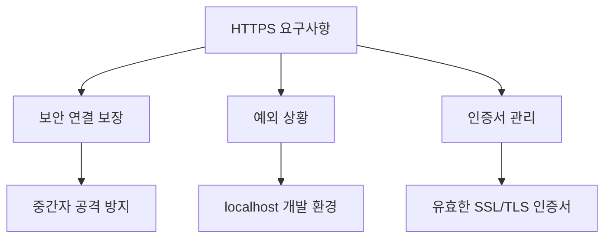
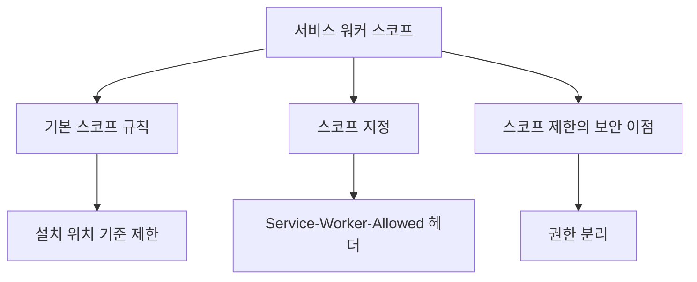
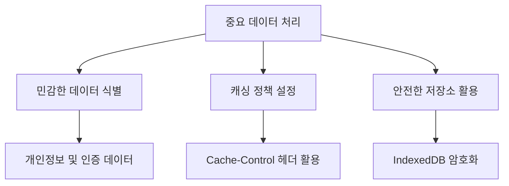
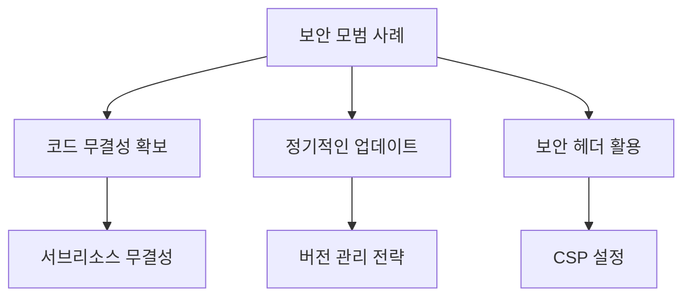

# Chapter 06 서비스 워커 고급 주제

## 06-2 보안 고려사항

### 개요
서비스 워커는 강력한 기능을 제공하지만, 그만큼 보안 측면에서 주의해야 할 사항이 많습니다. 이 섹션에서는 서비스 워커 사용 시 고려해야 할 주요 보안 요소인 HTTPS 요구사항, 서비스 워커 스코프 제한, 중요 데이터 처리 방법, 그리고 보안 모범 사례에 대해 알아봅니다. 이러한 보안 고려사항을 이해하고 적용함으로써 안전하고 신뢰할 수 있는 웹 애플리케이션을 구축할 수 있습니다.

### HTTPS 요구사항

서비스 워커는 보안상의 이유로 HTTPS 환경에서만 작동합니다. 이는 중간자 공격(Man-in-the-Middle Attack)과 같은 보안 위협으로부터 사용자를 보호하기 위한 필수 요구사항입니다.



#### HTTPS의 중요성

서비스 워커가 HTTPS를 요구하는 이유는 다음과 같습니다:

1. **네트워크 요청 가로채기**: 서비스 워커는 웹 페이지의 모든 네트워크 요청을 가로챌 수 있는 권한을 가집니다. HTTP 환경에서는 악의적인 공격자가 이 기능을 악용할 가능성이 있습니다.

2. **지속적인 백그라운드 실행**: 서비스 워커는 웹 페이지가 닫힌 후에도 백그라운드에서 실행될 수 있어, 보안 연결이 필수적입니다.

3. **민감한 데이터 접근**: 캐싱 및 오프라인 기능을 통해 민감한 사용자 데이터에 접근할 수 있으므로 안전한 환경이 필요합니다.

```javascript
// HTTPS 환경 확인 예시
if (location.protocol !== 'https:' && location.hostname !== 'localhost') {
  console.error('서비스 워커는 HTTPS 또는 localhost에서만 작동합니다.');
  // 서비스 워커 등록 시도하지 않음
} else {
  // 서비스 워커 등록 진행
  navigator.serviceWorker.register('/sw.js')
    .then(registration => {
      console.log('서비스 워커가 등록되었습니다:', registration.scope);
    })
    .catch(error => {
      console.error('서비스 워커 등록 실패:', error);
    });
}
```

#### 개발 환경에서의 예외

개발 과정에서는 `localhost`와 같은 로컬 개발 환경에서도 서비스 워커를 사용할 수 있습니다. 이는 개발자의 편의를 위한 예외 사항입니다:

```javascript
// 개발 환경과 프로덕션 환경 구분 예시
const isLocalhost = Boolean(
  window.location.hostname === 'localhost' ||
  window.location.hostname === '[::1]' ||
  window.location.hostname.match(/^127(?:\.(?:25[0-5]|2[0-4][0-9]|[01]?[0-9][0-9]?)){3}$/)
);

function registerServiceWorker() {
  if ('serviceWorker' in navigator) {
    // HTTPS 또는 로컬호스트 확인
    if (window.location.protocol === 'https:' || isLocalhost) {
      navigator.serviceWorker.register('/sw.js')
        .then(registration => {
          console.log('서비스 워커 등록 성공:', registration.scope);
        })
        .catch(error => {
          console.error('서비스 워커 등록 실패:', error);
        });
    } else {
      console.warn('안전하지 않은 환경: HTTPS가 필요합니다');
    }
  }
}
```

#### HTTPS 전환 고려사항

기존 HTTP 웹사이트를 HTTPS로 전환할 때 고려해야 할 사항:

1. **SSL/TLS 인증서 획득**: 신뢰할 수 있는 인증 기관(CA)에서 인증서를 발급받거나, Let's Encrypt와 같은 무료 서비스 활용

2. **혼합 콘텐츠 문제 해결**: HTTPS 페이지에서 HTTP 리소스를 로드하지 않도록 모든 리소스 URL 업데이트

3. **리다이렉션 설정**: HTTP 요청을 HTTPS로 자동 리다이렉션하도록 서버 구성

4. **HSTS(HTTP Strict Transport Security) 설정**: 브라우저가 항상 HTTPS를 통해 사이트에 접속하도록 강제

```javascript
// 서비스 워커에서 혼합 콘텐츠 문제 해결 예시
self.addEventListener('fetch', event => {
  let secureUrl = event.request.url;
  
  // HTTP URL을 HTTPS로 변환
  if (secureUrl.startsWith('http:') && !secureUrl.includes('localhost')) {
    secureUrl = secureUrl.replace('http:', 'https:');
    
    event.respondWith(
      fetch(secureUrl, { 
        mode: 'cors',
        credentials: 'same-origin'
      })
    );
  }
});
```

### 서비스 워커 스코프 제한

서비스 워커는 기본적으로 자신이 위치한 디렉토리와 그 하위 디렉토리에만 영향을 미칩니다. 이러한 스코프 제한은 보안을 강화하고 서비스 워커 간의 충돌을 방지합니다.



#### 기본 스코프 규칙

서비스 워커의 기본 스코프는 서비스 워커 파일이 위치한 디렉토리입니다:

```javascript
// 기본 스코프 예시
// 서비스 워커 파일 위치: /app/sw.js
navigator.serviceWorker.register('/app/sw.js')
  .then(registration => {
    // 스코프는 '/app/'
    console.log('서비스 워커 스코프:', registration.scope);
    // 출력: https://example.com/app/
  });
```

이 경우 서비스 워커는 `/app/` 경로와 그 하위 경로에만 영향을 미칩니다. 예를 들어:
- `/app/index.html` - 서비스 워커 제어 가능
- `/app/pages/about.html` - 서비스 워커 제어 가능
- `/index.html` - 서비스 워커 제어 불가능

#### 명시적 스코프 지정

등록 시 스코프 옵션을 사용하여 서비스 워커의 범위를 명시적으로 지정할 수 있습니다:

```javascript
// 명시적 스코프 지정 예시
navigator.serviceWorker.register('/app/sw.js', {
  scope: '/app/pages/'
})
.then(registration => {
  // 스코프는 '/app/pages/'
  console.log('서비스 워커 스코프:', registration.scope);
});
```

이 경우 서비스 워커는 `/app/pages/` 경로와 그 하위 경로에만 영향을 미칩니다:
- `/app/pages/about.html` - 서비스 워커 제어 가능
- `/app/index.html` - 서비스 워커 제어 불가능

#### 스코프 확장 제한

보안상의 이유로 서비스 워커의 스코프는 기본적으로 자신의 위치보다 상위 디렉토리로 확장할 수 없습니다:

```javascript
// 잘못된 스코프 확장 시도
navigator.serviceWorker.register('/app/sw.js', {
  scope: '/' // 오류 발생: 서비스 워커 위치보다 상위 경로 지정
})
.catch(error => {
  console.error('서비스 워커 등록 실패:', error);
  // "The path of the provided scope ('/') is not under the max scope allowed ('app/')"
});
```

#### Service-Worker-Allowed 헤더

서버에서 `Service-Worker-Allowed` 헤더를 설정하면 서비스 워커의 스코프를 확장할 수 있습니다:

```javascript
// 서버 측 코드 (Spring Boot 예시)
@Controller
public class ServiceWorkerController {

    @GetMapping(value = "/app/sw.js", produces = "application/javascript")
    public ResponseEntity<Resource> serviceWorker() {
        // 'static/app/sw.js'는 리소스 경로에 해당합니다.
        Resource resource = new ClassPathResource("static/app/sw.js");
        return ResponseEntity.ok()
                .header("Service-Worker-Allowed", "/")
                .body(resource);
    }
}
```

이 헤더를 설정한 후에는 확장된 스코프로 서비스 워커를 등록할 수 있습니다:

```javascript
// 확장된 스코프 사용
navigator.serviceWorker.register('/app/sw.js', {
  scope: '/' // 이제 유효함
})
.then(registration => {
  console.log('서비스 워커 스코프:', registration.scope);
  // 출력: https://example.com/
});
```

#### 스코프 제한의 보안 이점

스코프 제한은 다음과 같은 보안 이점을 제공합니다:

1. **권한 분리**: 각 서비스 워커가 자신의 영역만 제어하도록 제한하여 권한 분리 원칙을 적용합니다.

2. **공격 표면 감소**: 서비스 워커의 영향 범위를 제한하여 잠재적인 공격 표면을 줄입니다.

3. **다중 서비스 워커 관리**: 웹사이트의 다른 부분에 대해 다른 서비스 워커를 사용할 수 있어 기능별 분리가 가능합니다.

```javascript
// 기능별 서비스 워커 분리 예시
// 메인 애플리케이션용 서비스 워커
navigator.serviceWorker.register('/app/main-sw.js', {
  scope: '/app/'
});

// 관리자 영역용 서비스 워커
navigator.serviceWorker.register('/admin/admin-sw.js', {
  scope: '/admin/'
});

// API 요청 처리용 서비스 워커
navigator.serviceWorker.register('/api/api-sw.js', {
  scope: '/api/'
});
```

### 중요 데이터 처리

서비스 워커는 네트워크 요청을 가로채고 응답을 캐싱할 수 있기 때문에, 민감한 데이터를 처리할 때 특별한 주의가 필요합니다.



#### 민감한 데이터 식별

서비스 워커에서 특별히 주의해야 할 민감한 데이터 유형:

1. **인증 정보**: 토큰, 세션 ID, 쿠키 등
2. **개인 식별 정보(PII)**: 이름, 이메일, 주소, 전화번호 등
3. **금융 정보**: 신용카드 번호, 은행 계좌 정보 등
4. **건강 관련 정보**: 의료 기록, 처방전 등

#### 민감한 데이터 캐싱 방지

민감한 데이터를 포함하는 응답은 캐싱하지 않도록 주의해야 합니다:

```javascript
// 민감한 데이터 캐싱 방지 예시
self.addEventListener('fetch', event => {
  const url = new URL(event.request.url);
  
  // 민감한 엔드포인트 식별
  const isSensitiveEndpoint = 
    url.pathname.includes('/api/user/profile') ||
    url.pathname.includes('/api/payment') ||
    url.pathname.includes('/api/auth');
  
  if (isSensitiveEndpoint) {
    // 민감한 엔드포인트는 캐싱하지 않고 항상 네트워크 요청
    event.respondWith(fetch(event.request));
    return;
  }
  
  // 다른 요청은 일반 캐싱 전략 적용
  event.respondWith(handleNormalRequest(event.request));
});

// 일반 요청 처리 함수
async function handleNormalRequest(request) {
  // 캐시에서 응답 확인
  const cachedResponse = await caches.match(request);
  if (cachedResponse) {
    return cachedResponse;
  }
  
  // 캐시에 없으면 네트워크에서 가져오기
  const response = await fetch(request);
  
  // 응답 캐싱
  const cache = await caches.open('v1');
  cache.put(request, response.clone());
  
  return response;
}
```

#### Cache-Control 헤더 활용

서버 응답의 `Cache-Control` 헤더를 활용하여 캐싱 동작을 제어할 수 있습니다:

```javascript
// Cache-Control 헤더 확인 예시
self.addEventListener('fetch', event => {
  event.respondWith(handleCacheControlRequest(event.request));
});

// Cache-Control 헤더 처리 함수
async function handleCacheControlRequest(request) {
  // 네트워크에서 응답 가져오기
  const response = await fetch(request);
  
  // Cache-Control 헤더 확인
  const cacheControl = response.headers.get('Cache-Control');
  
  // 'no-store' 지시문이 있으면 캐싱하지 않음
  if (cacheControl && cacheControl.includes('no-store')) {
    return response;
  }
  
  // 그 외의 경우 캐싱
  const cache = await caches.open('v1');
  cache.put(request, response.clone());
  
  return response;
}
```

서버 측에서는 민감한 데이터를 포함하는 응답에 적절한 `Cache-Control` 헤더를 설정해야 합니다:

```javascript
// 서버 측 코드 (Spring Boot 예시)
@RestController
public class UserProfileController {

    // 사용자 정보를 담는 DTO (Data Transfer Object)
    public record UserProfile(String name, String email) {}

    @GetMapping("/api/user/profile")
    public ResponseEntity<UserProfile> getUserProfile() {
        // 민감한 데이터를 포함하는 응답에 no-store 설정
        UserProfile userProfile = new UserProfile("John Doe", "john@example.com");

        return ResponseEntity.ok()
                .cacheControl(CacheControl.noStore().cachePrivate())
                .body(userProfile);
    }
}
```

#### 안전한 데이터 저장

오프라인 기능을 위해 민감한 데이터를 저장해야 하는 경우, 적절한 보안 조치를 취해야 합니다:

```javascript
// IndexedDB에 암호화하여 데이터 저장 예시 (CryptoJS 사용)
async function securelyStoreUserData(userData) {
  // 사용자별 암호화 키 생성 (실제 구현에서는 더 안전한 방법 사용)
  const encryptionKey = await deriveEncryptionKey();
  
  // 데이터 암호화
  const encryptedData = CryptoJS.AES.encrypt(
    JSON.stringify(userData),
    encryptionKey
  ).toString();
  
  // IndexedDB에 암호화된 데이터 저장
  const db = await openDatabase();
  const tx = db.transaction('userData', 'readwrite');
  const store = tx.objectStore('userData');
  store.put({
    id: userData.id,
    encryptedData: encryptedData,
    timestamp: Date.now()
  });
  
  return tx.complete;
}

// 암호화 키 생성 함수 (예시)
async function deriveEncryptionKey() {
  // 실제 구현에서는 Web Crypto API 사용 권장
  // 이 예시는 단순화를 위한 것임
  const sessionToken = localStorage.getItem('sessionToken');
  return CryptoJS.PBKDF2(sessionToken, 'salt', {
    keySize: 256 / 32,
    iterations: 1000
  }).toString();
}
```

#### 데이터 만료 및 삭제

민감한 데이터는 필요한 기간 동안만 저장하고, 더 이상 필요하지 않을 때 안전하게 삭제해야 합니다:

```javascript
// 데이터 만료 처리 예시
self.addEventListener('activate', event => {
  event.waitUntil(cleanupExpiredData());
});

// 만료된 데이터 정리 함수
async function cleanupExpiredData() {
  // 오래된 캐시 삭제
  await cleanupExpiredCacheItems();
  
  // IndexedDB 데이터 정리
  await cleanupIndexedDB();
}

// 만료된 캐시 항목 정리 함수
async function cleanupExpiredCacheItems() {
  const cacheNames = await caches.keys();
  
  // 각 캐시에 대해 처리
  await Promise.all(cacheNames.map(async (cacheName) => {
    const cache = await caches.open(cacheName);
    const requests = await cache.keys();
    
    // 각 요청에 대해 만료 여부 확인
    await Promise.all(requests.map(async (request) => {
      const response = await cache.match(request);
      
      // 응답이 없거나 만료된 경우 삭제
      if (!response) return;
      
      const expires = response.headers.get('Expires');
      if (expires && new Date(expires) < new Date()) {
        await cache.delete(request);
      }
    }));
  }));
}

// IndexedDB 데이터 정리 함수
async function cleanupIndexedDB() {
  const MAX_AGE = 7 * 24 * 60 * 60 * 1000; // 7일
  const now = Date.now();
  
  const db = await openDatabase();
  const tx = db.transaction('userData', 'readwrite');
  const store = tx.objectStore('userData');
  
  // 오래된 데이터 찾기
  const oldItems = await store.index('timestamp').getAll(
    IDBKeyRange.upperBound(now - MAX_AGE)
  );
  
  // 오래된 데이터 삭제
  for (const item of oldItems) {
    store.delete(item.id);
  }
  
  return tx.complete;
}
```

### 보안 모범 사례

서비스 워커를 안전하게 사용하기 위한 추가적인 보안 모범 사례를 알아봅니다.



#### 코드 무결성 확보

서비스 워커 스크립트의 무결성을 보장하여 악의적인 코드 삽입을 방지합니다:

```html
<!-- 서브리소스 무결성(SRI) 적용 예시 -->
<script src="app.js" 
        integrity="sha384-oqVuAfXRKap7fdgcCY5uykM6+R9GqQ8K/uxy9rx7HNQlGYl1kPzQho1wx4JwY8wC"
        crossorigin="anonymous"></script>
```

서비스 워커 등록 시에도 무결성 검사를 수행할 수 있습니다:

```javascript
// 서비스 워커 무결성 검사 예시
async function registerServiceWorkerWithIntegrity() {
  try {
    // 서비스 워커 스크립트 가져오기
    const swText = await fetchServiceWorkerScript('/sw.js');
    
    // 무결성 검증
    await verifyIntegrity(swText);
    
    // 검증 후 등록
    const registration = await navigator.serviceWorker.register('/sw.js');
    console.log('서비스 워커 등록 성공:', registration.scope);
  } catch (error) {
    console.error('서비스 워커 등록 실패:', error);
  }
}

// 서비스 워커 스크립트 가져오기
async function fetchServiceWorkerScript(scriptPath) {
  const response = await fetch(scriptPath);
  return response.text();
}

// 무결성 검증 함수
async function verifyIntegrity(scriptContent) {
  // 미리 계산된 해시 (실제 구현에서는 안전하게 저장된 값 사용)
  const expectedHash = 'sha256-...';
  
  // 현재 스크립트의 해시 계산
  const actualHash = await calculateHash(scriptContent);
  
  // 해시 비교
  if (actualHash !== expectedHash) {
    throw new Error('서비스 워커 스크립트 무결성 검증 실패');
  }
}

// 해시 계산 함수
async function calculateHash(text) {
  const encoder = new TextEncoder();
  const data = encoder.encode(text);
  const hashBuffer = await crypto.subtle.digest('SHA-256', data);
  const hashArray = Array.from(new Uint8Array(hashBuffer));
  return hashArray.map(b => b.toString(16).padStart(2, '0')).join('');
}
```

#### 정기적인 업데이트 및 버전 관리

서비스 워커를 정기적으로 업데이트하고 적절한 버전 관리 전략을 사용합니다:

```javascript
// 버전 관리 예시
const CACHE_VERSION = 'v1.2.3';
const CACHE_NAME = `app-${CACHE_VERSION}`;

self.addEventListener('install', event => {
  event.waitUntil(
    caches.open(CACHE_NAME)
      .then(cache => {
        return cache.addAll([
          '/',
          '/index.html',
          '/styles/main.css',
          '/scripts/app.js'
        ]);
      })
  );
});

self.addEventListener('activate', event => {
  event.waitUntil(
    caches.keys().then(cacheNames => {
      return Promise.all(
        cacheNames
          .filter(cacheName => {
            // 현재 버전이 아닌 캐시 식별
            return cacheName.startsWith('app-') && cacheName !== CACHE_NAME;
          })
          .map(cacheName => {
            // 이전 버전 캐시 삭제
            return caches.delete(cacheName);
          })
      );
    })
  );
});
```

#### 보안 헤더 활용

적절한 보안 헤더를 설정하여 웹 애플리케이션의 보안을 강화합니다:

1. **Content-Security-Policy (CSP)**:
   서비스 워커와 함께 CSP를 사용하여 허용된 소스에서만 리소스를 로드하도록 제한합니다.

```html
<!-- CSP 설정 예시 -->
<meta http-equiv="Content-Security-Policy" content="
  default-src 'self';
  script-src 'self' https://trusted-scripts.com;
  connect-src 'self' https://api.example.com;
  worker-src 'self';
  img-src 'self' https://trusted-images.com data:;
  style-src 'self' https://trusted-styles.com;
  font-src 'self' https://trusted-fonts.com;
">
```

2. **Feature-Policy**:
   웹 애플리케이션에서 사용할 수 있는 기능을 제한합니다.

```html
<!-- Feature-Policy 설정 예시 -->
<meta http-equiv="Feature-Policy" content="
  geolocation 'self';
  camera 'none';
  microphone 'none';
  payment 'self' https://trusted-payment.com;
">
```

3. **X-Content-Type-Options**:
   MIME 타입 스니핑을 방지합니다.

```html
<!-- X-Content-Type-Options 설정 -->
<meta http-equiv="X-Content-Type-Options" content="nosniff">
```

#### 서비스 워커 권한 관리

서비스 워커가 접근할 수 있는 API와 기능을 제한하여 보안을 강화합니다:

```javascript
// 권한 확인 예시
self.addEventListener('push', event => {
  // 푸시 알림 권한 확인
  if (self.Notification.permission !== 'granted') {
    console.warn('푸시 알림 권한이 없습니다');
    return;
  }
  
  // 권한이 있는 경우에만 알림 표시
  const options = {
    body: event.data.text(),
    icon: '/images/notification-icon.png',
    badge: '/images/notification-badge.png'
  };
  
  event.waitUntil(
    self.registration.showNotification('알림 제목', options)
  );
});
```

#### 사용자 동의 및 투명성

서비스 워커의 기능과 데이터 사용에 대해 사용자에게 명확하게 알리고 동의를 얻습니다:

```javascript
// 사용자 동의 확인 예시
function requestServiceWorkerConsent() {
  const consentKey = 'sw-consent-given';
  
  // 이전에 동의했는지 확인
  if (localStorage.getItem(consentKey) === 'true') {
    registerServiceWorker();
    return;
  }
  
  // 동의 요청 UI 표시
  const consentDialog = document.getElementById('sw-consent-dialog');
  consentDialog.style.display = 'block';
  
  // 동의 버튼 이벤트 리스너
  document.getElementById('sw-consent-accept').addEventListener('click', () => {
    localStorage.setItem(consentKey, 'true');
    consentDialog.style.display = 'none';
    registerServiceWorker();
  });
  
  // 거부 버튼 이벤트 리스너
  document.getElementById('sw-consent-decline').addEventListener('click', () => {
    consentDialog.style.display = 'none';
    // 서비스 워커 없이 기본 기능만 제공
  });
}
```

### 4가지 키워드로 정리하는 핵심 포인트
1. **HTTPS 필수**: 서비스 워커는 보안 연결을 보장하기 위해 HTTPS 환경에서만 작동하며, 이는 중간자 공격과 같은 보안 위협으로부터 사용자를 보호합니다.
2. **스코프 제한**: 서비스 워커는 자신이 위치한 디렉토리와 그 하위 디렉토리에만 영향을 미치도록 제한되어 있어, 권한 분리와 공격 표면 감소에 기여합니다.
3. **민감한 데이터 보호**: 인증 정보, 개인 식별 정보 등 민감한 데이터는 캐싱하지 않거나 암호화하여 저장하는 등의 특별한 처리가 필요합니다.
4. **보안 모범 사례**: 코드 무결성 확보, 정기적인 업데이트, 보안 헤더 활용 등의 모범 사례를 통해 서비스 워커의 안전한 사용을 보장해야 합니다.

### 확인 문제
1. 서비스 워커가 HTTPS 환경에서만 작동하는 이유로 가장 적절한 것은?
   - [ ] 서비스 워커의 성능을 최적화하기 위해
   - [ ] 중간자 공격과 같은 보안 위협으로부터 보호하기 위해
   - [ ] 브라우저 호환성 문제를 해결하기 위해
   - [ ] 서비스 워커의 설치 속도를 높이기 위해

2. 서비스 워커의 스코프에 대한 설명으로 올바르지 않은 것은?
   - [ ] 서비스 워커는 기본적으로 자신이 위치한 디렉토리와 그 하위 디렉토리에만 영향을 미친다
   - [ ] 서비스 워커의 스코프는 등록 시 옵션으로 명시적으로 지정할 수 있다
   - [ ] 서비스 워커는 기본적으로 웹사이트의 모든 경로에 영향을 미친다
   - [ ] Service-Worker-Allowed 헤더를 사용하면 서비스 워커의 스코프를 확장할 수 있다

3. 서비스 워커에서 민감한 데이터를 처리할 때 권장되는 방법은? (복수 응답)
   - [ ] 모든 API 응답을 무조건 캐싱한다
   - [ ] 민감한 데이터를 포함하는 응답은 캐싱하지 않는다
   - [ ] Cache-Control 헤더를 활용하여 캐싱 동작을 제어한다
   - [ ] 필요한 경우 데이터를 암호화하여 저장한다
   - [ ] 민감한 데이터는 영구적으로 저장한다

4. 서비스 워커 보안을 강화하기 위한 모범 사례로 올바른 것은? (복수 응답)
   - [ ] 서비스 워커 스크립트의 무결성을 확인한다
   - [ ] 정기적으로 서비스 워커를 업데이트하고 버전을 관리한다
   - [ ] Content-Security-Policy(CSP)를 설정하여 리소스 로드를 제한한다
   - [ ] 모든 사용자 데이터를 평문으로 저장한다
   - [ ] 서비스 워커의 기능과 데이터 사용에 대해 사용자에게 투명하게 알린다

5. 다음 중 서비스 워커 스코프 제한의 보안 이점이 아닌 것은?
   - [ ] 권한 분리 원칙 적용
   - [ ] 잠재적인 공격 표면 감소
   - [ ] 기능별로 다른 서비스 워커 사용 가능
   - [ ] 서비스 워커의 실행 속도 향상

> [정답 및 해설 보기](../answers_and_explanations.md#06-2-보안-고려사항)
