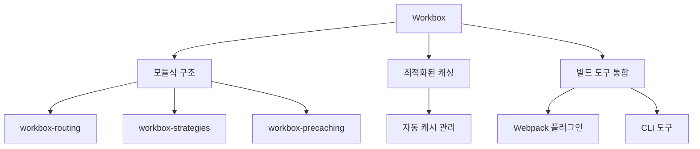
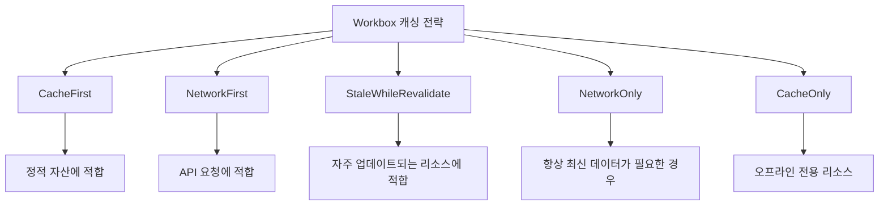
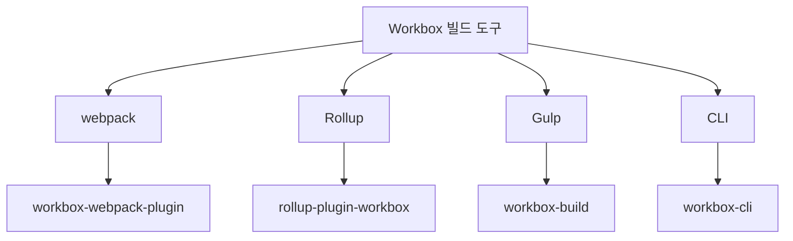

# Chapter 06 서비스 워커와 프레임워크

## 06-2 Workbox 라이브러리

### 개요
Workbox는 Google에서 개발한 서비스 워커 라이브러리 모음으로, 프로그레시브 웹 앱(PWA)을 구축하는 데 필요한 서비스 워커 기능을 쉽게 구현할 수 있게 해줍니다. 이 섹션에서는 Workbox의 주요 모듈과 기능, 다양한 캐싱 전략, 그리고 빌드 도구와의 통합 방법에 대해 알아봅니다. Workbox를 활용하면 복잡한 서비스 워커 코드를 직접 작성하지 않고도 강력한 오프라인 경험과 성능 최적화를 구현할 수 있습니다.

### Workbox 소개

Workbox는 서비스 워커 개발을 단순화하고 최적화하기 위한 라이브러리 모음으로, 서비스 워커의 복잡성을 추상화하여 개발자가 더 쉽게 PWA 기능을 구현할 수 있게 해줍니다.



#### Workbox의 주요 특징

Workbox는 다음과 같은 주요 특징을 제공합니다:

1. **모듈식 구조**: 필요한 기능만 선택적으로 사용할 수 있는 모듈식 설계
2. **최적화된 캐싱 전략**: 다양한 리소스 유형에 맞는 캐싱 전략 제공
3. **자동화된 서비스 워커 생성**: 빌드 도구와 통합하여 서비스 워커 코드 자동 생성
4. **캐시 만료 및 크기 제한**: 캐시 관리를 위한 다양한 옵션 제공
5. **백그라운드 동기화**: 오프라인 상태에서의 데이터 처리 지원
6. **디버깅 도구**: 개발 과정에서 서비스 워커 디버깅을 위한 도구 제공

#### Workbox 설치 및 기본 사용법

Workbox는 npm을 통해 설치할 수 있으며, 다양한 방식으로 프로젝트에 통합할 수 있습니다:

```bash
# 필요한 Workbox 모듈 설치
npm install workbox-core workbox-routing workbox-strategies workbox-precaching
```

기본적인 Workbox 사용 예시:

```javascript
// service-worker.js
importScripts('https://storage.googleapis.com/workbox-cdn/releases/6.4.1/workbox-sw.js');

// Workbox 모듈 사용
workbox.routing.registerRoute(
  ({request}) => request.destination === 'image',
  new workbox.strategies.CacheFirst({
    cacheName: 'images',
    plugins: [
      new workbox.expiration.ExpirationPlugin({
        maxEntries: 60,
        maxAgeSeconds: 30 * 24 * 60 * 60, // 30일
      }),
    ],
  })
);

// 빌드 도구에서 생성된 프리캐시 매니페스트 사용 (권장 방법)
// 빌드 과정에서 self.__WB_MANIFEST에 파일 목록과 revision이 자동으로 주입됩니다
workbox.precaching.precacheAndRoute(self.__WB_MANIFEST);

// 또는 특정 파일만 수동으로 프리캐시하려는 경우:
// workbox.precaching.precacheAndRoute([
//   // URL에 해시가 포함된 경우 revision은 null로 설정
//   {url: '/app.12abc34.js', revision: null},
//   {url: '/styles.56def78.css', revision: null},
//   // 해시가 없는 파일은 빌드 시점의 타임스탬프나 해시값 사용
//   {url: '/index.html', revision: Date.now().toString()},
// ]);
```

CDN을 통한 Workbox 사용 대신, npm 모듈을 직접 임포트하여 사용할 수도 있습니다:

```javascript
// service-worker.js
import {registerRoute} from 'workbox-routing';
import {CacheFirst} from 'workbox-strategies';
import {ExpirationPlugin} from 'workbox-expiration';
import {precacheAndRoute} from 'workbox-precaching';

// 이미지 캐싱
registerRoute(
  ({request}) => request.destination === 'image',
  new CacheFirst({
    cacheName: 'images',
    plugins: [
      new ExpirationPlugin({
        maxEntries: 60,
        maxAgeSeconds: 30 * 24 * 60 * 60, // 30일
      }),
    ],
  })
);

// 빌드 과정에서 생성된 프리캐시 매니페스트 사용
precacheAndRoute(self.__WB_MANIFEST);
```

### 주요 모듈 및 기능

Workbox는 다양한 모듈로 구성되어 있으며, 각 모듈은 서비스 워커의 특정 기능을 담당합니다. 필요한 기능에 따라 관련 모듈만 선택적으로 사용할 수 있습니다.

#### 라우팅

`workbox-routing` 모듈은 네트워크 요청을 가로채고 적절한 핸들러로 라우팅하는 기능을 제공합니다.

```javascript
import {registerRoute} from 'workbox-routing';
import {CacheFirst} from 'workbox-strategies';

// URL 패턴 기반 라우팅
registerRoute(
  ({url}) => url.pathname.startsWith('/api/'),
  new NetworkFirst()
);

// 정규식 기반 라우팅
registerRoute(
  new RegExp('/images/.*\\.(?:png|jpg|jpeg|svg|gif)'),
  new CacheFirst()
);

// 요청 대상 기반 라우팅
registerRoute(
  ({request}) => request.destination === 'script',
  new CacheFirst()
);
```

라우팅 우선순위와 기본 핸들러 설정:

```javascript
import {registerRoute, setDefaultHandler, setCatchHandler} from 'workbox-routing';
import {NetworkOnly, CacheFirst} from 'workbox-strategies';

// 우선순위가 높은 라우트 (먼저 평가됨)
registerRoute(
  ({url}) => url.pathname === '/important-resource',
  new NetworkFirst(),
  'GET'
);

// 기본 핸들러 (어떤 라우트에도 일치하지 않는 요청 처리)
setDefaultHandler(new NetworkOnly());

// 캐치 핸들러 (오류 발생 시 처리)
setCatchHandler(({event}) => {
  if (event.request.destination === 'document') {
    return caches.match('/offline.html');
  }
  return Response.error();
});
```

#### 캐싱 전략

`workbox-strategies` 모듈은 다양한 캐싱 전략을 제공하여 리소스 유형에 맞는 최적의 캐싱 방법을 구현할 수 있게 합니다.



주요 캐싱 전략:

1. **CacheFirst**: 캐시에서 먼저 응답을 찾고, 없는 경우에만 네트워크에서 가져옵니다. 자주 변경되지 않는 정적 자산에 적합합니다.

```javascript
import {registerRoute} from 'workbox-routing';
import {CacheFirst} from 'workbox-strategies';
import {ExpirationPlugin} from 'workbox-expiration';

registerRoute(
  ({request}) => request.destination === 'image',
  new CacheFirst({
    cacheName: 'images',
    plugins: [
      new ExpirationPlugin({
        maxEntries: 60,
        maxAgeSeconds: 30 * 24 * 60 * 60, // 30일
      }),
    ],
  })
);
```

2. **NetworkFirst**: 네트워크에서 먼저 응답을 가져오고, 실패할 경우 캐시에서 가져옵니다. API 요청과 같이 최신 데이터가 중요하지만 오프라인 폴백도 필요한 경우에 적합합니다.

```javascript
import {registerRoute} from 'workbox-routing';
import {NetworkFirst} from 'workbox-strategies';

registerRoute(
  ({url}) => url.pathname.startsWith('/api/'),
  new NetworkFirst({
    cacheName: 'api-responses',
    networkTimeoutSeconds: 3, // 네트워크 타임아웃
    plugins: [
      new ExpirationPlugin({
        maxEntries: 50,
        maxAgeSeconds: 5 * 60, // 5분
      }),
    ],
  })
);
```

3. **StaleWhileRevalidate**: 캐시된 응답을 즉시 반환하면서 동시에 네트워크 요청을 보내 캐시를 업데이트합니다. 빠른 응답과 최신 콘텐츠 사이의 균형이 필요한 경우에 적합합니다.

```javascript
import {registerRoute} from 'workbox-routing';
import {StaleWhileRevalidate} from 'workbox-strategies';

registerRoute(
  ({url}) => url.pathname.endsWith('.css') || url.pathname.endsWith('.js'),
  new StaleWhileRevalidate({
    cacheName: 'static-resources',
  })
);
```

4. **NetworkOnly**: 항상 네트워크에서만 응답을 가져옵니다. 캐싱이 적합하지 않은 요청에 사용됩니다.

```javascript
import {registerRoute} from 'workbox-routing';
import {NetworkOnly} from 'workbox-strategies';

registerRoute(
  ({url}) => url.pathname.startsWith('/admin/'),
  new NetworkOnly()
);
```

5. **CacheOnly**: 항상 캐시에서만 응답을 가져옵니다. 완전한 오프라인 경험이 필요한 경우에 사용됩니다.

```javascript
import {registerRoute} from 'workbox-routing';
import {CacheOnly} from 'workbox-strategies';

registerRoute(
  ({url}) => url.pathname.startsWith('/offline-only/'),
  new CacheOnly({
    cacheName: 'offline-resources',
  })
);
```

#### 프리캐싱

`workbox-precaching` 모듈은 서비스 워커 설치 단계에서 필수 리소스를 미리 캐싱하는 기능을 제공합니다. 이를 통해 앱 셸 아키텍처를 효과적으로 구현할 수 있습니다.

```javascript
import {precacheAndRoute} from 'workbox-precaching';

// 빌드 도구에서 생성한 매니페스트 사용 (권장 방법)
// Webpack, CLI 등의 빌드 도구가 파일 해시를 기반으로 자동 생성
precacheAndRoute(self.__WB_MANIFEST);

// 수동으로 프리캐시 항목을 지정해야 하는 경우:
precacheAndRoute([
  // URL에 해시가 포함된 파일들 (webpack 등에서 생성)
  {url: '/static/js/main.abc123.js', revision: null},
  {url: '/static/css/main.def456.css', revision: null},

  // 해시가 없는 파일들은 파일 내용 기반 해시나 타임스탬프 사용
  // 실제 개발에서는 빌드 스크립트에서 동적으로 생성
  {url: '/index.html', revision: generateFileHash('/index.html')},
  {url: '/manifest.json', revision: Date.now().toString()},
]);

// 파일 해시 생성 함수 예시 (빌드 스크립트에서 사용)
function generateFileHash(filepath) {
  // 실제로는 파일 내용을 읽어 해시를 생성
  // 예: crypto.createHash('md5').update(fileContent).digest('hex')
  return require('crypto').randomBytes(8).toString('hex');
}
```

프리캐싱의 주요 특징:

1. **버전 관리**: `revision` 속성을 통해 파일 변경 감지 및 업데이트
2. **효율적인 다운로드**: HTTP 캐시 헤더를 활용한 효율적인 다운로드
3. **URL 정규화**: 상대 경로와 절대 경로 처리
4. **설치 이벤트 처리**: 서비스 워커 설치 단계에서 자동으로 처리

프리캐싱과 런타임 캐싱 결합:

```javascript
import {precacheAndRoute} from 'workbox-precaching';
import {registerRoute} from 'workbox-routing';
import {CacheFirst} from 'workbox-strategies';

// 앱 셸 컴포넌트 프리캐싱
precacheAndRoute(self.__WB_MANIFEST);

// 런타임에 이미지 캐싱
registerRoute(
  ({request}) => request.destination === 'image',
  new CacheFirst({
    cacheName: 'runtime-images',
  })
);
```

#### 백그라운드 동기화

`workbox-background-sync` 모듈은 오프라인 상태에서 실패한 요청을 저장하고, 네트워크 연결이 복구되면 자동으로 재시도하는 기능을 제공합니다.

```javascript
import {registerRoute} from 'workbox-routing';
import {NetworkOnly} from 'workbox-strategies';
import {BackgroundSyncPlugin} from 'workbox-background-sync';

// 백그라운드 동기화 큐 생성
const bgSyncPlugin = new BackgroundSyncPlugin('formQueue', {
  maxRetentionTime: 24 * 60 // 24시간 동안 재시도
});

// POST 요청에 백그라운드 동기화 적용
registerRoute(
  ({url}) => url.pathname === '/api/submit-form',
  new NetworkOnly({
    plugins: [bgSyncPlugin]
  }),
  'POST'
);
```

백그라운드 동기화 고급 사용법:

```javascript
import {Queue} from 'workbox-background-sync';

self.addEventListener('fetch', (event) => {
  if (event.request.method === 'POST') {
    // 클론된 요청 저장
    const promiseChain = fetch(event.request.clone())
      .catch((err) => {
        // 네트워크 요청 실패 시 큐에 추가
        const queue = new Queue('myQueueName');
        return queue.pushRequest({request: event.request});
      });

    event.waitUntil(promiseChain);
  }
});
```

### 빌드 도구 통합

Workbox는 다양한 빌드 도구와 통합하여 서비스 워커 생성 과정을 자동화할 수 있습니다. 이를 통해 프로젝트 빌드 시 최적화된 서비스 워커 파일을 자동으로 생성할 수 있습니다.



#### Webpack과 통합

Webpack 프로젝트에서는 `workbox-webpack-plugin`을 사용하여 서비스 워커를 생성할 수 있습니다:

```javascript
// webpack.config.js
const {GenerateSW} = require('workbox-webpack-plugin');

module.exports = {
  // 기타 webpack 설정...
  plugins: [
    new GenerateSW({
      // 서비스 워커 옵션
      clientsClaim: true,
      skipWaiting: true,
      // 캐시할 파일 패턴 지정
      include: [/\.html$/, /\.js$/, /\.css$/, /\.png$/, /\.jpg$/],
      // 런타임 캐싱 설정
      runtimeCaching: [{
        urlPattern: /^https:\/\/api\.example\.com/,
        handler: 'NetworkFirst',
        options: {
          cacheName: 'api-cache',
          expiration: {
            maxEntries: 50,
            maxAgeSeconds: 30 * 60 // 30분
          }
        }
      }]
    })
  ]
};
```

Webpack 플러그인의 두 가지 모드:

1. **GenerateSW**: 완전히 새로운 서비스 워커 파일을 생성합니다. 대부분의 경우에 적합합니다.
2. **InjectManifest**: 기존 서비스 워커 파일에 프리캐시 매니페스트만 주입합니다. 더 많은 제어가 필요한 경우에 사용합니다.

```javascript
// webpack.config.js (InjectManifest 사용)
const {InjectManifest} = require('workbox-webpack-plugin');

module.exports = {
  // 기타 webpack 설정...
  plugins: [
    new InjectManifest({
      swSrc: './src/sw.js', // 커스텀 서비스 워커 소스
      swDest: 'service-worker.js', // 출력 파일명
      include: [/\.html$/, /\.js$/, /\.css$/]
    })
  ]
};
```

#### CLI 도구 사용

Workbox CLI는 빌드 시스템과 독립적으로 서비스 워커를 생성할 수 있는 명령줄 도구입니다:

```bash
# Workbox CLI 설치
npm install workbox-cli --global

# 설정 파일 생성
workbox wizard

# 서비스 워커 생성
workbox generateSW workbox-config.js
```

`workbox-config.js` 설정 예시:

```javascript
module.exports = {
  globDirectory: 'build/',
  globPatterns: [
    '**/*.{html,js,css,png,jpg,svg}'
  ],
  swDest: 'build/service-worker.js',
  clientsClaim: true,
  skipWaiting: true,
  runtimeCaching: [
    {
      urlPattern: /^https:\/\/api\.example\.com/,
      handler: 'NetworkFirst',
      options: {
        cacheName: 'api-cache',
        expiration: {
          maxEntries: 50,
          maxAgeSeconds: 30 * 60 // 30분
        }
      }
    }
  ]
};
```

#### Create React App과 통합

Create React App은 내부적으로 Workbox를 사용하여 서비스 워커를 생성합니다:

```javascript
// src/index.js
import React from 'react';
import ReactDOM from 'react-dom';
import './index.css';
import App from './App';
import * as serviceWorkerRegistration from './serviceWorkerRegistration';

ReactDOM.render(<App />, document.getElementById('root'));

// 서비스 워커 등록 (PWA 기능 활성화)
serviceWorkerRegistration.register();
```

CRA의 서비스 워커 설정 커스터마이징:

```javascript
// src/service-worker.js
/* eslint-disable no-restricted-globals */

import {clientsClaim} from 'workbox-core';
import {precacheAndRoute} from 'workbox-precaching';
import {registerRoute} from 'workbox-routing';
import {CacheFirst, StaleWhileRevalidate} from 'workbox-strategies';
import {ExpirationPlugin} from 'workbox-expiration';

clientsClaim();
self.skipWaiting();

// 기본 프리캐싱
precacheAndRoute(self.__WB_MANIFEST);

// 이미지 캐싱 추가
registerRoute(
  ({request}) => request.destination === 'image',
  new CacheFirst({
    cacheName: 'images',
    plugins: [
      new ExpirationPlugin({
        maxEntries: 60,
        maxAgeSeconds: 30 * 24 * 60 * 60, // 30일
      }),
    ],
  })
);

// API 요청 캐싱
registerRoute(
  ({url}) => url.pathname.startsWith('/api/'),
  new StaleWhileRevalidate({
    cacheName: 'api-cache',
    plugins: [
      new ExpirationPlugin({
        maxEntries: 50,
        maxAgeSeconds: 5 * 60, // 5분
      }),
    ],
  })
);
```

### 좀 더 알아보기: Workbox 고급 기능

Workbox는 기본 기능 외에도 다양한 고급 기능을 제공합니다.

#### 캐시 만료 및 크기 제한

`workbox-expiration` 모듈을 사용하여 캐시 항목의 수명과 크기를 제한할 수 있습니다:

```javascript
import {registerRoute} from 'workbox-routing';
import {CacheFirst} from 'workbox-strategies';
import {ExpirationPlugin} from 'workbox-expiration';

registerRoute(
  ({request}) => request.destination === 'image',
  new CacheFirst({
    cacheName: 'images',
    plugins: [
      new ExpirationPlugin({
        maxEntries: 60, // 최대 항목 수
        maxAgeSeconds: 30 * 24 * 60 * 60, // 최대 수명 (30일)
        purgeOnQuotaError: true // 스토리지 한도 초과 시 자동 정리
      }),
    ],
  })
);
```

#### 조건부 캐싱

`workbox-cacheable-response` 모듈을 사용하여 특정 조건을 만족하는 응답만 캐싱할 수 있습니다:

```javascript
import {registerRoute} from 'workbox-routing';
import {CacheFirst} from 'workbox-strategies';
import {CacheableResponsePlugin} from 'workbox-cacheable-response';

registerRoute(
  ({request}) => request.destination === 'image',
  new CacheFirst({
    cacheName: 'images',
    plugins: [
      new CacheableResponsePlugin({
        statuses: [0, 200], // 성공 상태 코드만 캐싱
        headers: {
          'X-Is-Cacheable': 'true' // 특정 헤더가 있는 응답만 캐싱
        }
      }),
    ],
  })
);
```

#### 범위 요청 처리

`workbox-range-requests` 모듈을 사용하여 비디오나 오디오와 같은 대용량 미디어 파일의 범위 요청을 처리할 수 있습니다:

```javascript
import {registerRoute} from 'workbox-routing';
import {CacheFirst} from 'workbox-strategies';
import {RangeRequestsPlugin} from 'workbox-range-requests';

registerRoute(
  ({request}) => request.destination === 'video',
  new CacheFirst({
    cacheName: 'videos',
    plugins: [
      new RangeRequestsPlugin(),
    ],
  })
);
```

#### 브로드캐스트 업데이트

`workbox-broadcast-update` 모듈을 사용하여 캐시된 응답이 업데이트되었을 때 클라이언트에 알림을 보낼 수 있습니다:

```javascript
import {registerRoute} from 'workbox-routing';
import {StaleWhileRevalidate} from 'workbox-strategies';
import {BroadcastUpdatePlugin} from 'workbox-broadcast-update';

registerRoute(
  ({url}) => url.pathname.startsWith('/api/'),
  new StaleWhileRevalidate({
    cacheName: 'api-cache',
    plugins: [
      new BroadcastUpdatePlugin({
        channelName: 'api-updates',
        headersToCheck: ['ETag', 'Last-Modified']
      }),
    ],
  })
);

// 클라이언트에서 업데이트 수신
const apiUpdatesChannel = new BroadcastChannel('api-updates');
apiUpdatesChannel.addEventListener('message', async (event) => {
  const {cacheName, updatedURL} = event.data.payload;
  console.log(`${updatedURL} in ${cacheName} has been updated`);
  // UI 업데이트 또는 사용자에게 알림
});
```

### 6가지 키워드로 정리하는 핵심 포인트
1. **모듈식 구조**: Workbox는 필요한 기능만 선택적으로 사용할 수 있는 모듈식 라이브러리로, 서비스 워커 개발을 단순화합니다.
2. **캐싱 전략**: CacheFirst, NetworkFirst, StaleWhileRevalidate 등 다양한 캐싱 전략을 제공하여 리소스 유형에 맞는 최적의 캐싱 방법을 구현할 수 있습니다.
3. **프리캐싱**: 서비스 워커 설치 단계에서 필수 리소스를 미리 캐싱하여 오프라인 경험과 성능을 향상시킵니다.
4. **라우팅 제어**: URL 패턴, 정규식, 요청 유형 등 다양한 조건에 따라 네트워크 요청을 처리할 수 있습니다.
5. **백그라운드 동기화**: 오프라인 상태에서 실패한 요청을 저장하고, 네트워크 연결이 복구되면 자동으로 재시도합니다.
6. **빌드 도구 통합**: Webpack, Rollup, Gulp 등 다양한 빌드 도구와 통합하여 서비스 워커 생성 과정을 자동화할 수 있습니다.

### 확인 문제
1. Workbox의 주요 목적은 무엇인가요?
   - [ ] 웹 서버 성능 최적화
   - [ ] 서비스 워커 개발 단순화 및 최적화
   - [ ] 데이터베이스 관리
   - [ ] 사용자 인증 처리

2. 다음 중 Workbox에서 제공하는 캐싱 전략이 아닌 것은?
   - [ ] CacheFirst
   - [ ] NetworkFirst
   - [ ] StaleWhileRevalidate
   - [ ] ServerFirst

3. Workbox의 프리캐싱 기능에 대한 설명으로 올바른 것은?
   - [ ] 사용자가 방문한 모든 페이지를 자동으로 캐싱한다
   - [ ] 서비스 워커 설치 단계에서 지정된 리소스를 미리 캐싱한다
   - [ ] 네트워크 요청이 실패할 때만 캐싱을 수행한다
   - [ ] 서버에서 푸시 알림을 받을 때마다 캐싱을 수행한다

4. Workbox를 빌드 도구와 통합하는 주된 이유는 무엇인가요?
   - [ ] 서버 부하 감소
   - [ ] 서비스 워커 생성 과정 자동화
   - [ ] 데이터베이스 연결 최적화
   - [ ] 사용자 인터페이스 개선

5. 다음 중 `workbox-routing` 모듈의 주요 기능은 무엇인가요?
   - [ ] 캐시 만료 관리
   - [ ] 네트워크 요청 가로채기 및 라우팅
   - [ ] 푸시 알림 처리
   - [ ] 오프라인 데이터베이스 관리

6. 오프라인 상태에서 실패한 요청을 저장하고 네트워크 연결이 복구되면 자동으로 재시도하는 Workbox 모듈은?
   - [ ] workbox-offline
   - [ ] workbox-retry
   - [ ] workbox-background-sync
   - [ ] workbox-queue

7. 다음 중 Workbox를 사용할 때의 장점이 아닌 것은? (복수 응답)
   - [ ] 서비스 워커 코드 작성 간소화
   - [ ] 자동화된 캐시 관리
   - [ ] 서버 측 렌더링 지원
   - [ ] 데이터베이스 자동 백업
   - [ ] 다양한 캐싱 전략 제공

> [정답 및 해설 보기](../answers_and_explanations.md#06-2-workbox-라이브러리)